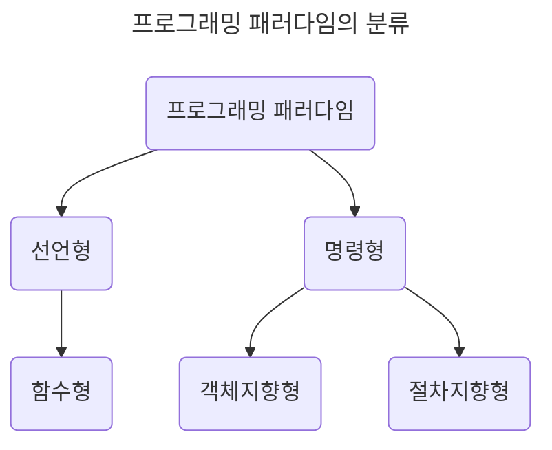

# 1장. 디자인 패턴과 프로그램 패러다임

## 1.1 디자인 패턴

### 1.1.1 싱글톤 패턴

### 1.1.2 팩토리 패턴

### 1.1.3 전략 패턴

### 1.1.4 옵저버 패턴

### 1.1.5 프록시 패턴과 프록시 서버

### 1.1.6 이터레이터 패턴

### 1.1.7 노출모듈 패턴

### 1.1.8 MVC 패턴

### 1.1.9 MVP 패턴

### 1.1.10 MVVM 패턴

## 1.2 프로그래밍 패러다임(Programming paradigm)

- 프로그래머에게 프로그래밍의 관점을 갖게 해주는 개발 방법론

  - 객체지향 프로그래밍: 프로그램을 상호 작용하는 객체들의 집합으로 인식

  - 함수형 프로그래밍: 상태 값을 지니지 않는 함수 값들의 연속



### 1.2.1 선언형(declarative)과 함수형(functional) 프로그래밍

- 선언형 프로그래밍: **무엇을** 풀어내는지?

  - 프로그램은 함수로 이루어진 것이다.

- 함수형 프로그래밍: *순수 함수*로 로직을 구현하고, *고차 함수*로 재사용성을 높인다.

  - 순수 함수: 출력이 입력에만 의존한다.

    ```js
    // pure 함수는 매개변수 a, b에만 영향을 받는다.
    const pure = (a, b) => {
      return a + b;
    };
    ```

  - 고차 함수: 함수를 매개변수로 받아 로직을 생성한다.

    - 고차 함수를 사용하기 위해서는 해당 언어가 **일급 객체(First Class Function)** 여야 한다.

      - 변수나 메서드에 함수를 할당할 수 있는가?

      - 함수 안에 함수를 매개변수로 담을 수 있는가?

      - 함수가 함수를 반환할 수 있는가?

  - ex) JavaScript, Clojure

### 1.2.2 객체지향 프로그래밍(OOP, Object-Oriented Programming)

- 데이터를 객체로 취급하여 객체 내부에 선언된 메서드를 활용한다.

- 설계하는데 많은 시간이 소요되고 상대적으로 느리다.

- ex) C++, Python, Java

| 특징                  | 설명                                                                                                                                                                                                                                              |
| --------------------- | ------------------------------------------------------------------------------------------------------------------------------------------------------------------------------------------------------------------------------------------------- |
| 추상화(abstration)    | 복잡한 시스템으로부터 핵심 개념 또는 기능을 간추려낸다.                                                                                                                                                                                           |
| 캡슐화(encapsulation) | 객체의 속성과 메서드를 하나로 묶고 일부를 외부에 감춰 은닉한다.                                                                                                                                                                                   |
| 상속성(inheritance)   | 상위 클래스의 특성을 하위 클래스가 이어받아 재사용하거나 추가, 확장한다. <br>코드의 재사용, 계층적 관계 생성, 유지 보수성 측면에서 중요하다.                                                                                                      |
| 다형성(polymorphism)  | 하나의 메서드나 클래스가 다양한 방법으로 동작한다. <br>- **오버로딩(overloading)**: 같은 이름의 메서드가 여러 개 (static: 컴파일 중에 발생) <br>- **오버라이딩(overriding)**: 하위 클래스가 상위 클래스 메서드 재정의 (dynamic: 런타임 중에 발생) |

#### 설계 원칙(SOLID)

- 시간이 지나도 유지 보수와 확장이 쉬운 시스템을 만들기 위해 적용한다.

  | 설계 원칙                                                      | 특징                                                                                                                                                                                                                          |
  | -------------------------------------------------------------- | ----------------------------------------------------------------------------------------------------------------------------------------------------------------------------------------------------------------------------- |
  | 단일 책임 원칙(SRP, **Single** Responsibility Principle)       | 한 클래스는 하나의 책임만 가져야 한다.                                                                                                                                                                                        |
  | 개방-폐쇄 원칙(OCP, **Open** Closed Principle)                 | 소프트웨어 요소는 확장에는 열려 있으나 변경에는 닫혀 있어야 한다.                                                                                                                                                             |
  | 리스코프 치환 원칙(LSP, **Liskov** Substitution Principle)     | 프로그램의 객체는 프로그램의 정확성을 깨뜨리지 않으면서 하위 타입의 인스턴스로 바꿀 수 있어야 한다. <br>- 부모 객체에 자식 객체를 넣어도 시스템이 돌아가야 한다.                                                              |
  | 인터페이스 분리 원칙(ISP, **Interface** Segregation Principle) | 특정 클라이언트를 위한 인터페이스 여러 개가 범용 인터페이스 하나보다 낫다.                                                                                                                                                    |
  | 의존 역전 원칙(DIP, **Dependency** Inversion Principle)        | 추상화에 의존해야지, 구체화에 의존하면 안된다. <br>- 상위 계층은 하위 계층의 변화로부터 독립해야 한다.<br>- 타이어를 갈아 끼울 *틀*을 만든 후, 다양한 타이어를 교체할 수 있어야 한다. <br>- 의존성 주입(Dependency Injection) |

### 1.2.3 절차형 프로그래밍(Procedural programming)

- 수행되어야 할 연속적인 계산 과정을 포함한다.

- 코드의 가독성이나 실행 속도가 빠르지만, 모듈화나 유지 보수성이 떨어진다.

- ex) C

### 1.2.4 패러다임의 혼합

- 비즈니스 로직이나 서비스의 특징을 고려한 패러다임을 선택한다.

## 예상 질문

1. 옵저버 패턴은 어떻게 구현하나요?

2. 프록시 서버는 어디에 사용되나요?

3. MVC 패턴이 무엇이고 MVVM 패턴과의 차이는 무엇인가요?

## 참고 및 출처

- [SOLID (객체 지향 설계)](<https://ko.wikipedia.org/wiki/SOLID_(%EA%B0%9D%EC%B2%B4_%EC%A7%80%ED%96%A5_%EC%84%A4%EA%B3%84)>)
