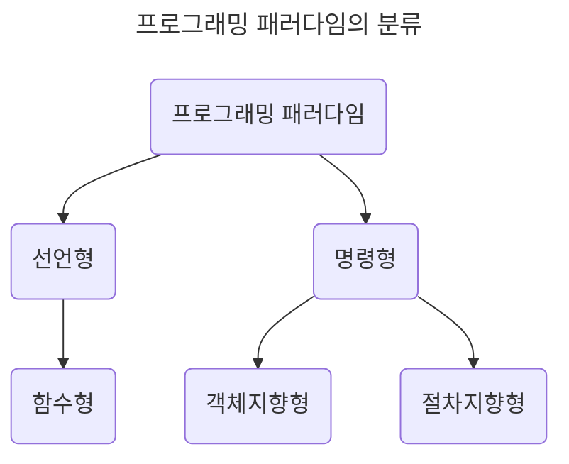

# 1장. 디자인 패턴과 프로그램 패러다임

- 디자인 패턴은 공통으로 사용될 수 있는 특정한 기능을 모듈화한 라이브러리나 프레임워크의 기본이다.

- 라이브러리 vs 프레임워크: 흐름의 제어 권한이 어디에 있는가?

  |                 | 라이브러리(Library) | 프레임워크(Framework) |
  | --------------- | ------------------- | --------------------- |
  | 규칙 유무       | 없다                | 있다                  |
  | 상대적인 자유도 | 자유롭다            | 엄격하다              |
  | 제어 권한       | 사용자              | 프레임워크            |

## 1.1 디자인 패턴

- 프로그램을 설계할 때 발생하는 문제점을 해결할 수 있도록 만들어 놓은 규약

### 1.1.1 싱글톤 패턴(Singleton pattern)

> 하나의 클래스에 오직 하나의 인스턴스만 가진다.

- 데이터베이스 연결 모듈에 주로 사용한다.

| 장점                      | 단점                                              |
| ------------------------- | ------------------------------------------------- |
| 저렴한 인스턴스 생성 비용 | 높아지는 의존성(종속성, 결합도) + 떨어지는 독립성 |

- ex) JavaScript의 `literal {}` 또는 `new Object` 객체 생성, Java의 중첩 클래스, mongoose의 `connect()` 함수

  ```js
  class Singleton {
    constructor() {
      if (!Singleton.instance) {
        Singleton.instance = this;
      }

      return Singleton.instance;
    }

    getInstance() {
      return this.instance;
    }
  }

  const a = new Singleton();
  const b = new Singleton();

  console.log(a === b); // true
  ```

#### 의존성 주입(DI, Dependency Injection)

> - 상위 모듈은 하위 모듈에서 어떠한 것도 가져오지 않아야 한다.
>
> - 둘 다 추상화에 의존해야하며, 추상화는 세부 사항에 의존하지 말아야 한다.

- 목적: 모듈간의 결합을 느슨하게 만든다.

- Decoupling? 메인 모듈과 하위 모듈 사이에 의존성 주입자(dependency injector)를 삽입함으로써 메인 모듈은 간접적으로 의존성을 주입한다.

| 장점                         | 단점                               |
| ---------------------------- | ---------------------------------- |
| 명확한 모듈 간의 관계        | 모듈들이 더 분리되면서 복잡성 증가 |
| 일관된 의존성 방향           | 약간의 런타임 패널티               |
| 수월한 테스트와 마이그레이션 |                                    |

### 1.1.2 팩토리 패턴(Factory pattern)

> - 객체를 사용하는 코드에서 객체 생성 부분을 떼어내 추상화한다.
>
> - 상속 관계에 있는 두 클래스에서 상위 클래스는 중요한 뼈대를 결정, 하위 클래스는 객체의 구체적인 특징을 결정한다.

| 장점                                     | 단점                                                   |
| ---------------------------------------- | ------------------------------------------------------ |
| 느슨한 결합으로 유연성 증가              | 제품 특징에 따라 증가하는 구현/관리할 서브 클래스 갯수 |
| [유지 보수성(OCP 원칙)](#설계-원칙solid) |                                                        |

### 1.1.3 전략 패턴(Strategy pattern), 정책 패턴(Policy pattern)

> 객체의 행위를 바꾸고 싶을 때, 컨텍스트 안에서 '캡슐화한 알고리즘(전략)'을 바꾼다. (상호 교체 가능)

- 컨텍스트(context)? 개발자가 어떠한 작업을 완료하는데 필요한 관련 정보

- ex) 물건을 결제하는 방법(무통장, 신용카드, 네이버페이 등)은 여러 가지가 존재한다.

#### passport의 전략 패턴

- [Passport](https://www.passportjs.org/) : Node.js에서 인증 모듈을 구현할 때 사용하는 미들웨어 라이브러리

| LocalStrategy 전략                                 | OAuth 전략                                |
| -------------------------------------------------- | ----------------------------------------- |
| 서비스 내 회원가입된 아이디/비밀번호 기반으로 인증 | naver 등 third-party 서비스 기반으로 인증 |

### 1.1.4 옵저버 패턴(Observer pattern)

> 주체가 객체(subject)의 상태 변화가 있을 때마다 메서드 등을 통해 옵저버 목록에 있는 옵저버에게 변화를 알려 준다.

| 주체                           | 옵저버(Observer)                                                                    |
| ------------------------------ | ----------------------------------------------------------------------------------- |
| 객체의 상태를 지켜 보는 관찰자 | 객체의 상태 변화에 따라 전달되는 메서드 등을 기반으로 추가적인 변화가 생기는 객체들 |

- 객체와 주체는 분리될 수도, 합쳐질 수도 있다. -> 상태가 변경되는 객체 기반으로 구성한다.

- 이벤트 기반 시스템이나 MVC(Model-View-Controller) 패턴에 주로 사용된다.

  - ex) Twitter: A(주체)를 팔로우하면, A가 포스팅(새로운 트윗)을 올릴 때마다 팔로워에게 알려준다(알람).

  - 모델(Model, 주체)에 변경 사항이 생기면, update() 메서드로 옵저버인 뷰(View)에 알려주고, 이를 기반으로 컨트롤러(Controller)가 동작한다.

```mermaid
---
title: 옵저버 패턴 구조
---
flowchart LR

A(@Observer View) ---> B(@EventListener Controller)
B ---> C(@Observable Model)

C ---> |notifyAll -> update| A
```

#### 자바: 상속과 구현

| 상속(extends)                                        | 구현(implement)                       |
| ---------------------------------------------------- | ------------------------------------- |
| 부모 클래스 메서드를 상속(inheritance)받아 추가/확장 | 부모 인터페이스(interface) **재정의** |
| 클래스(class) 기반으로 구현                          | 인터페이스(interface) 기반으로 구현   |
| 재사용성, 중복성의 최소화                            | 부모 클래스 메서드 재정의 필수        |

#### 자바스크립트에서의 옵저버 패턴

##### [프록시(proxy) 객체](https://developer.mozilla.org/en-US/docs/Web/JavaScript/Reference/Global_Objects/Proxy)

- 어떠한 대상의 기본적인 동작(속성 접근, 할당, 순회, 열거, 함수 호출 등)의 작업을 가로챌 수 있다: 프록시 패턴

  - target: 프록시할 대상

  - handler: target 동작을 가로채고 어떠한 동작을 할지 설정되어 있는 함수

```js
const handler = {
  get: function (target, name) {
    return name === "name" ? `${target.a} ${target.b}` : target[name];
  },
};

const p = new Proxy({ a: "Hello", b: "World!" }, handler);

console.log(p.name); // Hello World!
```

| get()                          | has()                   | set()                     |
| ------------------------------ | ----------------------- | ------------------------- |
| 속성/함수에 대한 접근 가로챈다 | in 연산자 사용 가로챈다 | 속성에 대한 접근 가로챈다 |

#### Vue.js 3.0의 옵저버 패턴

- `ref`나 `reactive`로 정의: 해당 값 변경시, DOM(Document Object Model, 웹 브라우저의 화면을 이루는 요소)에 있는 값이 자동으로 변경된다.

### 1.1.5 프록시 패턴(Proxy pattern)과 프록시 서버(Proxy server)

#### 프록시 패턴

> 대상 객체(subject) 앞단의 인터페이스 역할: 대상 객체에 접근하기 전, 그 접근에 대한 흐름을 가로챈다.

- 객체의 속성/변환 보완: 보안, 데이터 검증, 캐싱, 로깅에 사용한다.

- 프록시 서버에서의 캐싱: 캐시 안에 정보를 담아두면서 캐시 안에 있는 데이터를 활용한다.(트래픽 감소)

#### 프록시 서버

> 서버 - 클라이언트 사이에서 클라이언트가 자신을 통해 다른 네트워크 서비스에 **간접적으로 접속**할 수 있게 해주는 컴퓨터 시스템이나 응용 프로그램

##### nginx

- async 이벤트 기반의 구조와 다수의 연결을 효과적으로 처리 가능한 웹서버

  > [Node.js의 버퍼 오버플로우 취약점](https://blog.firosolutions.com/exploits/hacking-nodejs/)을 예방하기 위해서는 nginx를 프록시 서버로 앞단에 놓고 Node.js를 뒤쪽에 놓는 것이 좋다. - Node.js 창시자, 라이언 달(Ryan Dahl)
  >
  > - 버퍼 오버플로우(Buffer Overflow): 메모리 공간(Buffer)을 벗어나는 경우, 사용되지 않아야 할 영역에 데이터가 덮어 씌워져 주소, 값을 바꾸는 공격이 발생할 수 있다.

- Node.js 서버 앞단의 프록시 서버 역할: 보안 강화

  - 실제 port 숨기기

  - 정적 자원을 [gzip](https://en.wikipedia.org/wiki/Gzip)으로 압축

  - 메인 서버 앞단에서 로깅 가능

##### CloudFlare

- 웹 서버 앞단에 프록시 서버를 둔다.

  - DDOS 공격 방어: 네트워크에 단 기간 많은 요청을 보내 마비(가용성 방해)시키는 사이버 공격

  - HTTPS 구축: 별도의 인증서 설치가 필요하지 않아 좀 더 간편하다.

- 보안 강화: 들어오는 트래픽이 의심스럽다고 판단될 경우, C[APTCHA(Completely Automated Public Turing test to tell Computers and Humans Apart)](https://en.wikipedia.org/wiki/CAPTCHA) 등으로 일정 부분 막을 수 있다.

##### CORS와 프론트엔드의 프로시 서버

- [CORS(Cross-Origin Resource Sharing)](https://www.youtube.com/watch?v=j2Q2Ev6CZzQ): 서버가 웹 브라우저에서 리소스를 로드할 때 다른 origin을 통해 load하지 못하게 하는 HTTP 헤더 기반 메커니즘

  - origin: 프로토콜과 호스트 이름, 포트의 조합

    - ex) `https://google.com`/test

- `127.0.0.1`(loopback IP): 본인 PC 서버의 IP로 DNS를 거치지 않고 바로 본인 PC 서버로 연결된다.

### 1.1.6 이터레이터 패턴

```js

```

### 1.1.7 노출모듈 패턴

```js

```

### 1.1.8 MVC 패턴

```js

```

### 1.1.9 MVP 패턴

```js

```

### 1.1.10 MVVM 패턴

```js

```

## 1.2 프로그래밍 패러다임(Programming paradigm)

- 프로그래머에게 프로그래밍의 관점을 갖게 해주는 개발 방법론

  - 객체지향 프로그래밍: 프로그램을 상호 작용하는 객체들의 집합으로 인식

  - 함수형 프로그래밍: 상태 값을 지니지 않는 함수 값들의 연속



### 1.2.1 선언형(declarative)과 함수형(functional) 프로그래밍

- 선언형 프로그래밍: **무엇을** 풀어내는지?

  - 프로그램은 함수로 이루어진 것이다.

- 함수형 프로그래밍: *순수 함수*로 로직을 구현하고, *고차 함수*로 재사용성을 높인다.

  - 순수 함수: 출력이 입력에만 의존한다.

    ```js
    // pure 함수는 매개변수 a, b에만 영향을 받는다.
    const pure = (a, b) => {
      return a + b;
    };
    ```

  - 고차 함수: 함수를 매개변수로 받아 로직을 생성한다.

    - 고차 함수를 사용하기 위해서는 해당 언어가 **일급 객체(First Class Function)** 여야 한다.

      - 변수나 메서드에 함수를 할당할 수 있는가?

      - 함수 안에 함수를 매개변수로 담을 수 있는가?

      - 함수가 함수를 반환할 수 있는가?

  - ex) JavaScript, Clojure

### 1.2.2 객체지향 프로그래밍(OOP, Object-Oriented Programming)

- 데이터를 객체로 취급하여 객체 내부에 선언된 메서드를 활용한다.

- 설계하는데 많은 시간이 소요되고 상대적으로 느리다.

- ex) C++, Python, Java

| 특징                  | 설명                                                                                                                                                                                                                                              |
| --------------------- | ------------------------------------------------------------------------------------------------------------------------------------------------------------------------------------------------------------------------------------------------- |
| 추상화(abstration)    | 복잡한 시스템으로부터 핵심 개념 또는 기능을 간추려낸다.                                                                                                                                                                                           |
| 캡슐화(encapsulation) | 객체의 속성과 메서드를 하나로 묶고 일부를 외부에 감춰 은닉한다.                                                                                                                                                                                   |
| 상속성(inheritance)   | 상위 클래스의 특성을 하위 클래스가 이어받아 재사용하거나 추가, 확장한다. <br>코드의 재사용, 계층적 관계 생성, 유지 보수성 측면에서 중요하다.                                                                                                      |
| 다형성(polymorphism)  | 하나의 메서드나 클래스가 다양한 방법으로 동작한다. <br>- **오버로딩(overloading)**: 같은 이름의 메서드가 여러 개 (static: 컴파일 중에 발생) <br>- **오버라이딩(overriding)**: 하위 클래스가 상위 클래스 메서드 재정의 (dynamic: 런타임 중에 발생) |

#### 설계 원칙(SOLID)

- 시간이 지나도 유지 보수와 확장이 쉬운 시스템을 만들기 위해 적용한다.

  | 설계 원칙                                                      | 특징                                                                                                                                                                                                                          |
  | -------------------------------------------------------------- | ----------------------------------------------------------------------------------------------------------------------------------------------------------------------------------------------------------------------------- |
  | 단일 책임 원칙(SRP, **Single** Responsibility Principle)       | 한 클래스는 하나의 책임만 가져야 한다.                                                                                                                                                                                        |
  | 개방-폐쇄 원칙(OCP, **Open** Closed Principle)                 | 소프트웨어 요소는 확장에는 열려 있으나 변경에는 닫혀 있어야 한다.                                                                                                                                                             |
  | 리스코프 치환 원칙(LSP, **Liskov** Substitution Principle)     | 프로그램의 객체는 프로그램의 정확성을 깨뜨리지 않으면서 하위 타입의 인스턴스로 바꿀 수 있어야 한다. <br>- 부모 객체에 자식 객체를 넣어도 시스템이 돌아가야 한다.                                                              |
  | 인터페이스 분리 원칙(ISP, **Interface** Segregation Principle) | 특정 클라이언트를 위한 인터페이스 여러 개가 범용 인터페이스 하나보다 낫다.                                                                                                                                                    |
  | 의존 역전 원칙(DIP, **Dependency** Inversion Principle)        | 추상화에 의존해야지, 구체화에 의존하면 안된다. <br>- 상위 계층은 하위 계층의 변화로부터 독립해야 한다.<br>- 타이어를 갈아 끼울 *틀*을 만든 후, 다양한 타이어를 교체할 수 있어야 한다. <br>- 의존성 주입(Dependency Injection) |

### 1.2.3 절차형 프로그래밍(Procedural programming)

- 수행되어야 할 연속적인 계산 과정을 포함한다.

- 코드의 가독성이나 실행 속도가 빠르지만, 모듈화나 유지 보수성이 떨어진다.

- ex) C

### 1.2.4 패러다임의 혼합

- 비즈니스 로직이나 서비스의 특징을 고려한 패러다임을 선택한다.

## 예상 질문

1. 옵저버 패턴은 어떻게 구현하나요?

2. 프록시 서버는 어디에 사용되나요?

3. MVC 패턴이 무엇이고 MVVM 패턴과의 차이는 무엇인가요?

## 참고 및 출처

- [SOLID (객체 지향 설계)](<https://ko.wikipedia.org/wiki/SOLID_(%EA%B0%9D%EC%B2%B4_%EC%A7%80%ED%96%A5_%EC%84%A4%EA%B3%84)>)
