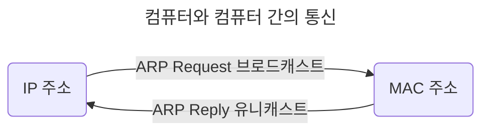
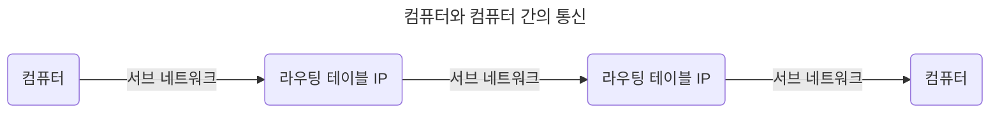
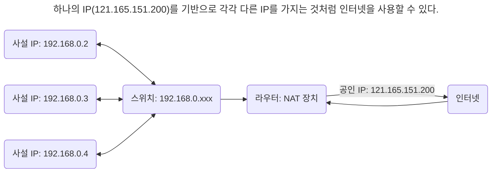

# 2장. 네트워크

## 2.1 네트워크의 기초

## 2.2 TCP/IP 4계층 모델

## 2.3 네트워크 기기

## 2.4 IP 주소

- 브로드캐스트(Broadcast): 송신 호스트가 전송한 데이터가 네트워크에 연결된 모든 호스트에 전송

- 유니캐스트(Unicast): 고유 주소로 식별된 하나의 네트워크 목적지에 1:1로 데이터 전송

### 2.4.1 ARP

> IP 주소로부터 MAC 주소를 구하는 IP와 MAC 주소의 다리 역할을 하는 프로토콜

| ARP(Address Resolution Protocol)                                         | RARP(Reverse Address Resolution Protocol)                                |
| ------------------------------------------------------------------------ | ------------------------------------------------------------------------ |
| IP 주소(가상 주소, 논리적 주소) -> MAC 주소(실제 주소, 물리적 주소) 변환 | MAC 주소(실제 주소, 물리적 주소) -> IP 주소(가상 주소, 논리적 주소) 변환 |

### 2.4.2 홉바이홉 통신(Hop-by-hop transport)

> IP 주소를 통해 통신하는 과정: 통신망에서 각 패킷이 여러 개의 라우터를 건너간다(hop)

- 통신 장치에 있는 라우팅 테이블의 IP를 통해 시작 주소부터 시작하여 패킷이 최종 목적지까지 도달하는 통신.

#### 라우팅 테이블(Routing Table)

> 라우터에 들어가 있는 목적지 정보(게이트웨이)와 그 목적지로 가기 위한 방법(다음 라우터 정보)이 들어 있는 리스트

- 송신지에서 수신지까지 도달하기 위해 사용된다.

#### 게이트웨이(Gateway)

- 서로 다른 통신망, 프로토콜을 사용하는 네트워크 간의 통신을 가능하게 하는 컴퓨터나 소프트웨어(관문 역할)

- 서로 다른 네트워크상의 통신 프로토콜 변환: 인터넷에 접속하기 위해 수많은 게이트웨이를 거친다.

- 라우팅 테이블을 통해 확인할 수 있다: `netstat -r` (윈도우 기준)

### 2.4.3 IP 주소 체계

| IP   | 설명                                                                  |
| ---- | --------------------------------------------------------------------- |
| IPv4 | 32비트를 8비트 단위로 점을 찍어 표기 (123.45.67.78): 가장 많이 쓰인다 |
| IPv6 | 64비트를 16비트 단위로 점을 찍어 표기 (2001:db8:ff00:42:8329)         |

#### 클래스 기반 할당 방식(Classful Network Addressing)

> IP 주소 체계를 A, B, C, D, E 다섯 개의 클래스로 구분한다.

| 클래스(통신)   | 1번째 바이트        | 2번째 바이트                 | 3번째 바이트  | 4번째 바이트  |
| -------------- | ------------------- | ---------------------------- | ------------- | ------------- |
| A (일대일)     | 네트워크 주소       | _호스트 주소(컴퓨터에 부여)_ | _호스트 주소_ | _호스트 주소_ |
| B (일대일)     | 네트워크 주소       | 네트워크 주소                | _호스트 주소_ | _호스트 주소_ |
| C (일대일)     | 네트워크 주소       | 네트워크 주소                | 네트워크 주소 | _호스트 주소_ |
| D (멀티캐스트) | 브로드캐스트용 주소 |
| E (예비용)     | 예비용 주소         |

| 클래스 | 범위(10진수)                | 범위(2진수)                      |
| ------ | --------------------------- | -------------------------------- |
| A      | 0.0.0.0 - 127.255.255.255   | **0**00000000.~ - **0**1111111.~ |
| B      | 128.0.0.0 - 191.255.255.255 | **10**0000000.~ - **10**111111.~ |
| C      | 192.0.0.0 - 223.255.255.255 | **110**000000.~ - **110**11111.~ |

- 구분 비트: 맨 왼족에 있는 비트

- ex) 클래스 A로 42.0.0.0을 부여받았을 때

  | IP 주소                   | 역할                                                           |
  | ------------------------- | -------------------------------------------------------------- |
  | 42.0.0.0                  | 네트워크 구별 주소                                             |
  | 42.0.0.1 - 42.255.255.254 | 컴퓨터에 부여할 수 있는 호스트 주소                            |
  | 42.255.255.255            | 브로트캐스트용 주소(네트워크에 속한 모든 컴퓨터에 데이터 전송) |

- 사용하는 주소보다 버리는 주소가 더 많다 -> DHCP, IPv6, NAT

#### DHCP(Dynamic Host Configuration Protocol)

> IP 주소 및 기타 통신 매개변수를 자동으로 할당하기 위한 네트워크 관리 프로토콜

- 인터넷에 접속할 때마다 자동으로 IP 주소 할당한다.

- 라우터와 게이트웨이 장비 대부분에 존재하여 대부분의 가정용 네트워크에서 IP 주소를 할당한다.

#### NAT(Network Address Translation)

> 패킷이 라우터를 통해 전송되는 동안 패킷의 IP 정보를 수정, IP 주소를 다른 주소로 매핑한다.

- 공인, 사설 IP로 분리: 사설 IP를 공인 IP로, 공인 IP를 사설 IP로 변환한다.

- 여러 대의 호스트가 하나의 공인 IP를 사용하여 인터넷에 접속하기 위해 사용한다: 인터넷 공유기(ipTIME 등)

- 보안성: 내부 네트워크에서 사용하는 IP와 외부에서 보이는 IP 주소를 다르게 유지한다.

- 여러 명이 동시에 인터넷을 접속하므로 실제 접속하는 호스트 숫자에 따라 접속 속도가 느려질 수 있다.

- NAT가 가능한 소프트웨어: ISC, RRAS, Netfilter 등

### 2.4.4 IP 주소를 이용한 위치 정보

- IP 주소는 인터넷에서 사용하는 네트워크 주소이므로 동, 구까지 [위치 추적](https://mylocation.co.kr/)이 가능하다.

## 2.5 HTTP

- 전송 계층 위에 있는 애플리케이션 계층으로 웹 서비스 통신에 사용된다.

### 2.5.1 HTTP/1.0

> 한 연결 당 하나의 요청을 처리한다 -> Connection: Closed

#### RTT(Round-trip time) 증가

> 패킷 왕복 시간: 패킷이 목적지에 도달하고 나서 다시 출발지로 돌아오기까지 걸리는 시간

- RTD(Round-trip delay)

  - 서버로부터 파일을 가져올 때마다 TCP의 3-way handshake를 계속해서 열어야 한다.

  - TCP 연결 초기화 - 파일 요청, 파일 요청 - 전체 파일 수신까지 걸리는 시간 등

- 서버에 부담이 많이 가고, 사용자 응답 시간이 길어진다.

- RTT보다 포괄적인 Latency(네트워크 지연 시간): 네트워크 통신 지연 및 성능에 영향을 미치는 여러 요인들

#### RTT 증가를 해결하기 위한 방법

- Image Sprite: 많은 이미지가 합쳐 있는 하나의 이미지를 다운로드, `background-image` - `position`으로 이미지를 표시한다.

  

- 코드 압축: 개행 문자, 빈칸등을 없애서 코드의 크기를 최소화한다.

- 이미지 Base64 인코딩: 이미지 파일을 64진법으로 이루어진 문자열로 인코딩한다.

  - 서버에 HTTP 요청을 하지 않아도 되지만 Base64 문자열로 변환할 경우 [크기가 33 - 37% 정도 더 커진다.](https://en.wikipedia.org/wiki/Base64)

### 2.5.2 HTTP/1.1

> 한 번 TCP 초기화(3-way handshake)하면, keep-alive 옵션으로 여러 개의 파일 송수신 -> `Connection: Keep-Alive`

- 문서 안에 포함된, 요청할 다수의 리소스(이미지, 동영상, 파일 등) 갯수에 비례해 대기 시간이 길어진다.

#### HOL(Head Of Line) Blocking

> 네트워크 상에서 같은 큐에 있는 패킷이 첫 번째 패킷에 의해 지연될 때 발생하는 성능 저하 현상

- 첫번째 패킷이 느리게 받아진다면, 뒤에 있는 패킷은 대기하게 되면서 다운로드가 지연된다.

#### 무거운 헤더 구조

- 쿠키 등 많은 메타 데이터가 들어 있고 압축이 되지 않아 무겁다.

### 2.5.3 HTTP/2

> 멀티 플렉싱, 헤더 압축, 서버 푸시, 요청의 우선순위 처리를 지원하는 프로토콜.

- SPDY(SPeeDY) 프로토콜에서 파생된 HTTP/1.x보다 지연 시간을 줄이고 응답 시간을 더 빠르게 할 수 있다.

#### 멀티 플렉싱(Multi-Flexing)

> 여러 개의 스트림을 사용하여 송수신한다.

- 특정 스트림(stream, 데이터 흐름)의 패킷이 손실되어도 다른 스트림에는 영향을 주지 않는다.

- 병렬적인 스트림을 통해 애플리케이션에서 받아온 메시지를 독립된 프레임으로 조각/조립하여 데이터를 주고 받는다.
  - 단일 연결을 사용하여 병렬로 여러 요청/응답을 줄 수 있다.
  - HTTP/1.x의 문제인 HOL Blocking 문제 해결

#### 헤더 압축

- 허프만 코딩(Huffman coding) 압축 알고리즘(전체 데이터 표현에 필요한 비트 양을 줄인다)을 사용하는 HPACK 압축 형식을 가진다.

#### 서버푸시

> 클라이언트 요청 없이 서버가 바로 리소스를 푸시할 수 있다.
