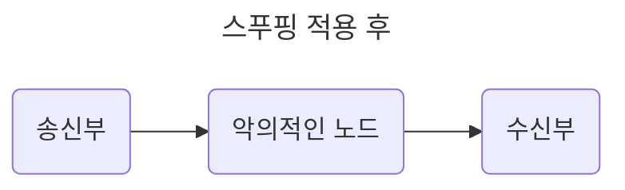
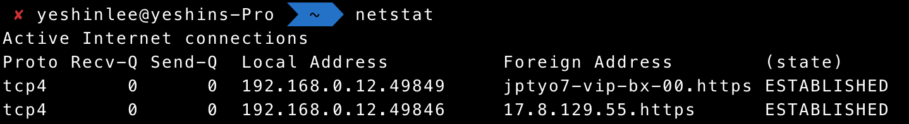
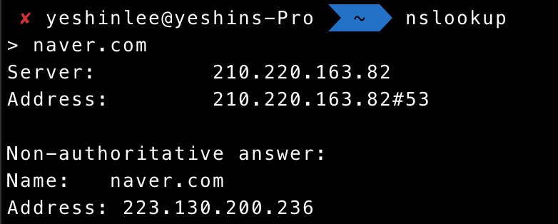
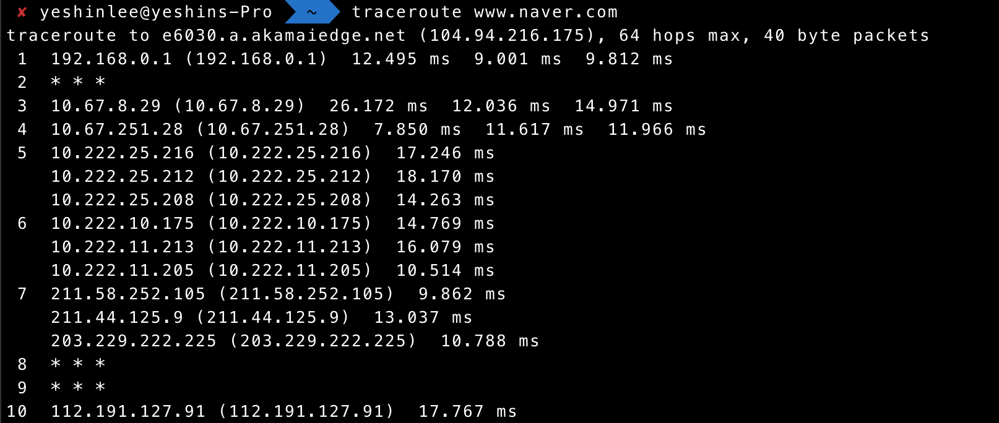
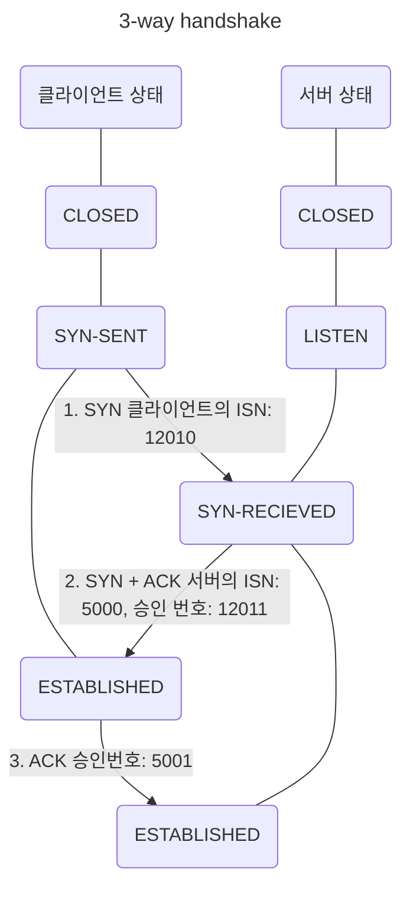
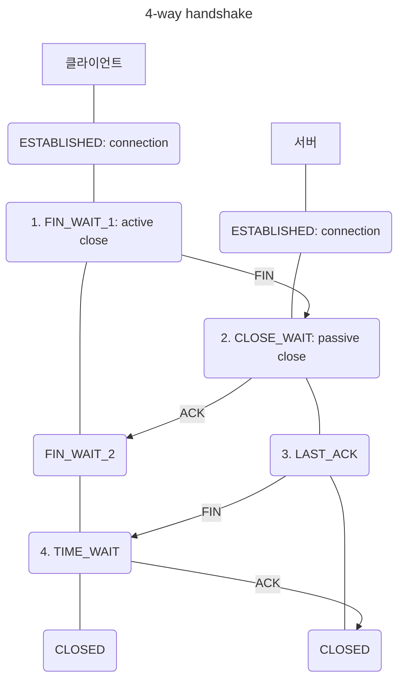
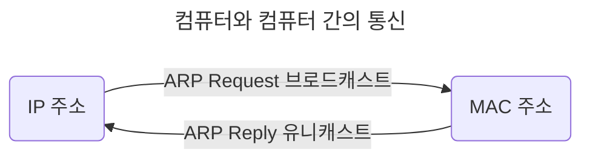
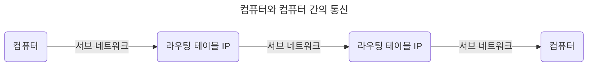
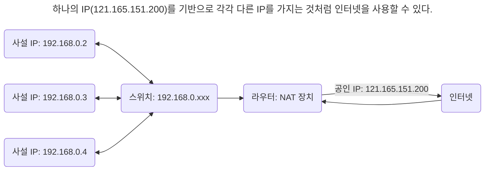

# 2장. 네트워크

- 컴퓨터 등 장치들이 통신 기술을 이용하여 구축하는 연결망

## 2.1 네트워크의 기초

- 노드와 링크가 서로 연결되어 있거나 연결되어 있지 않은 집합

|      |                                       |
| ---- | ------------------------------------- |
| node | 서버, 라우터, 스위치 등 네트워크 장치 |
| link | 유무선                                |

### 2.1.1 처리량과 지연 시간

- 좋은 네트워크? 많은 처리량 + 짧은 지연 시간 + 적은 장애 빈도 + 좋은 보안

#### 처리량(throughput)

- 링크를 통해 전달되는 단위 시간당 데이터 양

- 단위: bps(bits per second, 초당 전송/수신되는 비트 수)

- 사용자들이 많이 접속할 때마다 커지는 트래픽, 네트워크 장치 간의 대역폭, 네트워크 중간에 발생하는 에러, 장치의 하드웨어 스펙에 영향을 받는다.

  - 대역폭: 주어진 시간동안 네트워크 연결을 통해 흐를 수 있는 최대 비트 수

#### 지연 시간(latency)

- 요청이 처리되는 시간, 어떤 메시지가 두 장치 사이를 왕복하는 데 걸린 시간

- 매체 타입(무선, 유선), 패킷 크기, 라우터의 패킷 처리 시간에 영향을 받는다.

### 2.1.2 네트워크 토폴로지와 병목 현상

#### 네트워크 토폴로지(Network topology)

- 노드와 링크가 어떻게 배치되어 있는지에 대한 방식/연결 형태, 네트워크 구조

- 병목 현상을 찾을 때 중요한 기준이다.

##### 트리(계층형) 토폴로지

- 트리 형태로 배치한 네트워크 구성

- 노드 추가/삭제 용이, 특정 노드에 트래픽이 집중될 때 하위 노드에 영향이 간다.

##### 버스 토폴로지

- 중앙 통신 회선 하나에 여러 노드가 연결되어 공유하는 네트워크

- 근거리 통신망(LAN)에서 사용한다.

- 저렴한 설치 비용, 우수한 신뢰성, 중앙 통신 회선에 노드 추가/삭제 용이 vs 스푸핑(Spoofing)

  - 스푸핑: 스위칭 기능을 마비 또는 속여서 특정 노드에 해당 패킷이 오도록 처리한다.

    - 스위칭: LAN 상에서 송신부의 패킷을 송신과 관련없는 다른 호스트에게 가지 않도록 한다.



##### 스타(star) 토폴로지

- 중앙에 있는 노드에 모두 연결된 네트워크

- 노드 추가 용이, 쉬운 에러 탐지, 패킷의 충돌 발생 가능성 적음, 장애 노드가 중앙 노드가 아닐 경우, 다른 노드에 덜 영향 vs 중앙 노드에 장애 발생시 전체 사용 불가, 고가 설치 비용

##### 링형(ring) 토폴로지

- 각각의 노드가 양 옆의 두 노드와 연결: 전체적으로 고리형의 하나의 연속된 길을 통해 통신하는 망 구성 방식

- 데이터는 노드에서 노드로 이동, 각각의 노드는 고리 모양의 길을 통해 패킷을 처리한다.

- 노드 수가 증가해도 네트워크 상의 손실이 거의 없다, 충돌 발생 가능성 적음, 노드 고장 쉽게 발견 vs 어려운 네트워크 구성 변경, 회선에 장애 발생시 전체에 큰 영향

##### 메시(mesh, 망형) 토폴로지

- 그물망처럼 연결되어 있는 구조

- 한 단말 장치에 장애가 발생해도 여러 개의 경로가 존재하므로 네트워크 계속 사용 가능, 트래픽 분산 처리 가능 vs 어려운 노드 추가, 고가의 구축/운용 비용

#### 병목 현상(Bottleneck)

- 전체 시스템의 성능이나 용량이 하나의 구성 요소로 인해 제한받는 현상

### 2.1.3 네트워크 분류

| 분류                           | 정의                                               | 규모                |
| ------------------------------ | -------------------------------------------------- | ------------------- |
| LAN(Local Area Network)        | 근거리 통신망: 전송 속도 빠름, 혼잡하지 않다.      | 사무실 등 좁은 공간 |
| MAN(Metropolitan Area Network) | 대도시 지역 네트워크: 전송 속도 평균, LAN보다 혼잡 | 도시같은 넓은 지역  |
| WAN(Wide Area Network)         | 광역 네트워크: 전송 속도 느림, MAN보다 혼잡        | 국가 또는 대륙      |

### 2.1.4 네트워크 성능 분석 명령어

- 네트워크 병목 현상 주 원인: 네트워크 대역폭, 네트워크 토폴로지, 서버 CPU/메모리 사용량, 비효율적인 네트워크 구성

#### ping(Packet INternet Groper)

- 네트워크 상태를 확인하려는 대상 노드를 향해 일정 크기의 패킷을 전송하는 명령어

- 해당 노드의 패킷 수신 상태와 도달하기까지의 시간을 알 수 있다.

- 해당 노드까지 네트워크가 잘 연결되어있는지 확인할 수 있다.

- TCP/IP 프로토콜 중 ICMP 프로토콜을 통해 동작하므로 ICMP 프로토콜을 지원하지 않는 기기를 대상으로 테스트할 수 없다.

- 네트워크 정책상 ICMP나 traceroute를 차단하는 대상의 경우, ping 테스트 불가: 방화벽 해제로 진행할 수 있다.

- `ping [IP 주소 또는 도메인 주소]`로 실행한다.

#### netstat

- 접속되어 있는 서비스들의 네트워크 상태 표시: 네트워크 접속, 라우팅 테이블, 네트워크 프로토콜 등 리스트를 보여준다.

- 서비스의 포트가 열려있는지 확인할 때 사용한다.



#### nslookup

- DNS에 관련된 내용 확인: 특정 도메인에 매핑된 IP를 확인하기 위해 사용한다.



#### tracert(window), traceroute(mac)

- 목적지 노드까지 네트워크 경로를 확인할 때 사용한다.

- 목적지 노드까지 구간들 중 어느 구간에서 응답 시간이 느려지는지 등 확인할 수 있다.



|         |                            |
| ------- | -------------------------- |
| fp      | 대형 파일 전송 테스트      |
| tcpdump | 노드로 오고 가는 패킷 캡처 |

- 네트워크 분석 프로그램: wireshark, netmon

### 2.1.5 네트워크 프로토콜 표준화

- 다른 장치들끼리 데이터를 주고받기 위해 설정된 공통된 인터페이스

- IEEE(Institute of Electrical and Electronics Engineers) 또는 IETF(Internet Engineering Task Force)라는 표준화 단체가 정한다.

- [IEEE 802.3](https://www.ieee802.org/3/): 유선 LAN 프로토콜

  - 유선으로 LAN을 구축할 때 쓰이는 프로토콜

  - 이를 통해 만든 기업이 다른 장치라도 서로 데이터를 수신할 수 있다.

  - HTTP(Hypertext Transfer Protocol)을 통해 노드들은 웹 서비스를 기반으로 데이터를 주고받을 수 있다.

## 2.2 TCP/IP 4계층 모델

- 인터넷 프로토콜 스위트(internet protocol suite): 인터넷에서 컴퓨터들이 서로 정보를 주고받는데 쓰이는 프로토콜 집합

- TCP/IP(Transmission Control Protocol/Internet Protocol) 4계층 모델 혹은 OSI(Open Systems Interconnection) 7계층 모델로 설명한다.

### 2.2.1 계층 구조

| TCP/IP 4계층      |                           |
| ----------------- | ------------------------- |
| 애플리케이션 계층 | FTP, HTTP, SSH, SMTP, DNS |
| 전송 계층         | TCP, UDP, QUIC            |
| 인터넷 계층       | IP, ARP, ICMP             |
| 링크 계층         | ethernet                  |

- 특정 계층이 변경되었을 때 다른 계층은 영향을 받지 않는다.

#### 애플리케이션(Application) 계층

- 웹 서비스, 이메일 등 서비스를 실절적으로 사람들에게 제공하는 계층

|                                     |                                                                                              |
| ----------------------------------- | -------------------------------------------------------------------------------------------- |
| FTP(File Transfer Protocol)         | 장치와 장치 간의 파일을 전송하는 데 사용되는 표준 통신 프로토콜                              |
| SSH(Secure SHell)                   | 보안되지 않은 네트워크에서 네트워크 서비스를 안전하게 운영하기 위한 암호화 네트워크 프로토콜 |
| HTTP(Hypertext Transfer Protocol)   | World Wide Web을 위한 데이터 통신의 기초이자 웹 사이트를 이용하는 데 사용하는 프로토콜       |
| SMTP(Simple Mail Transfer Protocol) | 전자 메일 전송을 위한 인터넷 표준 통신 프로토콜                                              |
| DNS(Domain Name System)             | 도메인 이름과 IP 주소를 매핑해주는 서버                                                      |

#### 전송(Transport) 계층

- 송신자와 수신자를 연결하는 통신 서비스를 제공한다.

- 연결 지향 데이터 스트림 지원, 신뢰성, 흐름 제어를 제공한다.

- 애플리케이션과 인터넷 계층 사이의 데이터가 전달될 때의 중계 역할을 한다.

| TCP(Transmission Control Protocol) | UDP(User Diagram Protocol)    |
| ---------------------------------- | ----------------------------- |
| 가상회선 패킷 교환 방식            | 데이터그램 패킷 교환 방식     |
| 패킷 사이의 순서 보장(신뢰성)      | 순서 보장 X, 수신 여부 확인 X |
| 연결지향 프로토콜 사용             | 비연결형                      |

##### 가상회선(VC, Virtual Circuit) 패킷 교환 방식

- 각 패킷에는 가상회선 식별자가 포함되어 있다.

- 모든 패킷을 전송하면 가상회선이 해제되고 패킷들은 전송된 순서대로 도착한다.

##### 데이터그램 패킷 교환 방식

- 패킷이 독립적으로 이동하여 최적의 경로를 선책한다.

- 하나의 메시지에서 분할된 여러 패킷은 서로 다른 경로로 전송될 수 있으며 도착한 순서가 다를 수 있다.

##### TCP 연결 성립 과정

- 신뢰성을 확보한다.



1. SYN(SYNchronize, 연결 요청 플래그) 단계: 클라이언트는 서버에 클라이언트의 ISN을 담아 SYN에 보낸다.

   - ISN(Initial Sequence Numbers)? 새로운 TCP 연결의 첫번째 패킷에 할당된 32비트 고유 시퀀스 번호

2. SYN + ACK(ACKnowledgement, 응답 플래그) 단계: 서버는 클라이언트의 SYN을 수신하고 서버의 ISN을 보내며 승인번호로 클라이언트의 ISN + 1 값을 보낸다.

3. ACK 단계: 클라이언트는 승인번호(서버의 ISN + 1 값)를 담아 서버에 ACK를 보낸다.

##### TCP 연결 해제 과정



1. FIN_WAIT_1

   - 클라이언트가 연결을 닫으려고 할 때 FIN으로 설정된 세그먼트를 보낸다.

   - 클라이언트는 FIN_WAIT_1 상태로 들어가고 서버의 응답을 기다린다.

2. CLOSE_WAIT

   - 서버는 클라이언트에게 ACK 승인 세그먼트를 보내고 CLOSE_WAIT 상태에 들어간다.

   - 클라이언트가 세그먼트를 받으면 FIN_WAIT_2 상태에 들어간다.

3. LAST_ACK: 서버는 ACK를 보내고 일정 시간 이후에 클라이언트에 FIN 세그먼트를 보낸다.

4. **TIME_WAIT**

   - 클라이언트는 TIME_WAIT 상태가 되고 다시 서버로 ACK를 보내서 서버는 CLOSED 상태가 된다.

   - 클라이언트는 어느 정도 대기한 후 연결이 닫히고 클라이언트와 서버의 모든 자원의 연결이 해제된다.

- TIME_WAIT? 소켓이 바로 소멸되지 않고 일정 시간 유지되는 상태(CentOS6/Ubuntu: 60s, Window: 4m)

  - 일정 시간 후에 닫는 이유?

    - 지연 패킷 발생할 경우 대비: 패킷이 뒤늦게 도착하고 이를 처리하지 못하면 데이터 무결성(data intergrity) 문제가 발생한다.

    - 두 장치가 연결이 닫혔는지 확인하기 위해: LAST_ACK 상태에서 닫히게 되면 새로운 연결 시 접속 오류가 발생한다.

#### 인터넷(Internet) 계층

- 장치로부터 받은 네트워크 패킷을 IP 주소로 지정된 목적지로 전송하기 위해 사용되는 계층

- 패킷을 수신해야 할 상대의 주소를 지정하여 데이터를 전달한다.

- 비연결형: 상대방이 제대로 받았는지에 대해 보장하지 않는다.

#### 링크(네트워크 접근) 계층

- 전선, 광섬유, 무선 등으로 실질적으로 데이터를 전달하며 장치 간에 신호를 주고받는 규칙을 정한다.

|                  |                                                                      |
| ---------------- | -------------------------------------------------------------------- |
| 물리 계층        | 유/무선 LAN을 통해 0과 1로 이루어진 데이터를 보내는 계층             |
| 데이터 링크 계층 | 이더넷 프레임을 통해 에러 확인, 흐름 제어, 접근 제어를 담당하는 계층 |

##### 유선 LAN(IEEE 802.3)

- 유선 LAN을 이루는 이더넷은 IEEE 802.3을 따르고 전이중화 통신을 사용한다.

- 전이중화(full duplex) 통신: 양쪽 장치가 동시에 송수신할 수 있는 방식

  - 송신로와 수신로로 나눠서 데이터를 주고받으며 현대의 고속 이더넷은 이 방식을 기반으로 통신한다.

  - 같은 시간에 데이터를 주고받을 수 있다.

- CSMA/CD(Carrier-sense multiple access with collision detection): 반이중화 통신

  - 데이터를 보낸 이후 충돌이 발생한다면 일정 시간 이후 재전송하는, 이전에 유선 LAN이 사용한 방식

  - 수신로와 송신로를 각각 둔 것이 아니고 한 경로를 기반으로 데이터를 보내므로 데이터를 보낼 때 충돌에 대비해야 했다.

| 유선 LAN을 이루는 케이블           |                                                                                      |
| ---------------------------------- | ------------------------------------------------------------------------------------ |
| 트위스트 페어 케이블(Twisted Pair) | 구리선 8개를 2 개씩 꼬아 묶은 케이블: UTP(구리선 실드 처리 X), STP(구리선 실드 처리) |
| 광섬유 케이블                      | 광섬유로 만든 케이블: 레이저를 이용해 통신하므로 장거리 및 고속 통신이 가능하다      |

##### 무선 LAN(IEEE802.11)

- 송/수신에 같은 채널을 사용하므로 반이중화 통신을 사용한다.

- 반이중화 통신(half duplex): 양쪽 장치는 서로 통신할 수 있지만 동시에는 통신할 수 없다.(한 번에 한 방향만 통신 가능)

  - 둘 이상의 장치가 동시 전송시 충돌 발생으로 메시지가 손실/왜곡되므로 충돌 방지 시스템이 필요하다.

- CSMA/CA(Carrier-sense multiple access with collision avoidance)

  - 장치에서 데이터를 보내기 전에 캐리어 감지 등으로 사전에 가능한 한 충돌을 방지하는 방식

    1. 데이터를 송신하기 전에 무선 매체를 살핀다.

    2. 캐리어 감지: 회선이 비어 있는지를 판단한다.

    3. IFS(Inter FrameSpace): 랜덤 값을 기반으로 정해진 시간만큼 기다린다.(무선 매체가 사용 중이면 점차 그 간격을 늘려가며 기다린다.)

    4. 이후에 데이터를 송신한다.

  - 전이중화 통신은 충돌 감지/방지 매커니즘이 필요하지 않다: 양방향 통신이 가능하므로 충돌 가능성이 없다.

##### 무선 LAN(WLAN, Wireless Local Area Network)을 이루는 주파수

- 무선 신호 전달 방식을 이용하여 2대 이상의 장치를 연결하는 기술

- 비유도 매체(공기)에 주파수를 쏘아 무선 통신망을 구축(2.4GHz 대역 또는 5GHz 대역)한다.

| 대역   | 특징                                                                                                |
| ------ | --------------------------------------------------------------------------------------------------- |
| 2.4GHz | 장애물에 강하다 vs 전자레인지 등 전파 건섭이 일어나는 경우가 많다.                                  |
| 5GHz   | 보통 사용하는 대역: 사용 가능한 많은 채널 수, 동시 사용 가능, 상대적으로 깨끗한 전파 환경 구축 가능 |

- 와이파이(Wifi): 전자기기들이 무선 LAN 신호에 연결할 수 있게 하는 기술

  - 무선 접속 장치(AP, Access Point) 즉 공유기가 있어야 한다.

  - 공유기를 통해 유선 LAN에 흐르는 신호를 무선 LAN 신호로 바꿔주어 신호가 닿는 범위 내에서 무선 인터넷을 사용할 수 있다.

  - 무선 LAN을 이용한 기술: 와이파이, 지그비(ZigBee), 블루투스(Bluetooth) 등

- BSS(Basic Service Set): 기본 서비스 집합

  - 단순 공유기를 통해 네트워크에 접속하는 것이 아닌 동일 BSS 내에 있는 AP들과 장치들이 서로 통신이 가능한 구조

  - 근거리 무선 통신 제공, 하나의 AP만을 기반으로 구축되어있다: 사용자가 한 곳에서 다른 곳으로 자유롭게 이동하며 네트워크에 접속하는 것은 불가능하다.

- ESS(Extended Service Set): 하나 이상의 연결된 BSS 그룹

  - 장거리 무선 통신을 제공한다.

  - BSS보다 더 많은 가용성과 이동성을 지원한다: 사용자는 한 장소에서 다른 장소로 이동하여 중단없이 네트워크에 계속 연결할 수 있다.

##### [이더넷 프레임](https://en.wikipedia.org/wiki/Ethernet_frame)

- 데이터 링크 계층은 이더넷 프레임을 통해 전달받은 데이터의 에러를 검출하고 캡슐화한다.

| Preamble | SFD   | DMAC  | SMAC  | EtherType | Payload | CRC   |
| -------- | ----- | ----- | ----- | --------- | ------- | ----- |
| 7byte    | 1byte | 6byte | 6byte | 2byte     |         | 4byte |

- Physical layer header

  - Preamble: 이더넷 프레임이 시작됨을 알린다.

  - SFD(Start Frame Delimiter): 다음 바이트로부터 MAC 주소 필드가 시작됨을 알린다.

- DMAC(Destination MAC), SMAC(Source MAC): 수신/송신 MAC 주소

  - MAC(Media Access Control) 주소? 네트워크 연결 장치를 구별하기 위한 식별번호(6byte, 48bit)

- EtherType: 데이터 계층 위의 계층인 IP 프로토콜(IPv4, IPv6)을 정의한다.

- Payload: 전달받은 데이터

- CRC(Cyclic Redundency Check): 에러 확인 비트

#### 계층 간 데이터 송수신 과정

##### 캡슐화 과정

- 상위 계층의 헤더와 데이터를 하위 계층의 데이터 부분에 포함시키고 해당 계층의 헤더에 삽입하는 과정

|                   |             |             |              |        |                 |     |
| ----------------- | ----------- | ----------- | ------------ | ------ | --------------- | --- |
| 애플리케이션 계층 |             |             |              | 데이터 |                 | ⬇   |
| 전송 계층         |             |             | TCP(L4) 헤더 | 데이터 |                 | ⬇   |
| 인터넷 계층       |             | IP(L3) 헤더 | TCP(L4) 헤더 | 데이터 |                 | ⬇   |
| 링크 계층         | 프레임 헤더 | IP(L3) 헤더 | TCP(L4) 헤더 | 데이터 | 프레임 트레일러 | ⬇   |

- 세그먼트/데이터그램화: 애플리케이션 계층의 데이터가 전송 계층으로 전달된다, 이 때 TCP(L4) 헤더가 붙여진다.

- 패킷화: 인터넷 계층으로 가면서 IP(L3) 헤더가 붙여진다.

- 프레임화: 링크 계층으로 전달되면서 프레임 헤더와 프레임 트레일러가 붙는다.

##### 비캡슐화 과정

- 하위 계층에서 상위 계층으로 가며 각 계층의 헤더를 제거하는 과정

|                   |             |             |              |        |                 |     |
| ----------------- | ----------- | ----------- | ------------ | ------ | --------------- | --- |
| 애플리케이션 계층 |             |             |              | 데이터 |                 | ⬆   |
| 전송 계층         |             |             | TCP(L4) 헤더 | 데이터 |                 | ⬆   |
| 인터넷 계층       |             | IP(L3) 헤더 | TCP(L4) 헤더 | 데이터 |                 | ⬆   |
| 링크 계층         | 프레임 헤더 | IP(L3) 헤더 | TCP(L4) 헤더 | 데이터 | 프레임 트레일러 | ⬆   |

- 캡슐화된 데이터를 받게 되면 링크 계층으로부터 타고 올라오면서 프레임화된 데이터는 다시 비캡슐화(패킷화 - 세그먼트/데이터그램화 - 메시지화) 과정이 일어난다.

- 최종적으로 사용자에게 애플리케이션인 PDU인 메시지로 전달된다.

### 2.2.2 PDU(Protocol Data Unit)

- 네트워크의 어떠한 계층에서 계층으로 데이터가 전달될 때 한 덩어리의 단위

- 제어 관련 정보(헤더), 데이터(페이로드)로 구성된다: 각 계층마다 부르는 명칭이 다르다.

| 계층              | 명칭                                      |
| ----------------- | ----------------------------------------- |
| 애플리케이션 계층 | 메시지                                    |
| 전송 계층         | 세그먼트(TCP), 데이터그램(UDP)            |
| 인터넷 계층       | 패킷                                      |
| 링크 계층         | 프레임(데이터 링크 계층), 비트(물리 계층) |

- 애플리케이션 계층은 메시지 기반으로 데이터를 전달한다: HTTP의 헤더는 문자열이다.

```js
// curl www.naver.com

Content-Type: text/html; charset=UTF-8
Cache-Control: no-cache, no-store, must-revalidate
Pragma: no-cache
x-frame-options: DENY
x-xss-protection: 1; mode=block
strict-transport-security: max-age=63072000; includeSubdomains
referrer-policy: unsafe-url
Content-Encoding: gzip
Server: nfront
Content-Length: 38420
Date: Tue, 14 May 2024 11:31:39 GMT
Connection: keep-alive
Vary: Accept-Encoding
```

- PDU 중 아래 계층인 비트로 송수신하는 것이 모든 PDU 중 가장 빠르고 효율성이 높다.

- 애플리케이션 계층에서는 문자열을 기반으로 송수신: 헤더에 authorization 값 등 다른 값들을 넣는 확장이 쉽다.

## 2.3 네트워크 기기

- 네트워크는 여러 개의 네트워크 기기를 기반으로 구축된다.

### 2.3.1 네트워크 기기의 처리 범위

- 계층별로 처리 범위를 나눌 수 있다.

- 물리 계층을 처리할 수 있는 기기와 데이터 링크 계층을 처리할 수 있는 기기 등이 있다.

- 상위 계층을 처리하는 기기는 하위 계층을 처리할 수 있지만 그 반대는 불가하다.

|                   |                   |
| ----------------- | ----------------- |
| 애플리케이션 계층 | L7 스위치         |
| 인터넷 계층       | 라우터, L3 스위치 |
| 데이터 링크 계층  | 브리지, L2 스위치 |
| 물리 계층         | NIC, 리피터, AP   |

### 2.3.2 애플리케이션 계층을 처리하는 기기

- 스위치: 여러 장비를 연결하고 데이터 통신을 중재하며 목적지가 연결된 포트로만 전기 신호를 보내 데이터를 전송하는 통신 네트워크 장비

#### L7 스위치(로드 밸런서)

- 서버의 부하를 분산한다.

- 클라이언트로부터 오는 요청을 뒤쪽의 여러 서버로 나누는 역할을 하며 시스템이 처리할 수 있는 트래픽 증가를 목표로 한다.

- URL(Uniform Resource Locator), 서버, 캐시, 쿠키들을 기반으로 트래픽을 분산한다.

- 필터링 기능: 바이러스, 불필요한 외부 데이터 등을 걸러낸다.

- 응용 프로그램 수준의 트래픽 모니터링이 가능하다.

- 정기적인 헬스 체크(health check): 장애가 발생한 서버가 있다면 트래픽 분산 대상에서 제외한다.

##### L4 스위치와 L7 스위치의 차이

- L4 스위치: 인터넷 계층을 처리하는 기기

  - 스트리밍 관련 서비스에서는 사용할 수 없다.

  - 메시지가 아닌 IP, (특히) 포트를 기반으로 트래픽을 분산한다.

- L7 스위치(로드 밸런서): IP, 포트 외에도 URL, HTTP 헤더, 쿠키 등을 기반으로 트래픽을 분산한다.

|                                         |                                                           |
| --------------------------------------- | --------------------------------------------------------- |
| ALB(Application Load Balancer) 컴포넌트 | 클라우드 서비스(AWS 등)에서 L7 스위치를 이용한 로드밸런싱 |
| NLB(Network Load Balancer) 컴포넌트     | 클라우드 서비스(AWS 등)에서 L4 스위치를 이용한 로드밸런싱 |

##### 헬스 체크

- 전송 주기와 재전송 횟수 등을 설정한 이후 반복적으로 서버에 요청을 보낸다.

- L4, L7 스위치 모두 헬스 체크를 통해 (비)정상 서버를 판별한다.

- 서버에 부하가 되지 않을 만큼 요청 횟수가 적절해야 한다.

##### 로드밸런서를 이용한 서버 이중화

- 서비스를 안정적으로 운용하기 위해서는 2대 이상의 서버는 필수적이다.

### 2.3.3 인터넷 계층을 처리하는 기기

#### 라우터(Router)

- 여러 개의 네트워크를 연결, 분할, 구분시켜주는 역할

- 다른 네트워크에 존재하는 장치끼리 서로 데이터를 주고받을 때 패킷 소모를 최소화하고 경로를 최적화하여 최소 경로로 패킷을 포워딩하는 라우팅하는 장비

#### L3 스위치(라우터)

- L2 스위치의 기능과 라우팅 기능을 갖춘 장비

- 소프트웨어 기반의 라우팅과 하드웨어 기반의 라우팅(L3 스위치)하는 것으로 분류할 수 있다.

| 구분        | L2 스위치       | L3 스위치     |
| ----------- | --------------- | ------------- |
| 참조 테이블 | MAC 주소 테이블 | 라우팅 테이블 |
| 참조 PDU    | 이더넷 프레임   | IP 패킷       |
| 참조 주소   | MAC 주소        | IP 주소       |

### 2.3.4 데이터 링크 계층을 처리하는 기기

#### L2 스위치

- 장치들의 MAC 주소를 MAC 주소 테이블을 통해 관리, 연결된 장치로부터 패킷이 왔을 때 패킷 전송을 담당한다.

- 단순 패킷의 MAC 주소를 읽어 스위칭하는 역할: IP 주소를 이해하지 못해 IP 주소를 기반으로 라우팅은 불가능하다.

- 목적지에 MAC 주소 테이블이 없다면 전체 포트에 전달, MAC 주소 테이블의 주소는 일정 시간 이후 삭제하는 기능도 있다.

#### 브리지(Bridge)

- 두 개의 근거리 통신망(LAN)을 상호 접속할 수 있도록 하는 통신망 연결 장치: 포트와 포트 사이의 다리 역할

- 장치에서 받아온 MAC 주소를 MAC 주소 테이블로 관리한다.

- 통신망 범위를 확장하고 서로 다른 LAN 등으로 이루어진 하나의 통신망을 구축할 때 사용한다.

### 2.3.5 물리 계층을 처리하는 기기

#### LAN 카드(NIC, Network Interface Card)

- 2대 이상의 컴퓨터 네트워크를 구성하는데 사용한다.

- 네트워크와 빠른 속도로 데이터를 송수신할 수 있도록 컴퓨터 내에 설치하는 확장 카드

- MAC 주소: 각 LAN 카드를 구분하기 위한 고유의 식별번호

#### 리피터(Repeater)

- 들어오는 약해진 신호 정도를 증폭하여 다른 쪽으로 전달하는 장치

- 패킷이 더 멀리 갈 수 있지만, 광케이블 보급으로 현재는 잘 쓰이지 않는다.

#### AP(Access Point)

- 패킷을 복사하는 기기

- AP에 유선 LAN을 연결한 후 다른 장치에서 무선 LAN 기술(wifi 등)을 사용하여 무선 네트워크 연결을 할 수 있다.

## 2.4 IP 주소



- 브로드캐스트(Broadcast): 송신 호스트가 전송한 데이터가 네트워크에 연결된 모든 호스트에 전송

- 유니캐스트(Unicast): 고유 주소로 식별된 하나의 네트워크 목적지에 1:1로 데이터 전송

### 2.4.1 ARP

> IP 주소로부터 MAC 주소를 구하는 IP와 MAC 주소의 다리 역할을 하는 프로토콜

| ARP(Address Resolution Protocol)                                         | RARP(Reverse Address Resolution Protocol)                                |
| ------------------------------------------------------------------------ | ------------------------------------------------------------------------ |
| IP 주소(가상 주소, 논리적 주소) -> MAC 주소(실제 주소, 물리적 주소) 변환 | MAC 주소(실제 주소, 물리적 주소) -> IP 주소(가상 주소, 논리적 주소) 변환 |

### 2.4.2 홉바이홉 통신(Hop-by-hop transport)

> IP 주소를 통해 통신하는 과정: 통신망에서 각 패킷이 여러 개의 라우터를 건너간다(hop)



- 통신 장치에 있는 라우팅 테이블의 IP를 통해 시작 주소부터 시작하여 패킷이 최종 목적지까지 도달하는 통신.

#### 라우팅 테이블(Routing Table)

> 라우터에 들어가 있는 목적지 정보(게이트웨이)와 그 목적지로 가기 위한 방법(다음 라우터 정보)이 들어 있는 리스트

- 송신지에서 수신지까지 도달하기 위해 사용된다.

#### 게이트웨이(Gateway)

- 서로 다른 통신망, 프로토콜을 사용하는 네트워크 간의 통신을 가능하게 하는 컴퓨터나 소프트웨어(관문 역할)


- 서로 다른 네트워크상의 통신 프로토콜 변환: 인터넷에 접속하기 위해 수많은 게이트웨이를 거친다.

- 라우팅 테이블을 통해 확인할 수 있다: `netstat -r` (윈도우 기준)

### 2.4.3 IP 주소 체계

| IP   | 설명                                                                  |
| ---- | --------------------------------------------------------------------- |
| IPv4 | 32비트를 8비트 단위로 점을 찍어 표기 (123.45.67.78): 가장 많이 쓰인다 |
| IPv6 | 64비트를 16비트 단위로 점을 찍어 표기 (2001:db8:ff00:42:8329)         |

#### 클래스 기반 할당 방식(Classful Network Addressing)

> IP 주소 체계를 A, B, C, D, E 다섯 개의 클래스로 구분한다.

| 클래스(통신)   | 1번째 바이트        | 2번째 바이트                 | 3번째 바이트  | 4번째 바이트  |
| -------------- | ------------------- | ---------------------------- | ------------- | ------------- |
| A (일대일)     | 네트워크 주소       | _호스트 주소(컴퓨터에 부여)_ | _호스트 주소_ | _호스트 주소_ |
| B (일대일)     | 네트워크 주소       | 네트워크 주소                | _호스트 주소_ | _호스트 주소_ |
| C (일대일)     | 네트워크 주소       | 네트워크 주소                | 네트워크 주소 | _호스트 주소_ |
| D (멀티캐스트) | 브로드캐스트용 주소 |
| E (예비용)     | 예비용 주소         |

| 클래스 | 범위(10진수)                | 범위(2진수)                      |
| ------ | --------------------------- | -------------------------------- |
| A      | 0.0.0.0 - 127.255.255.255   | **0**00000000.~ - **0**1111111.~ |
| B      | 128.0.0.0 - 191.255.255.255 | **10**0000000.~ - **10**111111.~ |
| C      | 192.0.0.0 - 223.255.255.255 | **110**000000.~ - **110**11111.~ |

- 구분 비트: 맨 왼족에 있는 비트

- ex) 클래스 A로 42.0.0.0을 부여받았을 때

  | IP 주소                   | 역할                                                           |
  | ------------------------- | -------------------------------------------------------------- |
  | 42.0.0.0                  | 네트워크 구별 주소                                             |
  | 42.0.0.1 - 42.255.255.254 | 컴퓨터에 부여할 수 있는 호스트 주소                            |
  | 42.255.255.255            | 브로트캐스트용 주소(네트워크에 속한 모든 컴퓨터에 데이터 전송) |

- 사용하는 주소보다 버리는 주소가 더 많다 -> DHCP, IPv6, NAT

#### DHCP(Dynamic Host Configuration Protocol)

> IP 주소 및 기타 통신 매개변수를 자동으로 할당하기 위한 네트워크 관리 프로토콜

- 인터넷에 접속할 때마다 자동으로 IP 주소 할당한다.

- 라우터와 게이트웨이 장비 대부분에 존재하여 대부분의 가정용 네트워크에서 IP 주소를 할당한다.

#### NAT(Network Address Translation)

> 패킷이 라우터를 통해 전송되는 동안 패킷의 IP 정보를 수정, IP 주소를 다른 주소로 매핑한다.

- 공인, 사설 IP로 분리: 사설 IP를 공인 IP로, 공인 IP를 사설 IP로 변환한다.

- 여러 대의 호스트가 하나의 공인 IP를 사용하여 인터넷에 접속하기 위해 사용한다: 인터넷 공유기(ipTIME 등)

- 보안성: 내부 네트워크에서 사용하는 IP와 외부에서 보이는 IP 주소를 다르게 유지한다.

- 여러 명이 동시에 인터넷을 접속하므로 실제 접속하는 호스트 숫자에 따라 접속 속도가 느려질 수 있다.

- NAT가 가능한 소프트웨어: ISC, RRAS, Netfilter 등



### 2.4.4 IP 주소를 이용한 위치 정보

- IP 주소는 인터넷에서 사용하는 네트워크 주소이므로 동, 구까지 [위치 추적](https://mylocation.co.kr/)이 가능하다.

## 2.5 HTTP

- 전송 계층 위에 있는 애플리케이션 계층으로 웹 서비스 통신에 사용된다.

### 2.5.1 HTTP/1.0

> 한 연결 당 하나의 요청을 처리한다 -> Connection: Closed

#### RTT(Round-trip time) 증가

> 패킷 왕복 시간: 패킷이 목적지에 도달하고 나서 다시 출발지로 돌아오기까지 걸리는 시간

- RTD(Round-trip delay)

  - 서버로부터 파일을 가져올 때마다 TCP의 3-way handshake를 계속해서 열어야 한다.

  - TCP 연결 초기화 - 파일 요청, 파일 요청 - 전체 파일 수신까지 걸리는 시간 등

- 서버에 부담이 많이 가고, 사용자 응답 시간이 길어진다.

- RTT보다 포괄적인 Latency(네트워크 지연 시간): 네트워크 통신 지연 및 성능에 영향을 미치는 여러 요인들

#### RTT 증가를 해결하기 위한 방법

- Image Sprite: 많은 이미지가 합쳐 있는 하나의 이미지를 다운로드, `background-image` - `position`으로 이미지를 표시한다.

  

- 코드 압축: 개행 문자, 빈칸등을 없애서 코드의 크기를 최소화한다.

- 이미지 Base64 인코딩: 이미지 파일을 64진법으로 이루어진 문자열로 인코딩한다.

  - 서버에 HTTP 요청을 하지 않아도 되지만 Base64 문자열로 변환할 경우 [크기가 33 - 37% 정도 더 커진다.](https://en.wikipedia.org/wiki/Base64)

### 2.5.2 HTTP/1.1

> 한 번 TCP 초기화(3-way handshake)하면, keep-alive 옵션으로 여러 개의 파일 송수신 -> `Connection: Keep-Alive`

- 문서 안에 포함된, 요청할 다수의 리소스(이미지, 동영상, 파일 등) 갯수에 비례해 대기 시간이 길어진다.

#### HOL(Head Of Line) Blocking

> 네트워크 상에서 같은 큐에 있는 패킷이 첫 번째 패킷에 의해 지연될 때 발생하는 성능 저하 현상

- 첫번째 패킷이 느리게 받아진다면, 뒤에 있는 패킷은 대기하게 되면서 다운로드가 지연된다.

#### 무거운 헤더 구조

- 쿠키 등 많은 메타 데이터가 들어 있고 압축이 되지 않아 무겁다.

### 2.5.3 HTTP/2

> 멀티 플렉싱, 헤더 압축, 서버 푸시, 요청의 우선순위 처리를 지원하는 프로토콜.

- SPDY(SPeeDY) 프로토콜에서 파생된 HTTP/1.x보다 지연 시간을 줄이고 응답 시간을 더 빠르게 할 수 있다.

#### 멀티 플렉싱(Multi-Flexing)

> 여러 개의 스트림을 사용하여 송수신한다.

- 특정 스트림(stream, 데이터 흐름)의 패킷이 손실되어도 다른 스트림에는 영향을 주지 않는다.

- 병렬적인 스트림을 통해 애플리케이션에서 받아온 메시지를 독립된 프레임으로 조각/조립하여 데이터를 주고 받는다.
  - 단일 연결을 사용하여 병렬로 여러 요청/응답을 줄 수 있다.
  - HTTP/1.x의 문제인 HOL Blocking 문제 해결

#### 헤더 압축

- 허프만 코딩(Huffman coding) 압축 알고리즘(전체 데이터 표현에 필요한 비트 양을 줄인다)을 사용하는 HPACK 압축 형식을 가진다.

#### 서버푸시

> 클라이언트 요청 없이 서버가 바로 리소스를 푸시할 수 있다.

### 2.5.4 HTTPS

> 애플리케이션 계층과 전송 계층 사이에 신뢰 계층인 SSL/TLS 계층을 넣은, 신뢰할 수 있는 HTTP 요청(통신 암호화)

- HTTP/2는 HTTPS 위에서 동작한다.

#### SSL(Secure Socket Layer)/TLS(Transport Layer Security Protocol)

> 전송 계층에서 보안을 제공하는 프로토콜

- SSL 1.0, 2.0, 3.0, TLS 1.0, TLS 1.3으로 버전이 올라가며 보통 SSL/TLS로 부른다.

- 네트워크 상의 인터셉터(공격자가 사용자 정보를 가로채는 등)를 방지할 수 있다.

- handshake를 통해 보안 세션을 생성, 이를 기반으로 상태 정보를 공유하고 데이터를 암호화한다.

- 보안 세션이 만들어질 때 인증 메커니즘, 키 교환 암호화 알고리즘, 해싱 알고리즘이 사용된다.

##### 보안 세션

> 보안이 시작되고 끝나는 동안 유지되는 세션(session, OS가 사용자로부터 자신의 자산 이용을 허락하는 일정 기간).

- 단 한 번의 1-RTT(클라이언트 - 서버와 키 공유, 인증, 인증 확인)후 데이터를 송수신한다.

  1. 클라이언트에서 서버에 사이퍼 슈트(cypher suites) 전달

  2. 서버는 받은 사이퍼 슈트의 암호화 알고리즘 리스트틀 제공할 수 있는지 확인

  3. 제공할 수 있으면, 서버에서 클라이언트로 인증서를 보내는 인증 메커니즘이 시작한다.

  4. 이후 해싱 알고리즘 등으로 암호화된 데이터의 송수신이 시작된다.

- 사이퍼 슈트: 프로토콜(TLS), AEAD 사이퍼 모드(AES_128_GCM 등), 해싱 알고리즘(SHA256)이 나열된 규약

  - TLS_AES_128_GCM_SHA256, TLS_AES_256_GCM_SHA384, TLS_CHACHA20_POLY1305_SHA256, TLS_AES_128_CCM_SHA256, TLS_AES_128_CCM_8_SHA256

  - AEAD(Authenticated Encryption with Associated Data) 사이퍼 모드: 데이터 암호화 알고리즘

    - AES_128_GCM: 128비트의 키를 사용하는 표준 블록 암호화 기술 + 암호화 알고리즘 GCM(병렬 계산 용이)

##### 인증 메커니즘

> 인증 기관(CA, Certificate Authority)에서 발급한 인증서를 기반으로 이뤄진다.

- 인증서는 서비스 정보, 공개키, 지문, 디지털 서명 등으로 이루어져 있다.

- 안전한 연결을 위한 공개키(public key)룰 클라이언트에 제공, 사용자가 접속한 서버가 신뢰할 수 있는 서버임을 보장한다.

- CA는 신뢰성이 엄격하게 공인된 기업들(Comodo, GoDaddy, GlobalSign, Amazon 등)만 참여할 수 있다.

- CA에 자신의 사이트 정보와 공개키 제출 - CA는 지문(finger print, 공개키 해시 값)을 사용하는 CA의 비밀키 등을 기반으로 인증서를 발급한다.

##### 암호화 알고리즘

- Diffie-Hellman 방식을 토대로 만들어졌다.

| 키 교환 암호화 알고리즘                         | 설명          |
| ----------------------------------------------- | ------------- |
| ECDHE(Elliptic Curve Diffie-Hellman Ephermeral) | 대수곡선 기반 |
| DHE(Diffie-Hellman Ephermeral)                  | 모듈식 기반   |

- 디피-헬만 키 교환 (Diffie-Hellman key exchange) 암호화 알고리즘: 암호키 교환 방법

  - g와 x, p를 알면 y를 구하기 쉽지만 g와 y, p만 알면 x를 구하기 어렵다.

  ```
  y = g^x mod p
  ```

  - PSK(Pre-Shared Key, 공통 암호키) 생성: 처음에 공개 값(공개키) 공유 - 각자의 비밀 값(비밀키)과 혼합 - 혼합 값 공유 - 각자의 비밀 값과 다시 혼합

##### 해싱(Hashing) 알고리즘

> 데이터를 추정하기 힘들게 더 작고, 섞여있는 조각으로 만드는 알고리즘

- SSL/TLS: SHA-256, SHA-386 알고리즘을 사용한다.

- [SHA-256](https://md5calc.com/hash): 해시 함수의 결괏값이 256비트인 알고리즘, 전처리된 메시지를 기반으로 해시를 반환한다.

  - 해시(hash): 다양한 길이의 데이터를 고정된 길이의 데이터로 매핑(mapping)한 값.

  - 해시 함수: 임의의 데이터를 입력벋아 일정한 길이로 바꿔주는(hasing) 함수.

- 0-RTT

  - TLS 1.3은 사용자가 이전에 방문한 사이트로 다시 방문하면, SSL/TLS에서 보안 세션을 만들 때 걸리는 통신을 하지 않아도 된다(1-RTT 이미 수행)

#### SEO에도 도움이 되는 HTTPS

> 사이트 내 모든 요소가 동일하다면, HTTPS 서비스를 하는 사이트는 그렇지 않은 사이트보다 SEO 순위가 높을 것이다(Google 공식 발표)

- SEO(Search Engine Optimization): 검색엔진 최적화

  - 검색엔진으로 웹 사이트 검색시, 페이지 상단에 결과를 노출시켜 많은 사람들이 볼 수 있도록 최적화하는 방법(서비스 운영시 필수)

  | 방법             | 설명                                                                                                                |
  | ---------------- | ------------------------------------------------------------------------------------------------------------------- |
  | 캐노니컬 설정    | 사이트 링크에서 캐노니컬을 설정: `<link rel="canonical href="" />`                                                  |
  | 메타 설정        | html의 [meta 설정](https://hubspot.marketingmm.co.kr/seo-%EB%A9%94%ED%83%80%ED%83%9C%EA%B7%B8/)                     |
  | 페이지 속도 개선 | [페이지 인사이트](https://pagespeed.web.dev/): 페이지 속도 reporting                                                |
  | 사이트맵 관리    | 사이트맵 제너레이터를 사용하거나 직접 구현하여 sitemap.[xml](https://youtu.be/WXo4CDSvMUI?si=xpLg5kq0etgSXfGQ) 관리 |

#### HTTPS 구축 방법

- CA에서 구매한 인증키를 기반으로 구축한다.

- 서버 앞단의 HTTPS를 제공하는 로드밸런서나 CDN을 둔다.

### 2.5.5 HTTP/3

> UDP 기반으로 QUIC(Quick UDP Internet Connections) 계층에서 동작하는 HTTP, 멀티 플렉싱이 가능하다.

#### 초기 연결 설정 시 지연 시간 감소

- QUIC는 TCP를 사용하지 않는다: 통신 시작시, 3-way handshake 과정을 거치지 않는다.

- 첫 연결 설정에 1-RTT만 소요: 클라이언트가 서버에 신호를 한 번 주고 서버가 응답하면, 바로 본 통신을 시작할 수 있다.

- 순방향 오류 수정 매커니즘(FEC, Forword Error Correction) 적용: 전송한 패킷이 손실됐을 시 수신 측에서 에러를 검출하고 수정한다(낮은 패킷 손실률)

## 예상 질문

1. OSI 7 계층과 TCP/IP 4계층의 차이점은 무엇인가?

2. HTTP/2에 대해 전부 설명하시오.

3. 주소창에 www.google.com을 입력하면 어떻게 되는가?
