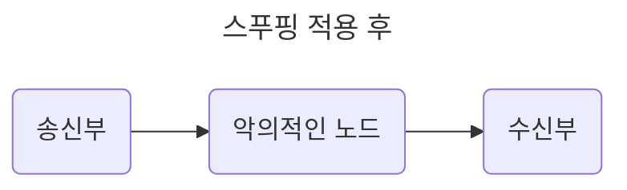
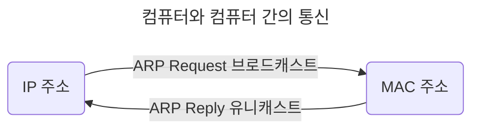
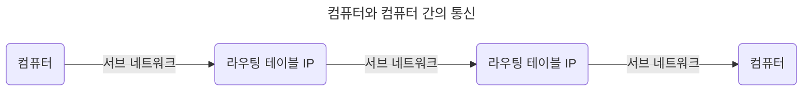
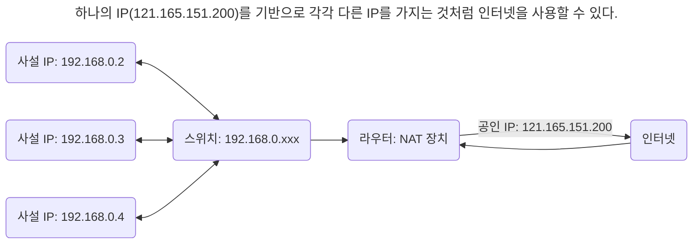

# 2장. 네트워크

- 컴퓨터 등 장치들이 통신 기술을 이용하여 구축하는 연결망

## 2.1 네트워크의 기초

- 노드와 링크가 서로 연결되어 있거나 연결되어 있지 않은 집합

|      |                                       |
| ---- | ------------------------------------- |
| node | 서버, 라우터, 스위치 등 네트워크 장치 |
| link | 유무선                                |

### 2.1.1 처리량과 지연 시간

- 좋은 네트워크? 많은 처리량 + 짧은 지연 시간 + 적은 장애 빈도 + 좋은 보안

#### 처리량(throughput)

- 링크를 통해 전달되는 단위 시간당 데이터 양
- 단위: bps(bits per second, 초당 전송/수신되는 비트 수)
- 사용자들이 많이 접속할 때마다 커지는 트래픽, 네트워크 장치 간의 대역폭, 네트워크 중간에 발생하는 에러, 장치의 하드웨어 스펙에 영향을 받는다.
  - 대역폭: 주어진 시간동안 네트워크 연결을 통해 흐를 수 있는 최대 비트 수

#### 지연 시간(latency)

- 요청이 처리되는 시간, 어떤 메시지가 두 장치 사이를 왕복하는 데 걸린 시간
- 매체 타입(무선, 유선), 패킷 크기, 라우터의 패킷 처리 시간에 영향을 받는다.

### 2.1.2 네트워크 토폴로지와 병목 현상

#### 네트워크 토폴로지(Network topology)

- 노드와 링크가 어떻게 배치되어 있는지에 대한 방식/연결 형태, 네트워크 구조
- 병목 현상을 찾을 때 중요한 기준이다.

##### 트리(계층형) 토폴로지

- 트리 형태로 배치한 네트워크 구성
- 노드 추가/삭제 용이, 특정 노드에 트래픽이 집중될 때 하위 노드에 영향이 간다.

##### 버스 토폴로지

- 중앙 통신 회선 하나에 여러 노드가 연결되어 공유하는 네트워크
- 근거리 통신망(LAN)에서 사용한다.
- 저렴한 설치 비용, 우수한 신뢰성, 중앙 통신 회선에 노드 추가/삭제 용이 vs 스푸핑(Spoofing)
  - 스푸핑: 스위칭 기능을 마비 또는 속여서 특정 노드에 해당 패킷이 오도록 처리한다.
    - 스위칭: LAN 상에서 송신부의 패킷을 송신과 관련없는 다른 호스트에게 가지 않도록 한다.



##### 스타(star) 토폴로지

- 중앙에 있는 노드에 모두 연결된 네트워크
- 노드 추가 용이, 쉬운 에러 탐지, 패킷의 충돌 발생 가능성 적음, 장애 노드가 중앙 노드가 아닐 경우, 다른 노드에 덜 영향 vs 중앙 노드에 장애 발생시 전체 사용 불가, 고가 설치 비용

##### 링형(ring) 토폴로지

- 각각의 노드가 양 옆의 두 노드와 연결: 전체적으로 고리형의 하나의 연속된 길을 통해 통신하는 망 구성 방식
- 데이터는 노드에서 노드로 이동, 각각의 노드는 고리 모양의 길을 통해 패킷을 처리한다.
- 노드 수가 증가해도 네트워크 상의 손실이 거의 없다, 충돌 발생 가능성 적음, 노드 고장 쉽게 발견 vs 어려운 네트워크 구성 변경, 회선에 장애 발생시 전체에 큰 영향

##### 메시(mesh, 망형) 토폴로지

- 그물망처럼 연결되어 있는 구조
- 한 단말 장치에 장애가 발생해도 여러 개의 경로가 존재하므로 네트워크 계속 사용 가능, 트래픽 분산 처리 가능 vs 어려운 노드 추가, 고가의 구축/운용 비용

#### 병목 현상(Bottleneck)

- 전체 시스템의 성능이나 용량이 하나의 구성 요소로 인해 제한받는 현상

### 2.1.3 네트워크 분류

| 분류                           | 정의                                               | 규모                |
| ------------------------------ | -------------------------------------------------- | ------------------- |
| LAN(Local Area Network)        | 근거리 통신망: 전송 속도 빠름, 혼잡하지 않다.      | 사무실 등 좁은 공간 |
| MAN(Metropolitan Area Network) | 대도시 지역 네트워크: 전송 속도 평균, LAN보다 혼잡 | 도시같은 넓은 지역  |
| WAN(Wide Area Network)         | 광역 네트워크: 전송 속도 느림, MAN보다 혼잡        | 국가 또는 대륙      |

### 2.1.4 네트워크 성능 분석 명령어

- 네트워크 병목 현상 주 원인: 네트워크 대역폭, 네트워크 토폴로지, 서버 CPU/메모리 사용량, 비효율적인 네트워크 구성

#### ping(Packet INternet Groper)

- 네트워크 상태를 확인하려는 대상 노드를 향해 일정 크기의 패킷을 전송하는 명령어
- 해당 노드의 패킷 수신 상태와 도달하기까지의 시간을 알 수 있다.
- 해당 노드까지 네트워크가 잘 연결되어있는지 확인할 수 있다.
- TCP/IP 프로토콜 중 ICMP 프로토콜을 통해 동작하므로 ICMP 프로토콜을 지원하지 않는 기기를 대상으로 테스트할 수 없다.
- 네트워크 정책상 ICMP나 traceroute를 차단하는 대상의 경우 ping 테스트는 불가하다.
- ping [IP 주소 또는 도메인 주소]로 실행한다.

## 2.2 TCP/IP 4계층 모델

## 2.3 네트워크 기기

## 2.4 IP 주소



- 브로드캐스트(Broadcast): 송신 호스트가 전송한 데이터가 네트워크에 연결된 모든 호스트에 전송

- 유니캐스트(Unicast): 고유 주소로 식별된 하나의 네트워크 목적지에 1:1로 데이터 전송

### 2.4.1 ARP

> IP 주소로부터 MAC 주소를 구하는 IP와 MAC 주소의 다리 역할을 하는 프로토콜

| ARP(Address Resolution Protocol)                                         | RARP(Reverse Address Resolution Protocol)                                |
| ------------------------------------------------------------------------ | ------------------------------------------------------------------------ |
| IP 주소(가상 주소, 논리적 주소) -> MAC 주소(실제 주소, 물리적 주소) 변환 | MAC 주소(실제 주소, 물리적 주소) -> IP 주소(가상 주소, 논리적 주소) 변환 |

### 2.4.2 홉바이홉 통신(Hop-by-hop transport)

> IP 주소를 통해 통신하는 과정: 통신망에서 각 패킷이 여러 개의 라우터를 건너간다(hop)



- 통신 장치에 있는 라우팅 테이블의 IP를 통해 시작 주소부터 시작하여 패킷이 최종 목적지까지 도달하는 통신.

#### 라우팅 테이블(Routing Table)

> 라우터에 들어가 있는 목적지 정보(게이트웨이)와 그 목적지로 가기 위한 방법(다음 라우터 정보)이 들어 있는 리스트

- 송신지에서 수신지까지 도달하기 위해 사용된다.

#### 게이트웨이(Gateway)

- 서로 다른 통신망, 프로토콜을 사용하는 네트워크 간의 통신을 가능하게 하는 컴퓨터나 소프트웨어(관문 역할)


- 서로 다른 네트워크상의 통신 프로토콜 변환: 인터넷에 접속하기 위해 수많은 게이트웨이를 거친다.

- 라우팅 테이블을 통해 확인할 수 있다: `netstat -r` (윈도우 기준)

### 2.4.3 IP 주소 체계

| IP   | 설명                                                                  |
| ---- | --------------------------------------------------------------------- |
| IPv4 | 32비트를 8비트 단위로 점을 찍어 표기 (123.45.67.78): 가장 많이 쓰인다 |
| IPv6 | 64비트를 16비트 단위로 점을 찍어 표기 (2001:db8:ff00:42:8329)         |

#### 클래스 기반 할당 방식(Classful Network Addressing)

> IP 주소 체계를 A, B, C, D, E 다섯 개의 클래스로 구분한다.

| 클래스(통신)   | 1번째 바이트        | 2번째 바이트                 | 3번째 바이트  | 4번째 바이트  |
| -------------- | ------------------- | ---------------------------- | ------------- | ------------- |
| A (일대일)     | 네트워크 주소       | _호스트 주소(컴퓨터에 부여)_ | _호스트 주소_ | _호스트 주소_ |
| B (일대일)     | 네트워크 주소       | 네트워크 주소                | _호스트 주소_ | _호스트 주소_ |
| C (일대일)     | 네트워크 주소       | 네트워크 주소                | 네트워크 주소 | _호스트 주소_ |
| D (멀티캐스트) | 브로드캐스트용 주소 |
| E (예비용)     | 예비용 주소         |

| 클래스 | 범위(10진수)                | 범위(2진수)                      |
| ------ | --------------------------- | -------------------------------- |
| A      | 0.0.0.0 - 127.255.255.255   | **0**00000000.~ - **0**1111111.~ |
| B      | 128.0.0.0 - 191.255.255.255 | **10**0000000.~ - **10**111111.~ |
| C      | 192.0.0.0 - 223.255.255.255 | **110**000000.~ - **110**11111.~ |

- 구분 비트: 맨 왼족에 있는 비트

- ex) 클래스 A로 42.0.0.0을 부여받았을 때

  | IP 주소                   | 역할                                                           |
  | ------------------------- | -------------------------------------------------------------- |
  | 42.0.0.0                  | 네트워크 구별 주소                                             |
  | 42.0.0.1 - 42.255.255.254 | 컴퓨터에 부여할 수 있는 호스트 주소                            |
  | 42.255.255.255            | 브로트캐스트용 주소(네트워크에 속한 모든 컴퓨터에 데이터 전송) |

- 사용하는 주소보다 버리는 주소가 더 많다 -> DHCP, IPv6, NAT

#### DHCP(Dynamic Host Configuration Protocol)

> IP 주소 및 기타 통신 매개변수를 자동으로 할당하기 위한 네트워크 관리 프로토콜

- 인터넷에 접속할 때마다 자동으로 IP 주소 할당한다.

- 라우터와 게이트웨이 장비 대부분에 존재하여 대부분의 가정용 네트워크에서 IP 주소를 할당한다.

#### NAT(Network Address Translation)

> 패킷이 라우터를 통해 전송되는 동안 패킷의 IP 정보를 수정, IP 주소를 다른 주소로 매핑한다.

- 공인, 사설 IP로 분리: 사설 IP를 공인 IP로, 공인 IP를 사설 IP로 변환한다.

- 여러 대의 호스트가 하나의 공인 IP를 사용하여 인터넷에 접속하기 위해 사용한다: 인터넷 공유기(ipTIME 등)

- 보안성: 내부 네트워크에서 사용하는 IP와 외부에서 보이는 IP 주소를 다르게 유지한다.

- 여러 명이 동시에 인터넷을 접속하므로 실제 접속하는 호스트 숫자에 따라 접속 속도가 느려질 수 있다.

- NAT가 가능한 소프트웨어: ISC, RRAS, Netfilter 등



### 2.4.4 IP 주소를 이용한 위치 정보

- IP 주소는 인터넷에서 사용하는 네트워크 주소이므로 동, 구까지 [위치 추적](https://mylocation.co.kr/)이 가능하다.

## 2.5 HTTP

- 전송 계층 위에 있는 애플리케이션 계층으로 웹 서비스 통신에 사용된다.

### 2.5.1 HTTP/1.0

> 한 연결 당 하나의 요청을 처리한다 -> Connection: Closed

#### RTT(Round-trip time) 증가

> 패킷 왕복 시간: 패킷이 목적지에 도달하고 나서 다시 출발지로 돌아오기까지 걸리는 시간

- RTD(Round-trip delay)

  - 서버로부터 파일을 가져올 때마다 TCP의 3-way handshake를 계속해서 열어야 한다.

  - TCP 연결 초기화 - 파일 요청, 파일 요청 - 전체 파일 수신까지 걸리는 시간 등

- 서버에 부담이 많이 가고, 사용자 응답 시간이 길어진다.

- RTT보다 포괄적인 Latency(네트워크 지연 시간): 네트워크 통신 지연 및 성능에 영향을 미치는 여러 요인들

#### RTT 증가를 해결하기 위한 방법

- Image Sprite: 많은 이미지가 합쳐 있는 하나의 이미지를 다운로드, `background-image` - `position`으로 이미지를 표시한다.

  

- 코드 압축: 개행 문자, 빈칸등을 없애서 코드의 크기를 최소화한다.

- 이미지 Base64 인코딩: 이미지 파일을 64진법으로 이루어진 문자열로 인코딩한다.

  - 서버에 HTTP 요청을 하지 않아도 되지만 Base64 문자열로 변환할 경우 [크기가 33 - 37% 정도 더 커진다.](https://en.wikipedia.org/wiki/Base64)

### 2.5.2 HTTP/1.1

> 한 번 TCP 초기화(3-way handshake)하면, keep-alive 옵션으로 여러 개의 파일 송수신 -> `Connection: Keep-Alive`

- 문서 안에 포함된, 요청할 다수의 리소스(이미지, 동영상, 파일 등) 갯수에 비례해 대기 시간이 길어진다.

#### HOL(Head Of Line) Blocking

> 네트워크 상에서 같은 큐에 있는 패킷이 첫 번째 패킷에 의해 지연될 때 발생하는 성능 저하 현상

- 첫번째 패킷이 느리게 받아진다면, 뒤에 있는 패킷은 대기하게 되면서 다운로드가 지연된다.

#### 무거운 헤더 구조

- 쿠키 등 많은 메타 데이터가 들어 있고 압축이 되지 않아 무겁다.

### 2.5.3 HTTP/2

> 멀티 플렉싱, 헤더 압축, 서버 푸시, 요청의 우선순위 처리를 지원하는 프로토콜.

- SPDY(SPeeDY) 프로토콜에서 파생된 HTTP/1.x보다 지연 시간을 줄이고 응답 시간을 더 빠르게 할 수 있다.

#### 멀티 플렉싱(Multi-Flexing)

> 여러 개의 스트림을 사용하여 송수신한다.

- 특정 스트림(stream, 데이터 흐름)의 패킷이 손실되어도 다른 스트림에는 영향을 주지 않는다.

- 병렬적인 스트림을 통해 애플리케이션에서 받아온 메시지를 독립된 프레임으로 조각/조립하여 데이터를 주고 받는다.
  - 단일 연결을 사용하여 병렬로 여러 요청/응답을 줄 수 있다.
  - HTTP/1.x의 문제인 HOL Blocking 문제 해결

#### 헤더 압축

- 허프만 코딩(Huffman coding) 압축 알고리즘(전체 데이터 표현에 필요한 비트 양을 줄인다)을 사용하는 HPACK 압축 형식을 가진다.

#### 서버푸시

> 클라이언트 요청 없이 서버가 바로 리소스를 푸시할 수 있다.

### 2.5.4 HTTPS

> 애플리케이션 계층과 전송 계층 사이에 신뢰 계층인 SSL/TLS 계층을 넣은, 신뢰할 수 있는 HTTP 요청(통신 암호화)

- HTTP/2는 HTTPS 위에서 동작한다.

#### SSL(Secure Socket Layer)/TLS(Transport Layer Security Protocol)

> 전송 계층에서 보안을 제공하는 프로토콜

- SSL 1.0, 2.0, 3.0, TLS 1.0, TLS 1.3으로 버전이 올라가며 보통 SSL/TLS로 부른다.

- 네트워크 상의 인터셉터(공격자가 사용자 정보를 가로채는 등)를 방지할 수 있다.

- handshake를 통해 보안 세션을 생성, 이를 기반으로 상태 정보를 공유하고 데이터를 암호화한다.

- 보안 세션이 만들어질 때 인증 메커니즘, 키 교환 암호화 알고리즘, 해싱 알고리즘이 사용된다.

##### 보안 세션

> 보안이 시작되고 끝나는 동안 유지되는 세션(session, OS가 사용자로부터 자신의 자산 이용을 허락하는 일정 기간).

- 단 한 번의 1-RTT(클라이언트 - 서버와 키 공유, 인증, 인증 확인)후 데이터를 송수신한다.

  1. 클라이언트에서 서버에 사이퍼 슈트(cypher suites) 전달

  2. 서버는 받은 사이퍼 슈트의 암호화 알고리즘 리스트틀 제공할 수 있는지 확인

  3. 제공할 수 있으면, 서버에서 클라이언트로 인증서를 보내는 인증 메커니즘이 시작한다.

  4. 이후 해싱 알고리즘 등으로 암호화된 데이터의 송수신이 시작된다.

- 사이퍼 슈트: 프로토콜(TLS), AEAD 사이퍼 모드(AES_128_GCM 등), 해싱 알고리즘(SHA256)이 나열된 규약

  - TLS_AES_128_GCM_SHA256, TLS_AES_256_GCM_SHA384, TLS_CHACHA20_POLY1305_SHA256, TLS_AES_128_CCM_SHA256, TLS_AES_128_CCM_8_SHA256

  - AEAD(Authenticated Encryption with Associated Data) 사이퍼 모드: 데이터 암호화 알고리즘

    - AES_128_GCM: 128비트의 키를 사용하는 표준 블록 암호화 기술 + 암호화 알고리즘 GCM(병렬 계산 용이)

##### 인증 메커니즘

> 인증 기관(CA, Certificate Authority)에서 발급한 인증서를 기반으로 이뤄진다.

- 인증서는 서비스 정보, 공개키, 지문, 디지털 서명 등으로 이루어져 있다.

- 안전한 연결을 위한 공개키(public key)룰 클라이언트에 제공, 사용자가 접속한 서버가 신뢰할 수 있는 서버임을 보장한다.

- CA는 신뢰성이 엄격하게 공인된 기업들(Comodo, GoDaddy, GlobalSign, Amazon 등)만 참여할 수 있다.

- CA에 자신의 사이트 정보와 공개키 제출 - CA는 지문(finger print, 공개키 해시 값)을 사용하는 CA의 비밀키 등을 기반으로 인증서를 발급한다.

##### 암호화 알고리즘

- Diffie-Hellman 방식을 토대로 만들어졌다.

| 키 교환 암호화 알고리즘                         | 설명          |
| ----------------------------------------------- | ------------- |
| ECDHE(Elliptic Curve Diffie-Hellman Ephermeral) | 대수곡선 기반 |
| DHE(Diffie-Hellman Ephermeral)                  | 모듈식 기반   |

- 디피-헬만 키 교환 (Diffie-Hellman key exchange) 암호화 알고리즘: 암호키 교환 방법

  - g와 x, p를 알면 y를 구하기 쉽지만 g와 y, p만 알면 x를 구하기 어렵다.

  ```
  y = g^x mod p
  ```

  - PSK(Pre-Shared Key, 공통 암호키) 생성: 처음에 공개 값(공개키) 공유 - 각자의 비밀 값(비밀키)과 혼합 - 혼합 값 공유 - 각자의 비밀 값과 다시 혼합

##### 해싱(Hashing) 알고리즘

> 데이터를 추정하기 힘들게 더 작고, 섞여있는 조각으로 만드는 알고리즘

- SSL/TLS: SHA-256, SHA-386 알고리즘을 사용한다.

- [SHA-256](https://md5calc.com/hash): 해시 함수의 결괏값이 256비트인 알고리즘, 전처리된 메시지를 기반으로 해시를 반환한다.

  - 해시(hash): 다양한 길이의 데이터를 고정된 길이의 데이터로 매핑(mapping)한 값.

  - 해시 함수: 임의의 데이터를 입력벋아 일정한 길이로 바꿔주는(hasing) 함수.

- 0-RTT

  - TLS 1.3은 사용자가 이전에 방문한 사이트로 다시 방문하면, SSL/TLS에서 보안 세션을 만들 때 걸리는 통신을 하지 않아도 된다(1-RTT 이미 수행)

#### SEO에도 도움이 되는 HTTPS

> 사이트 내 모든 요소가 동일하다면, HTTPS 서비스를 하는 사이트는 그렇지 않은 사이트보다 SEO 순위가 높을 것이다(Google 공식 발표)

- SEO(Search Engine Optimization): 검색엔진 최적화

  - 검색엔진으로 웹 사이트 검색시, 페이지 상단에 결과를 노출시켜 많은 사람들이 볼 수 있도록 최적화하는 방법(서비스 운영시 필수)

  | 방법             | 설명                                                                                                                |
  | ---------------- | ------------------------------------------------------------------------------------------------------------------- |
  | 캐노니컬 설정    | 사이트 링크에서 캐노니컬을 설정: `<link rel="canonical href="" />`                                                  |
  | 메타 설정        | html의 [meta 설정](https://hubspot.marketingmm.co.kr/seo-%EB%A9%94%ED%83%80%ED%83%9C%EA%B7%B8/)                     |
  | 페이지 속도 개선 | [페이지 인사이트](https://pagespeed.web.dev/): 페이지 속도 reporting                                                |
  | 사이트맵 관리    | 사이트맵 제너레이터를 사용하거나 직접 구현하여 sitemap.[xml](https://youtu.be/WXo4CDSvMUI?si=xpLg5kq0etgSXfGQ) 관리 |

#### HTTPS 구축 방법

- CA에서 구매한 인증키를 기반으로 구축한다.

- 서버 앞단의 HTTPS를 제공하는 로드밸런서나 CDN을 둔다.

### 2.5.5 HTTP/3

> UDP 기반으로 QUIC(Quick UDP Internet Connections) 계층에서 동작하는 HTTP, 멀티 플렉싱이 가능하다.

#### 초기 연결 설정 시 지연 시간 감소

- QUIC는 TCP를 사용하지 않는다: 통신 시작시, 3-way handshake 과정을 거치지 않는다.

- 첫 연결 설정에 1-RTT만 소요: 클라이언트가 서버에 신호를 한 번 주고 서버가 응답하면, 바로 본 통신을 시작할 수 있다.

- 순방향 오류 수정 매커니즘(FEC, Forword Error Correction) 적용: 전송한 패킷이 손실됐을 시 수신 측에서 에러를 검출하고 수정한다(낮은 패킷 손실률)

## 예상 질문

1. OSI 7 계층과 TCP/IP 4계층의 차이점은 무엇인가?

2. HTTP/2에 대해 전부 설명하시오.

3. 주소창에 www.google.com을 입력하면 어떻게 되는가?
