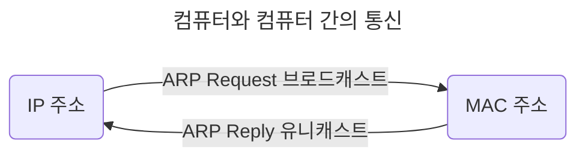

# 2장. 네트워크

## 2.1 네트워크의 기초

## 2.2 TCP/IP 4계층 모델

## 2.3 네트워크 기기

## 2.4 IP 주소

- 브로드캐스트(Broadcast): 송신 호스트가 전송한 데이터가 네트워크에 연결된 모든 호스트에 전송

- 유니캐스트(Unicast): 고유 주소로 식별된 하나의 네트워크 목적지에 1:1로 데이터 전송

### 2.4.1 ARP

> IP 주소로부터 MAC 주소를 구하는 IP와 MAC 주소의 다리 역할을 하는 프로토콜

| ARP(Address Resolution Protocol)                                         | RARP(Reverse Address Resolution Protocol)                                |
| ------------------------------------------------------------------------ | ------------------------------------------------------------------------ |
| IP 주소(가상 주소, 논리적 주소) -> MAC 주소(실제 주소, 물리적 주소) 변환 | MAC 주소(실제 주소, 물리적 주소) -> IP 주소(가상 주소, 논리적 주소) 변환 |

### 2.4.2 홉바이홉 통신(Hop-by-hop transport)

> IP 주소를 통해 통신하는 과정: 통신망에서 각 패킷이 여러 개의 라우터를 건너간다(hop)

## 2.5 HTTP
