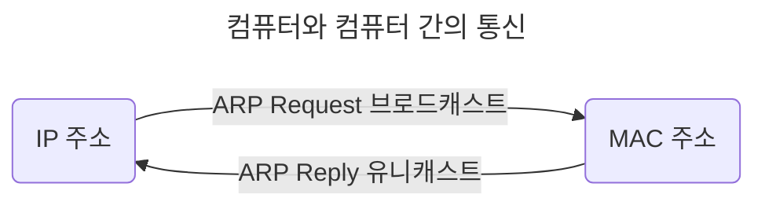
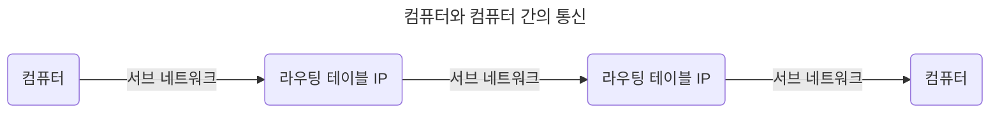

# 2장. 네트워크

## 2.1 네트워크의 기초

## 2.2 TCP/IP 4계층 모델

## 2.3 네트워크 기기

## 2.4 IP 주소

- 브로드캐스트(Broadcast): 송신 호스트가 전송한 데이터가 네트워크에 연결된 모든 호스트에 전송

- 유니캐스트(Unicast): 고유 주소로 식별된 하나의 네트워크 목적지에 1:1로 데이터 전송

### 2.4.1 ARP

> IP 주소로부터 MAC 주소를 구하는 IP와 MAC 주소의 다리 역할을 하는 프로토콜

| ARP(Address Resolution Protocol)                                         | RARP(Reverse Address Resolution Protocol)                                |
| ------------------------------------------------------------------------ | ------------------------------------------------------------------------ |
| IP 주소(가상 주소, 논리적 주소) -> MAC 주소(실제 주소, 물리적 주소) 변환 | MAC 주소(실제 주소, 물리적 주소) -> IP 주소(가상 주소, 논리적 주소) 변환 |

### 2.4.2 홉바이홉 통신(Hop-by-hop transport)

> IP 주소를 통해 통신하는 과정: 통신망에서 각 패킷이 여러 개의 라우터를 건너간다(hop)

- 통신 장치에 있는 '라우팅 테이블'의 IP를 통해 시작 주소부터 시작하여 패킷이 최종 목적지까지 도달하는 통신.

#### 라우팅 테이블(Routing Table)

> 라우터에 들어가 있는 목적지 정보(게이트웨이)와 그 목적지로 가기 위한 방법(다음 라우터 정보)이 들어 있는 리스트

- 송신지에서 수신지까지 도달하기 위해 사용된다.

#### 게이트웨이(Gateway)

- 서로 다른 통신망, 프로토콜을 사용하는 네트워크 간의 통신을 가능하게 하는 컴퓨터나 소프트웨어(관문 역할)

- 서로 다른 네트워크상의 통신 프로토콜 변환: 인터넷에 접속하기 위해 수많은 게이트웨이를 거친다.
- 라우팅 테이블을 통해 확인할 수 있다: `netstat -r` (윈도우 기준)

## 2.5 HTTP
