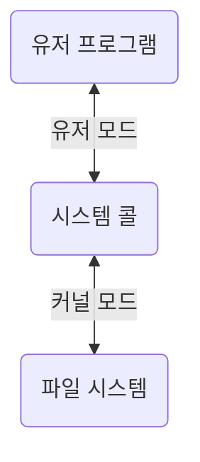
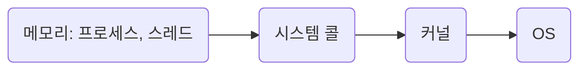
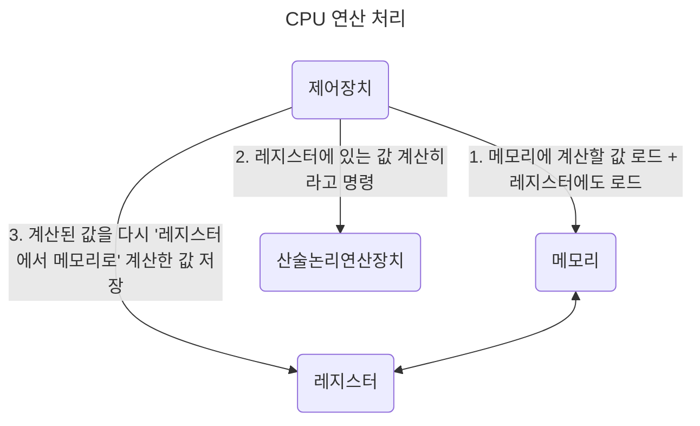
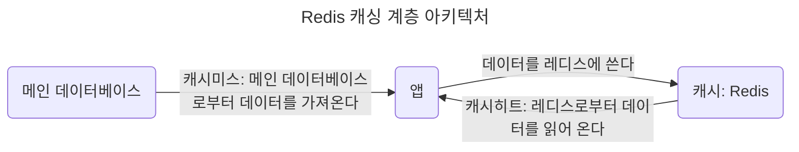

# 3장. 운영체제

## 3.1 운영체제와 컴퓨터

### 3.1.1 운영체제의 역할과 구조

#### 운영체제의 역할

- CPU 스케쥴링과 프로세스 관리: 어떤 프로세스에 CPU 소유권을 할당할지, 프로세스의 생성과 삭제, 자원 할당 및 반환 관리

- 메모리 관리: 한정된 메모리를 프로세스마다 얼마만큼 할당해야 하는지?

- 디스크 파일 관리: 디스크 파일을 어떻게 보관할지?

- I/O 디바이스 관리: 마우스, 키보드와 컴퓨터 간에 데이터를 주고받는 것을 관리

#### 운영체제의 구조

- 운영체제: GUI, System Call, Kernel, Driver

  - User Program

  - _GUI(Graphical User Interface)_: GUI 대신 CLI(Command-Line Interface)가 있는 리눅스 서버도 있다.

  - _System Call_

  - _Kernel_

  - _Driver_: 하드웨어를 제어하기 위한 소프트웨어

  - Hardware

##### 시스템콜

> 운영체제가 커널에 접근하기 위한 인터페이스

- 유저 프로그램이 운영체제의 서비스를 받기 위해 커널 함수를 호출할 때 사용한다.

  1. 유저 프로그램이 I/O 요청으로 트랩(trap) 발동

  2. 올바른 I/O 요청인지 확인

  3. 유저 모드가 시스템콜을 통해 커널 모드로 변환되어 실행

- 유저모드에서 파일을 읽지 않고 커널 모드로 들어간다.

- 파일을 읽고 다시 유저 모드로 돌아간다.

- 그 뒤에 있는 유저 프로그램의 로직을 수행한다.

- 컴퓨터 자원에 대한 직접 접근을 차단하고 다른 프로그램으로부터 보호할 수 있다.

- 시스템콜은 하나의 추상화 계층이다: 낮은 단계의 영역 처리(네트워크 통신, 데이터베이스 등)를 덜 신경쓰면서 프로그램을 구현할 수 있다.

- modebit: 1 또는 0의 값을 가지는 플래그(flag) 변수

  - I/O 디바이스는 운영체제를 통해서만 동작한다: 사용자가 의도한 동작만 수행한다.

| 모드      | 정의                                                        | modebit |
| --------- | ----------------------------------------------------------- | ------- |
| 유저 모드 | 유저의 접근 영역 제한: 컴퓨터 자원에 함부로 침범하지 못한다 | 1       |
| 커널 모드 | 모든 컴퓨터 자원에 접근할 수 있다                           | 0       |

- 커널: 운영체제의 핵심 부분이자 시스템콜 인터페이스를 제공한다. -> 운영체제의 중추적인 역할(관리자 역할)

### 3.1.2 컴퓨터의 요소

#### CPU(Central Processing Unit)

- 산술논리연산장치, 제어장치, 레저스터로 구성되어있는 컴퓨터 장치

- 인터럽트에 의해 단순히 메모리에 존재하는 명령어를 해석해서 실행한다.

- 커널이 메모리에 프로그램을 올려 프로세스로 만들면 이를 CPU가 처리한다.

##### 제어장치(CU, Control Unit)

- 프로세스 조작을 지시한다.

- 입출력장치 간 통신 제어, 명령어를 읽고 해석, 데이터 처리를 위한 순서 결정

##### 레지스터(Register)

- CPU 안에 있는 임시기억장치

- CPU와 직접 연결되어 있어 연산 속도가 메모리보다 훨씬 빠르다.

- CPU는 자체적으로 데이터를 저장할 방법이 없으므로 레지스터를 거쳐 데이터를 전달한다.

##### 산술논리연산장치(ALU, Arithmetic Logic Unit)

- 산술 연산(덧셈, 뺄셈)과 배타적 논리합, 논리곱 같은 논리 연산을 계산하는 디지털 회로

##### 인터럽트

- 어떤 신호가 들어왔을 때 CPU를 잠깐 정지시키는 것

  - 키보드, 마우스 등 IO 디바이스로 인한 인터럽트

  - 0으로 숫자를 나누는 산술 연산에서의 인터럽트

  - 프로세스 오류

- 인터럽트 발생: 인터럽트 핸들러 함수가 모여있는 인터럽트 벡터로 가서 인터럽트 함수가 실행된다 - 인터럽트 간에는 우선순위가 있어 우선 순위에 따라 실행된다.

  - 인터럽트 핸들러 함수: 인터럽트가 발생했을 때 이를 핸들링하기 위한 함수.

    - 커널 내부의 IRQ를 통해 호출 - request_irq()를 통해 해당 함수를 등록한다.

| 종류                      |                                           |
| ------------------------- | ----------------------------------------- |
| 하드웨어 인터럽트         | IO 디바이스에서 발생한다.                 |
| 소프트웨어 인터럽트(Trap) | 프로세스가 시스템콜을 호출할 때 발동한다. |

#### DMA(Direct Memory Access) 컨트롤러

- I/O 디바이스가 메모리에 직접 접근할 수 있도록 하는 하드웨어 장치.

- CPU의 일을 부담하는 보조 일꾼: CPU에만 너무 많은 인터럽트 요청이 들어오기 때문에 CPU 부하를 막아준다.

- 하나의 작업을 CPU와 DMA 컨트롤러가 동시에 하는 것을 방지한다.

#### 메모리(memory)

- 전자회로에서 데이터나 상태, 명령어등을 기록하는 장치 -> RAM(Random Access Memory)을 일컫는다.

- CPU가 계산을 담당(일꾼)하고 메모리는 기억을 담당(작업장)한다. -> 메모리가 클수록 많은 일을 동시에 할 수 있다.

#### 타이머(timer)

- 시간이 많이 걸리는 프로그램이 작동할 때 제한을 걸기 위해 존재한다.

#### 디바이스 컨트롤러(device controller)

- 컴퓨터와 연결되어 있는 IO 디바이스들의 작은 CPU.

## 3.2 메모리

- CPU는 메모리에 올라와 있는 프로그램의 명령어를 실행한다.

### 3.1.2 메모리 계층

- 계층이 존재하는 이유: 경제성, 캐시(16GB RAM이 16GB SSD보다 비싸다)

| 메모리 계층            | 정의                                   | 속도   | 용량 | 가격   |
| ---------------------- | -------------------------------------- | ------ | ---- | ------ |
| 레지스터               | CPU 안에 있는 작은 메모리로 휘발성이다 | 빠르다 | 적다 | 비싸다 |
| 캐시(L1, L2)           | 휘발성이다                             |        |      |        |
| 주기억장치(RAM)        | 휘발성이다                             |        |      |
| 보조기억장치(HDD, SSD) | 휘발성이다                             | 느리다 | 많다 |        |

- RAM: 하드디스크로부터 일정량의 데이터를 복사해서 임시 저장하고 이를 필요할 때마다 CPU에 빠르게 전달한다.

- 보조기억 장치: HDD(Hard Disk Drive), SSD(Solid State Drive)

- 로딩 중: 하드디스크 또는 인터넷에서 데이터를 읽어 RAM으로 전송하는 과정이 아직 끝나지 않았다.

#### 캐시(Cache)

- 데이터를 미리 복사해 놓은 임시 저장소, 속도 차가 있는 장치 사이에서 속도 차이에 따른 병목 현상을 줄이기 위한 메모리

  - 메모리 - CPU 사이의 속도차가 너무 크므로 중간에 레지스터 계층(캐싱 계층)을 두어서 속도 차이를 해결한다.

  - 캐시 메모리 - 보조기억장치 사이에 있는 주기억장치 = 보조기억장치의 캐싱 계층

- 데이터를 접근하는 시간이 오래 걸리는 경우를 해결, 무언가를 다시 계산하는 시간을 절약한다.

##### 지역성의 원리

- 캐시를 직접 설정하려고 한다면? 자주 사용하는 데이터 기반(지역성)으로

| 종류                           | 설명                                                                |
| ------------------------------ | ------------------------------------------------------------------- |
| 시간 지역성(temporal locality) | 최근 사용한 데이터에 다시 접근한다                                  |
| 공간 지역성(spatial locality)  | 최근 접근한 데이터를 이루고 있는 공간이나 그 가까운 공간에 접근한다 |

#### 캐시히트와 캐시미스

- 캐시히트: 캐시에서 원하는 데이터를 찾았다. -> 해당 데이터를 제어장치를 거쳐 가져온다: 가까운 위치에 CPU 내부 버스 기반으로 작동하므로 빠르다.

- 캐시미스: 해당 데이터에 캐시가 없어 주메모리에 가서 데이터를 찾아온다. -> 시스템 버스를 기반으로 작동하므로 느리다.

#### 캐시매핑

- 캐시가 히트되기 위해 매핑하는 방법 -> CPU의 레지스터와 주 메모리(RAM) 간에 데이터를 주고받을 떄를 기반으로 설명한다.

- 레지스터는 주 메모리에 비해 상당히 작고, 주 메모리는 상당히 크다 -> 매핑을 어떻게 하는지가 중요하다.

| 종류                                    | 설명                                                                                              |
| --------------------------------------- | ------------------------------------------------------------------------------------------------- |
| 직접 매핑(directed mapping)             | 순서대로 매핑하여 처리가 빠르지만 충돌이 잦다                                                     |
| 연관 매핑(associative mapping)          | 순서가 아닌 관련 있는 캐시와 메모리를 매핑하여 충돌이 적지만 모든 블록을 탐색하므로 속도가 느리다 |
| 집합 연관 매핑(set associative mapping) | 직접 매핑 + 연관 매핑으로 검색에 효율적이다                                                       |

#### 웹 브라우저의 캐시

- 사용자의 커스텀한 정보나 인증 모듈 관련한 사항을 웹 브라우저에 저장한다.

- 서버에 요청할 때 자신의 나타내는 identity나 중복 요청 방지를 위해 쓰인다.

| 종류          | 설명                                                                                                                                                                                                                                                    |
| ------------- | ------------------------------------------------------------------------------------------------------------------------------------------------------------------------------------------------------------------------------------------------------- |
| 쿠키          | 만료기한이 있는 키-값 저장소 4KB까지 데이터를 저장할 수 있고 만료기한을 정할 수 있다 httponly 옵션을 거는 것이 중요하다(document.cookie로 쿠키를 볼 수 있음) 클라이언트, 서버에서 만료기한 등을 정할 수 있지만 보통 서버에서 만료기한을 정한다 |
| 로컬 스토리지 | 만료기한이 없는 키-값 저장소 10MB까지 저장할 수 있고 웹 브라우저를 닫아도 유지된다 도메인 단위로 저장, 생성된다 HTML5를 지원하지 않는 웹 브라우저에서는 사용할 수 없고 클라이언트에서만 수정 가능하다                                          |
| 세션 스토리지 | 만료 기한이 없는 키-값 저장소 탭 단위로 세션 스토리지를 생성하고 탭을 닫을 때 해당 데이터가 삭제된다 5MB까지 저장이 가능하고 HTML5를 지원하지 않는 웹 브라우저에서는 사용할 수 없다 클라이언트에서만 수정 가능하다                             |

#### 데이터베이스의 캐싱 계층

- 메인 데이터베이스 위에 레디스(Redis) 데이터베이스 계층을 '캐싱 계층'으로 두어 성능을 향상시킨다.

### 메모리 관리

#### 가상 메모리(virtual memory)

- 컴퓨터가 실제로 이용 가능한 메모리 자원을 추상화하여 이를 사용하는 사용자에게 매우 큰 메모리로 보이게 만드는 것

- 가상 메모리에는 가상 주소와 실제 주소가 매핑되어 있다.

  - 가상 주소(virtual address): 가상적으로 주어진 주소 -> 메모리관리장치(MMU, Memory Management Unit)에 의해 실제 주소로 변환된다 -> 사용자는 실제 주소를 의식할 필요없이 프로그램을 구축한다.

  - 실제 주소(physical address): 실제 메모리상에 있는 주소

- 프로세스의 주소 정보가 들어있는 '페이지 테이블'로 관리된다.

- 속도 향상을 위해 TLB(Translation Lookaside Buffer)를 사용한다.

  - 메모리와 CPU 사이에 있는 주소 변환을 위한 캐시

  - 페이지 테이블에 있는 리스트를 보관하며 CPU가 페이지 테이블까지 가지 않도록 해 속도를 향상시킬 수 있는 캐시 계층

#### 스와핑(swapping)

- 당장 사용하지 않는 영역을 하드디스크로 옮긴다 -> 필요할 때 다시 RAM으로 불러와 올리면서 RAM을 효과적으로 관리하는 것

- 페이지 폴트를 방지한다.

#### 페이지 폴트(Page fault)

- 프로세스의 주소 공간(가상 메모리)에 존재하지만 실제 메모리(RAM)에는 없는 데이터에 접근하는 경우에 발생한다.

- 페이지 폴트와 스와핑 과정

  1. CPU는 물리 메모리를 확인하여 해당 페이지가 없으면 트랩을 발생해서 OS에 알린다.

  2. OS는 CPU의 동작을 잠시 멈춘다.

  3. OS는 페이지 테이블을 확인하여 가상 메모리에 페이지가 존재하는지 확인한다. 없으면 프로세스를 중단 - 현재 물리 메모리에 비어있는 프레임이 찾는다. - 물리 메모리에도 없으면 스와핑이 발동된다.

  4. 비어있는 프레임에 해당 페이지를 로드하고 페이지 테이블을 최신화한다.

  5. 중단되었던 CPU를 다시 시작한다.

- 페이지(Page): 가상 메모리를 사용하는 최소 크기 단위

- 프레임(Frame): 실제 메모리에 사용하는 최소 크기 단위

### 스레싱(thrashing)

- 메모리의 페이지 폴트율이 높다 -> 컴퓨터의 심각한 성능 저하 초래

- 메모리에 너무 많은 프로세스가 동시에 올라가게 되면 스와핑이 많이 일어나서 발생한다.

  - 페이지 폴트가 일어나면 CPU 이용률이 낮아진다.

  - OS는 CPU 이용률이 낮은 것을 보고 가용성을 더 높이기 위해 더 많은 프로세스를 메모리에 올린다.

  - 이와 같은 악순환이 반복되면서 스레싱이 일어난다.

- 메모리를 늘리거나 HDD를 사용하면 SSD로 바꾸는 방법이 있다.

- 운영체제에서는 작업 세트(working set)와 PFF(Page Fault Frequency)를 통해 해결할 수 있다.

|           |                                                                                                                                            |
| --------- | ------------------------------------------------------------------------------------------------------------------------------------------ |
| 작업 세트 | 프로세스의 과거 사용 이력(지역성, locality)으로 결정된 페이지 집합을 만들어 미리 메모리에 로드 -> 탐색에 드는 비용과 스와핑을 줄일 수 있다 |
| PFF       | 페이지 폴트 빈도를 조절해 상한선과 하한선을 만든다 -> 상한선에 도달하면 페이지를 늘리고, 하한선에 도달하면 페이지를 줄인다                 |

### 메모리 할당

- 시작 메모리 위치, 메모리의 할당 크기를 기반으로 메모리에 프로그램을 할당한다.

#### 연속 할당

- 메모리에 연속적(순차적)으로 공간을 할당한다.

| 종류                                          | 정의                                               | 문제점      |
| --------------------------------------------- | -------------------------------------------------- | ----------- |
| 고정 분할 방식(fixed partition allocation)    | 메모리를 미리 나누어 관리 -> 융통성이 없다         | 내부 단편화 |
| 가변 분할 방식(variable partition allocation) | 프로그램의 크기에 맞게 동적으로 메모리를 나눠 사용 | 외부 단편화 |

- 내부 단편화(internal fragmentation): 메모리를 나눈 크기보다 프로그램이 작아서 들어가지 못하는 공간이 많다

- 외부 단편화(external fragmentation): 메모리를 나눈 크기보다 프로그램이 커서 들어가지 못하는 공간이 많다

  - 100MB를 55MB, 45MB로 나눴지만 프로그램의 크기가 70MB일 때 들어가지 못하는 경우

- 가변 분할 방식 종류

  |                      |                                                        |
  | -------------------- | ------------------------------------------------------ |
  | 최초 적합(first fit) | 위/아래쪽부터 시작해서 홀을 찾으면 바로 할당한다       |
  | 최적 적합(best fit)  | 프로세스 크기 이상인 공간 중 가장 작은 홀부터 할당한다 |
  | 최악 적합(worst fit) | 프로세스의 크기와 가장 많이 차이가 나는 홀에 할당한다. |

  - 홀(hole): 할당할 수 있는 비어 있는 메모리 공간

#### 불연속 할당

- 메모리를 연속적으로 할당하지 않는다.

- 현대 OS에서는 페이징 기법을 사용한다: 메모리를 동일한 크기의 페이지(보통 4KB)로 나누고 프로그램마다 페이지 테이블을 두어 이를 통해 메모리에 프로그램을 할당한다.

##### 페이징(paging)

- 동일한 크기의 페이지 단위로 나누어 메모리의 서로 다른 위치에 프로세스를 할당한다.

- 홀의 크기가 균일하지 않은 문제는 해결되지만 주소 변환이 복잡해진다.

##### 세그멘테이션(segmentation)

- 페이지 단위가 아닌 의미 단위인 세그먼트(segment)로 나눈다.

- 프로세스는 코드, 데이터, 스택, 힙 등으로 이루어지는데, 코드와 데이터 등 이를 기반으로 나눌 수도 있고 함수 단위로도 나눌 수 있다.

- 공유와 보안 측면에서 좋으며 홀 크기가 균일하지 않은 문제가 발생한다.

##### 페이지드 세그멘테이션(paged segmentation)

- 공유나 보안을 의미 단위의 세그먼트로 나누고, 물리적 메모리는 페이지로 나눈다.

#### 페이지 교체 알고리즘

- 메모리는 한정되어 있기 때문에 스와핑이 많이 일어난다.

- 스와핑은 많이 일어나지 않도록 설계되어야 한다 -> 페이지 교체 알고리즘을 기반으로 스와핑이 일어난다.

##### 오프라인 알고리즘(Offline Algorithm)

- 먼 미래에 참조되는 페이지와 현재 할당하는 페이지를 바꾸는 알고리즘

- 미래에 사용되는 프로세스를 알 수 없기 때문에 사용할 수 없지만, 다른 알고리즘과의 성능 비교에 대한 기준을 제공한다.

|                            |                                                             |
| -------------------------- | ----------------------------------------------------------- |
| FIFO(First In First Out)   | 가장 먼저 온 페이지를 교체 영역에 가장 먼저 놓는다          |
| LRU(Least Recently Used)   | 참조가 가장 오래된 페이지를 바꾼다                          |
| NUR(Not Used Recently)     | LRU에서 발전, clock 알고리즘                                |
| LFU(Least Frequently Used) | 가장 참조 횟수가 적은, 많이 사용되지 않은 페이지를 교체한다 |

- LRU: 오래된 것을 파악하기 위해 각 페이지마다 계수기, 스택을 두어야 한다.

  - 보통 해시 테이블(이중 연결 리스트에서 빠르게 찾는다)과 이중 연결 리스트(한정된 메모리)로 구현한다.

- NUR: 0(참조되지 않음)과 1(최근에 참조되었음)을 가진 비트를 두고 시계 방향을 돌면서 0을 찾고 이를 해당 프로세스를 교체하고 해당 부분을 1로 바꾸는 알고리즘이다.
