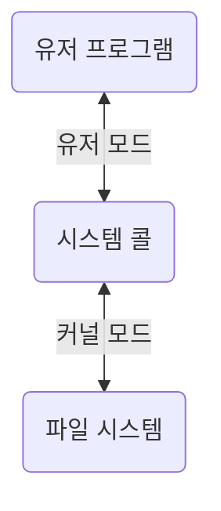
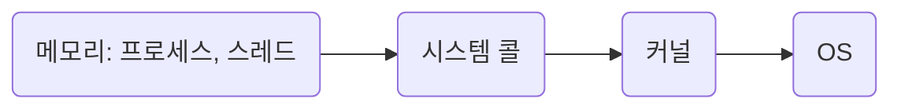
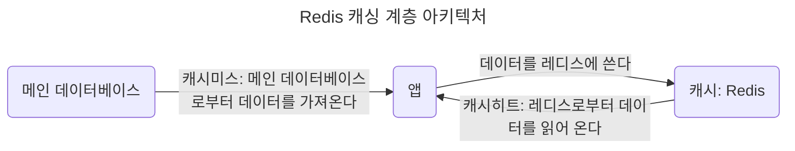
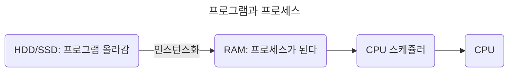
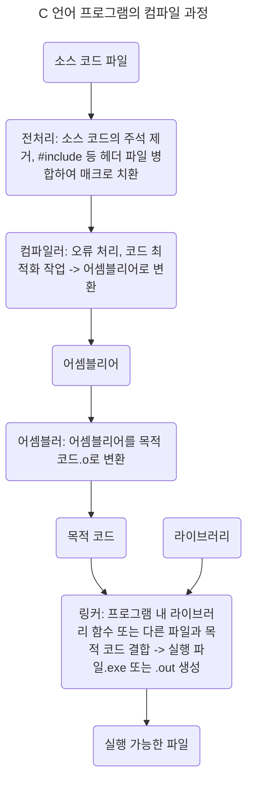
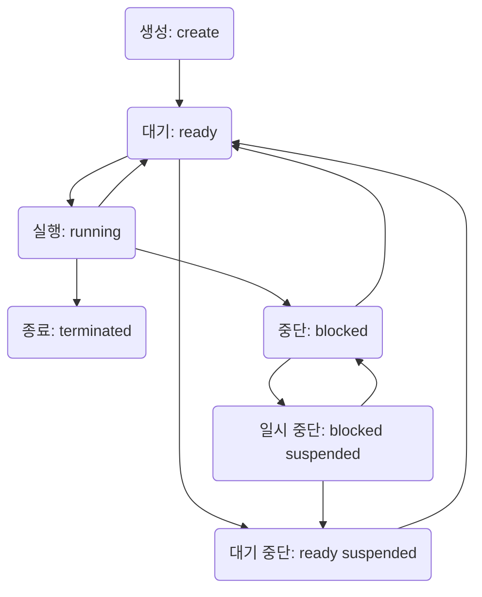
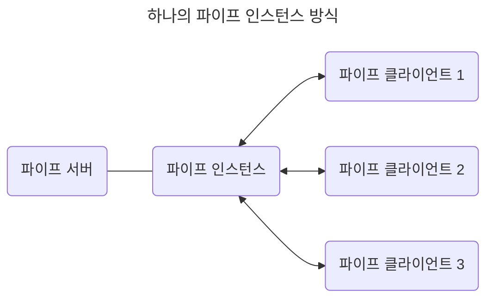
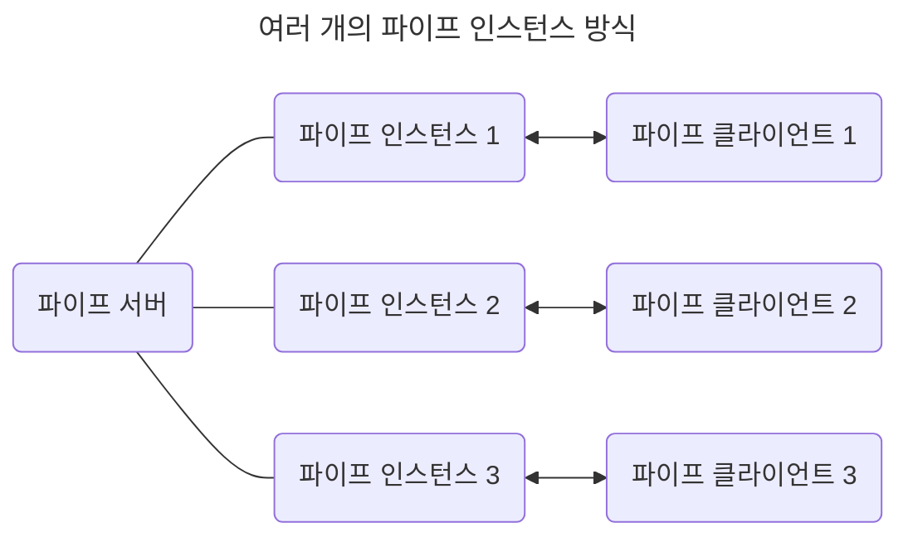

# 3장. 운영체제

## 3.1 운영체제와 컴퓨터

### 3.1.1 운영체제의 역할과 구조

#### 운영체제의 역할

- CPU 스케쥴링과 프로세스 관리: 어떤 프로세스에 CPU 소유권을 할당할지, 프로세스의 생성과 삭제, 자원 할당 및 반환 관리

- 메모리 관리: 한정된 메모리를 프로세스마다 얼마만큼 할당해야 하는지?

- 디스크 파일 관리: 디스크 파일을 어떻게 보관할지?

- I/O 디바이스 관리: 마우스, 키보드와 컴퓨터 간에 데이터를 주고받는 것을 관리

#### 운영체제의 구조

- 운영체제: GUI, System Call, Kernel, Driver

  - User Program

  - _GUI(Graphical User Interface)_: GUI 대신 CLI(Command-Line Interface)가 있는 리눅스 서버도 있다.

  - _System Call_

  - _Kernel_

  - _Driver_: 하드웨어를 제어하기 위한 소프트웨어

  - Hardware

##### 시스템콜

> 운영체제가 커널에 접근하기 위한 인터페이스

- 유저 프로그램이 운영체제의 서비스를 받기 위해 커널 함수를 호출할 때 사용한다.

  1. 유저 프로그램이 I/O 요청으로 트랩(trap) 발동

  2. 올바른 I/O 요청인지 확인

  3. 유저 모드가 시스템콜을 통해 커널 모드로 변환되어 실행

- 유저모드에서 파일을 읽지 않고 커널 모드로 들어간다.

- 파일을 읽고 다시 유저 모드로 돌아간다.

- 그 뒤에 있는 유저 프로그램의 로직을 수행한다.

- 컴퓨터 자원에 대한 직접 접근을 차단하고 다른 프로그램으로부터 보호할 수 있다.

- 시스템콜은 하나의 추상화 계층이다: 낮은 단계의 영역 처리(네트워크 통신, 데이터베이스 등)를 덜 신경쓰면서 프로그램을 구현할 수 있다.

- modebit: 1 또는 0의 값을 가지는 플래그(flag) 변수

  - I/O 디바이스는 운영체제를 통해서만 동작한다: 사용자가 의도한 동작만 수행한다.

| 모드      | 정의                                                        | modebit |
| --------- | ----------------------------------------------------------- | ------- |
| 유저 모드 | 유저의 접근 영역 제한: 컴퓨터 자원에 함부로 침범하지 못한다 | 1       |
| 커널 모드 | 모든 컴퓨터 자원에 접근할 수 있다                           | 0       |

- 커널: 운영체제의 핵심 부분이자 시스템콜 인터페이스를 제공한다. -> 운영체제의 중추적인 역할(관리자 역할)

### 3.1.2 컴퓨터의 요소

#### CPU(Central Processing Unit)

- 산술논리연산장치, 제어장치, 레저스터로 구성되어있는 컴퓨터 장치

- 인터럽트에 의해 단순히 메모리에 존재하는 명령어를 해석해서 실행한다.

- 커널이 메모리에 프로그램을 올려 프로세스로 만들면 이를 CPU가 처리한다.

##### 제어장치(CU, Control Unit)

- 프로세스 조작을 지시한다.

- 입출력장치 간 통신 제어, 명령어를 읽고 해석, 데이터 처리를 위한 순서 결정

##### 레지스터(Register)

- CPU 안에 있는 임시기억장치

- CPU와 직접 연결되어 있어 연산 속도가 메모리보다 훨씬 빠르다.

- CPU는 자체적으로 데이터를 저장할 방법이 없으므로 레지스터를 거쳐 데이터를 전달한다.

##### 산술논리연산장치(ALU, Arithmetic Logic Unit)

- 산술 연산(덧셈, 뺄셈)과 배타적 논리합, 논리곱 같은 논리 연산을 계산하는 디지털 회로

##### 인터럽트

- 어떤 신호가 들어왔을 때 CPU를 잠깐 정지시키는 것

  - IO 디바이스(키보드, 마우스)로 인한 인터럽트

  - 산술 연산에서 인터럽트: 0으로 숫자 나누기

  - 프로세스 오류

- 인터럽트 발생 시: 인터럽트 핸들러 함수가 모여있는 인터럽트 벡터로 가서 인터럽트 함수 실행 - 인터럽트 우선 순위에 따라 실행

  - 인터럽트 핸들러 함수: 인터럽트가 발생했을 때 이를 핸들링하기 위한 함수.

    - 커널 내부의 IRQ(Interrupt Request)를 통해 호출 - `request_irq()`를 통해 해당 함수를 등록한다.

| 종류                      |                                           |
| ------------------------- | ----------------------------------------- |
| 하드웨어 인터럽트         | IO 디바이스에서 발생한다.                 |
| 소프트웨어 인터럽트(Trap) | 프로세스가 시스템콜을 호출할 때 발동한다. |

#### DMA(Direct Memory Access) 컨트롤러

- I/O 디바이스가 메모리에 직접 접근할 수 있도록 하는 하드웨어 장치.

- CPU의 일을 부담하는 보조 일꾼: CPU에만 너무 많은 인터럽트 요청이 들어오기 때문에 CPU 부하를 막아준다.

- 하나의 작업을 CPU와 DMA 컨트롤러가 동시에 하는 것을 방지한다.

#### 메모리(memory)

- 전자회로에서 데이터나 상태, 명령어등을 기록하는 장치: RAM(Random Access Memory)

- CPU : 메모리 = 계산(일꾼) : 기억(작업장)

- 메모리가 클수록 많은 일을 동시에 할 수 있다.

#### 타이머(timer)

- 시간이 많이 걸리는 프로그램이 작동할 때 제한을 걸기 위해 존재한다.

#### 디바이스 컨트롤러(device controller)

- 컴퓨터와 연결되어 있는 IO 디바이스들의 작은 CPU.

## 3.2 메모리

- CPU는 메모리에 올라와 있는 프로그램의 명령어를 실행한다.

### 3.1.2 메모리 계층

- 계층이 존재하는 이유? 캐시, 경제성(16GB RAM이 16GB SSD보다 비싸다)

| 메모리 계층     | 특징                                           | 휘발성 | 속도   | 용량 | 가격   |
| --------------- | ---------------------------------------------- | ------ | ------ | ---- | ------ |
| 레지스터        | CPU 안에 있는 작은 메모리                      | 휘발성 | 빠르다 | 적다 | 비싸다 |
| 캐시(L1, L2)    |                                                | 휘발성 |        |      |        |
| 주기억장치(RAM) | HDD의 일부 데이터 임시 저장, 필요시 CPU에 전달 | 휘발성 |        |      |
| 보조기억장치    | HDD(Hard Disk Drive), SSD(Solid State Drive)   | 휘발성 | 느리다 | 많다 |        |

- 로딩 중: 하드디스크 또는 인터넷에서 데이터를 읽어 RAM으로 전송하는 과정이 아직 끝나지 않았다.

#### 캐시(Cache)

- 데이터를 미리 복사해 놓은 임시 저장소: 속도 차가 있는 장치 사이에서 병목 현상을 줄이기 위한 메모리

  - 메모리 - CPU 사이의 속도차가 너무 크므로 중간에 레지스터 계층(캐싱 계층)을 두어서 속도 차이를 해결한다.

  - 주기억장치: 보조기억장치의 캐싱 계층(캐시 메모리 - 보조기억장치 사이에 존재)

- 데이터를 접근하는 시간이 오래 걸리는 경우 해결, 무언가를 다시 계산하는 시간을 절약한다.

##### 지역성의 원리

- 캐시를 직접 설정하고 싶다? 자주 사용하는 데이터 기반(지역성)으로

| 종류                           | 설명                                                       |
| ------------------------------ | ---------------------------------------------------------- |
| 시간 지역성(temporal locality) | 최근 사용한 데이터에 다시 접근                             |
| 공간 지역성(spatial locality)  | 최근 접근한 데이터를 이루는 공간이나 그 가까운 공간에 접근 |

#### 캐시히트와 캐시미스

| 캐시히트                                 | 캐시미스                          |
| ---------------------------------------- | --------------------------------- |
| 캐시에서 원하는 데이터를 찾았을 경우     | 해당 데이터에 캐시가 없는 경우    |
| 해당 데이터를 제어장치를 거쳐 가져온다   | 주메모리에 가서 데이터를 찾아온다 |
| 가까운 위치에 CPU 내부 버스 기반: 빠르다 | 시스템 버스 기반: 느리다          |

#### 캐시매핑

- 캐시가 히트되기 위해 매핑하는 방법

  > CPU의 레지스터와 주 메모리(RAM) 간에 데이터를 주고받을 떄를 기반으로 설명한다.

- 레지스터는 주 메모리에 비해 상당히 작고, 주 메모리는 상당히 크다: 매핑을 어떻게 하는지가 중요하다.

| 종류                                  | 정의                         | 장점          | 단점                      |
| ------------------------------------- | ---------------------------- | ------------- | ------------------------- |
| 직접 매핑(directed mapping)           | 순서대로 매핑                | 빠른 처리     | 잦은 충돌                 |
| 연관 매핑(associative mapping)        | 관련 있는 캐시 - 메모리 매핑 | 적은 충돌     | 느린 속도(모든 블록 탐색) |
| 집합 연관 매핑(set associativeapping) | 직접 매핑 + 연관 매핑        | 효율적인 검색 |                           |

#### 웹 브라우저의 캐시

- 사용자의 커스텀한 정보나 인증 모듈 관련한 사항을 웹 브라우저에 저장한다.

- 서버에 요청할 때 자신의 나타내는 identity나 중복 요청 방지를 위해 쓰인다.

| 종류          | 설명                                                                                                                                                                                                               |
| ------------- | ------------------------------------------------------------------------------------------------------------------------------------------------------------------------------------------------------------------ |
| 쿠키          | 만료기한이 있는 키-값 저장소 4KB까지 데이터 저장 + 만료기한 설정 가능 httponly 옵션 거는 것이 중요하다(document.cookie로 쿠키를 볼 수 있음) 클라이언트, 서버에서 만료기한 등설정 가능: 보통 서버에서 정함 |
| 로컬 스토리지 | 만료기한이 없는 키-값 저장소 10MB까지 저장 + 웹 브라우저 닫아도 유지 도메인 단위로 저장, 생성 HTML5를 지원하지 않는 웹 브라우저에서는 사용 불가 + 클라이언트에서만 수정 가능                              |
| 세션 스토리지 | 만료 기한이 없는 키-값 저장소 5MB까지 저장 탭 단위로 세션 스토리지 생성 + 탭 닫을 때 해당 데이터 삭제 HTML5를 지원하지 않는 웹 브라우저에서는 사용 불가 + 클라이언트에서만 수정 가능                      |

#### 데이터베이스의 캐싱 계층

- 메인 데이터베이스 위에 레디스(Redis) 데이터베이스 계층을 '캐싱 계층'으로: 성능 향상

### 메모리 관리

#### 가상 메모리(virtual memory)

- 컴퓨터가 실제로 이용 가능한 메모리 자원을 추상화, 사용자에게 매우 큰 메모리로 보이게 만든다

- 가상 메모리에는 가상 주소와 실제 주소가 매핑되어 있다.

  - 가상 주소(virtual address): 가상적으로 주어진 주소

    - 메모리관리장치(MMU, Memory Management Unit)에 의해 실제 주소로 변환된다

    - 사용자는 실제 주소를 의식할 필요없이 프로그램을 구축한다.

  - 실제 주소(physical address): 실제 메모리상에 있는 주소

- 프로세스의 주소 정보가 들어있는 '페이지 테이블'로 관리된다.

- 속도 향상을 위해 TLB(Translation Lookaside Buffer)를 사용한다.

  - 메모리와 CPU 사이에 있는 주소 변환을 위한 캐시

  - 페이지 테이블에 있는 리스트 보관: CPU가 페이지 테이블까지 가지 않도록 하여 속도를 향상시킬 수 있는 캐시 계층

#### 스와핑(swapping)

- 당장 사용하지 않는 영역을 하드디스크로 옮긴다 -> 필요할 때 다시 RAM으로 불러온다: RAM을 효과적으로 관리한다.

- 페이지 폴트를 방지한다.

#### 페이지 폴트(Page fault)

- 프로세스의 주소 공간(가상 메모리)에 존재하지만, 실제 메모리(RAM)에는 없는 데이터에 접근하는 경우에 발생한다.

- 페이지 폴트와 스와핑 과정

  1. CPU는 물리 메모리를 확인하여 해당 페이지가 없으면 트랩을 발생해서 OS에 알린다.

     - 페이지(Page): 가상 메모리를 사용하는 최소 크기 단위

  2. OS는 CPU의 동작을 잠시 멈춘다.

  3. OS는 페이지 테이블을 확인하여 가상 메모리에 페이지가 존재하는지 확인한다.

     3-1. 없으면 프로세스를 중단하고, 현재 물리 메모리에 비어있는 프레임이 존재하는지 찾는다.

     3-2. 물리 메모리에도 없으면 스와핑이 발동된다.

  4. 비어있는 프레임에 해당 페이지를 로드하고 페이지 테이블을 최신화한다.

     - 프레임(Frame): 실제 메모리에 사용하는 최소 크기 단위

  5. 중단되었던 CPU를 다시 시작한다.

### 스레싱(thrashing)

- 메모리의 페이지 폴트율이 높다: 컴퓨터의 심각한 성능 저하 초래

- 메모리에 너무 많은 프로세스가 동시에 올라가게 되면 스와핑이 많이 일어나서 발생한다.

  - 페이지 폴트가 일어나면 CPU 이용률이 낮아진다.

  - OS는 CPU 이용률이 낮은 것을 보고 가용성을 더 높이기 위해 더 많은 프로세스를 메모리에 올린다.

  - 이와 같은 악순환이 반복되면서 스레싱이 일어난다.

- 메모리를 늘리거나 HDD를 사용하면 SSD로 바꾸는 방법이 있다.

- 운영체제에서는 작업 세트(working set)와 PFF(Page Fault Frequency)를 통해 해결할 수 있다.

| 작업 세트                                                                  | PFF (Page Fault Frequency)                         |
| -------------------------------------------------------------------------- | -------------------------------------------------- |
| 프로세스의 과거 사용 이력으로 결정된 페이지 집합 생성 - 메모리에 미리 로드 | 페이지 폴트 빈도를 조절해 상한선과 하한선을 만든다 |
| 탐색에 드는 비용과 스와핑 감소                                             | 상한선 도달: 페이지 늘림, 하한선 도달: 페이지 줄임 |

### 메모리 할당

- 시작 메모리 위치, 메모리의 할당 크기를 기반으로 메모리에 프로그램을 할당한다.

#### 연속 할당

- 메모리에 연속적(순차적)으로 공간을 할당한다.

| 종류                                          | 정의                                               | 문제점      |
| --------------------------------------------- | -------------------------------------------------- | ----------- |
| 고정 분할 방식(fixed partition allocation)    | 메모리를 미리 나누어 관리: 융통성이 없다           | 내부 단편화 |
| 가변 분할 방식(variable partition allocation) | 프로그램의 크기에 맞게 동적으로 메모리를 나눠 사용 | 외부 단편화 |

- 내부 단편화(internal fragmentation): 메모리를 나눈 크기보다 프로그램이 작아서 들어가지 못하는 공간이 많다

- 외부 단편화(external fragmentation): 메모리를 나눈 크기보다 프로그램이 커서 들어가지 못하는 공간이 많다

  - 100MB를 55MB, 45MB로 나눴지만 프로그램의 크기가 70MB일 때 들어가지 못하는 경우

  | 가변 분할 방식       | 정의                                                   |
  | -------------------- | ------------------------------------------------------ |
  | 최초 적합(first fit) | 위/아래쪽부터 시작해서 홀을 찾으면 바로 할당한다       |
  | 최적 적합(best fit)  | 프로세스 크기 이상인 공간 중 가장 작은 홀부터 할당한다 |
  | 최악 적합(worst fit) | 프로세스의 크기와 가장 많이 차이가 나는 홀에 할당한다. |

  - 홀(hole): 할당할 수 있는 비어 있는 메모리 공간

#### 불연속 할당

- 메모리를 연속적으로 할당하지 않는다.

- 현대 OS에서 페이징 기법 사용: 메모리를 동일한 크기의 페이지(보통 4KB)로 나누고 프로그램마다 페이지 테이블을 두어 이를 통해 메모리에 프로그램을 할당한다.

##### 페이징(paging)

- 동일한 크기의 페이지 단위로 나누어 메모리의 서로 다른 위치에 프로세스를 할당한다.

- 홀의 크기가 균일하지 않은 문제는 해결되지만 주소 변환이 복잡해진다.

##### 세그멘테이션(segmentation)

- 페이지 단위가 아닌 의미 단위인 세그먼트(segment)로 나눈다.

- 프로세스는 코드, 데이터, 스택, 힙 등으로 이루어지는데, 코드와 데이터 등 이를 기반으로 나눌 수도 있고 함수 단위로도 나눌 수 있다.

- 공유와 보안 측면에서 좋으며 홀 크기가 균일하지 않은 문제가 발생한다.

##### 페이지드 세그멘테이션(paged segmentation)

- 공유나 보안을 의미 단위의 세그먼트로 나누고, 물리적 메모리는 페이지로 나눈다.

#### 페이지 교체 알고리즘

- 메모리는 한정되어 있다: 잦은 스와핑 발생.

- 스와핑은 많이 일어나지 않도록 설계되어야 한다: 페이지 교체 알고리즘을 기반으로 스와핑이 일어난다.

##### 오프라인 알고리즘(Offline Algorithm)

- 먼 미래에 참조되는 페이지와 현재 할당하는 페이지를 바꾸는 알고리즘

- 미래에 사용되는 프로세스를 알 수 없기 때문에 사용할 수 없다: 다른 알고리즘과의 성능 비교에 대한 기준을 제공한다.

|                            |                                                             |
| -------------------------- | ----------------------------------------------------------- |
| FIFO(First In First Out)   | 가장 먼저 온 페이지를 교체 영역에 가장 먼저 놓는다          |
| LRU(Least Recently Used)   | 참조가 가장 오래된 페이지를 바꾼다                          |
| NUR(Not Used Recently)     | LRU에서 발전, clock 알고리즘                                |
| LFU(Least Frequently Used) | 가장 참조 횟수가 적은, 많이 사용되지 않은 페이지를 교체한다 |

- LRU: 오래된 것을 파악하기 위해 각 페이지마다 계수기, 스택을 두어야 한다.

  - 보통 해시 테이블(이중 연결 리스트에서 빠르게 찾는다)과 이중 연결 리스트(한정된 메모리)로 구현한다.

- NUR: 0(참조되지 않음)과 1(최근에 참조되었음)을 가진 비트를 두고 시계 방향을 돌면서 0을 찾고 이를 해당 프로세스를 교체하고 해당 부분을 1로 바꾸는 알고리즘.

## 3.3 프로세스(Process)와 스레드(Thread)

|          |                                         |
| -------- | --------------------------------------- |
| 프로세스 | 컴퓨터에서 실행되고 있는 프로그램(task) |
| 스레드   | 프로세스 내 작업의 흐름                 |

### 3.3.1 프로세스와 컴파일 과정

- 프로세스: 프로그램으로부터 인스턴스화

  - 프로그램: 구글 크롬 프로그램(chrome.exe)같은 실행 파일

  - 프로세스: 프로그램을 두 번 클릭하여 구글 크롬 '프로세스' 시작

- 프로그램(C언어 기반)은 컴파일러가 컴파일 과정을 거쳐 컴퓨터가 이해할 수 있는 기계어로 번역, 실행한다.

##### 정적 라이브러라와 동적 라이브러리

| 종류            | 설명                                                                                                                         |
| --------------- | ---------------------------------------------------------------------------------------------------------------------------- |
| 정적 라이브러리 | 프로그램 빌드 시, 라이브러리가 제공하는 모든 코드를 실행 파일에 넣음 낮은 외부 의존도 + 떨어지는 메모리 효율성(코드 중복) |
| 동적 라이브러리 | 프로그램 실행시, 필요할 때만 DLL(Dynamic-link library)통해 참조 메모리 효율성 + 높은 외부 의존도(시스템 환경 등)          |

### 3.3.2 프로세스의 상태

#### 생성 상태

- 프로세스가 생성된 상태

- fork() 또는 exec() 함수로 생성한다.

  - fork()

    - 부모 프로세스의 주소 공간을 그대로 복사, 새로운 자식 프로세스를 생성한다.

    - 부모 프로세스의 비동기 작업 등은 상속하지 않는다.

  - exec(): 새로운 프로세스를 생성한다.

- PCB(Process Control Block)가 할당된다.

#### 대기 상태

- CPU 스케쥴러로부터 CPU 소유권이 넘어오기를 기다리는 상태

- 메모리 공간이 충분하면 메모리를 할당받고, 아니라면 아닌 상태로 대기한다.

#### 대기 중단 상태

- 메모리 부족으로 일시 중단된 상태

#### 실행 상태

- CPU burst가 일어났다: CPU 소유권과 메모리를 할당받고 인스트럭션을 수행 중인 상태

#### 중단 상태

- 어떤 이벤트가 발생한 이후 기다리며 프로세스가 차단된 상태

- 주로 I/O 디바이스에 의한 인터럽트로 많이 발생: 프린트 인쇄 버튼을 눌렀을 때 프로세스가 잠깐 멈추는 경우

#### 일시 중단 상태

- 중단된 상태에서 프로세스가 실행되려고 했지만 메모리 부족으로 일시 중단된 상태

#### 종료 상태

- 메모리와 CPU 소유권을 모두 놓고 가는 상태

- 비자발적 종료(abort): 부모 프로세스가 자식 프로세스를 강제로 종료시킨다.

  - 자식 프로세스에 할당된 자원의 한계치를 넘는 경우

  - 부모 프로세스가 종료되는 경우

  - 사용자가 명령어(process.kill 등)로 프로세스를 종료하는 경우

### 3.3.3 프로세스의 메모리 구조

|                                        |
| -------------------------------------- |
| 스택(Stack): 위 주소부터 할당          |
| 힙(Heap): 아래 주소부터 할당           |
| 데이터 영역(BSS segment, Data Segment) |
| 코드 영역(Code segment)                |

#### 스택

- 지역변수, 매개변수, 함수가 저장된다.

- 컴파일 시에 크기가 결정된다: '동적'인 특징을 갖는다.

- 함수가 함수를 재귀적으로 호출하면서 동적으로 크기가 늘어날 수 있다.

  - 힙과 스택의 메모리 영역이 겹치면 안되므로 힙과 스택 사이의 공간을 비워 놓는다.

#### 힙

- 동적 할당시 사용된다.

- 런타임때 크기가 결정된다: '동적'인 특징을 갖는다.

#### 데이터 영역

- 전역변수, 정적변수가 저장된다.

- 정적인 특징을 갖는 프로그램이 종료되면 사라지는 변수가 들어있다.

| 데이터 영역                       | 설명                                                 |
| --------------------------------- | ---------------------------------------------------- |
| BSS(Block Started by Symbol) 영역 | 초기화가 되지 않은 변수가 0으로 초기화되어 저장된다. |
| Data 영역                         | 0이 아닌 다른 값으로 할당된 변수들이 저장된다.       |

#### 코드 영역

- 프로그램에 내장되어 있는 소스 코드가 들어간다.

- 수정 불가능한 기계어로 저장되어있다: '정적'인 특징을 가진다.

### 3.3.4 PCB(Process Control Block)

- 프로세스 제어 블록: 운영체제에서 프로세스에 대한 메타데이터를 저장한 데이터.

  - 메타데이터? 데이터에 관한 구조화된 데이터 -> 데이터를 설명하는 작은 데이터

    - 찾고 있는 정보를 효율적으로 찾기 위해 일정한 규칙에 따라 콘텐츠에 대해 부여되는 데이터

- 프로세스가 생성되면 OS는 해당 PCB를 생성한다.

  - 프로그램 실행 - 프로세스 생성 - 프로세스 주소 값들에 메모리 할당 - 프로세스의 메타데이터들이 PCB에 저장되어 관리

- 프로세스의 중요한 정보를 포함한다: 커널 스택의 가장 앞부분(일반 사용자 접근 불가)에서 관리된다.

#### PCB의 구조

- 프로세스 스케쥴링 상태: 기타 스케쥴링 정보

  - '준비', '일시중단' 프로세스가 CPU에 대한 소유권을 얻은 이후 또는 이후 경과된 시간 등

- 프로세스 ID: 자신 프로세스 ID, 해당 프로세스의 자식 프로세스 ID

- 프로세스 권한: 컴퓨터 자원 또는 I/O 디바이스에 대한 권한 정보

- 프로그램 카운터: 프로세스에서 실행해야 할 다음 명령어의 주소에 대한 포인터

- CPU 레지스터: 프로세스를 실행하기 위해 저장해야 할 레지스터에 대한 정보

- CPU 스케쥴링 정보: CPU 스케쥴러에 의해 중단된 시간 등에 대한 정보

- 계정 정보: 프로세스 실행에 사용된 CPU 사용량, 실행한 유저의 정보

- I/O 상태 정보: 프로세스에 할당된 I/O 디바이스 목록

#### 컨텍스트 스위칭(Context Switching)

- PCB를 교환하는 과정: 한 프로세스에 할당된 시간이 끝나거나 인터럽트에 의해 발생한다.

- 컴퓨터는 많은 프로그램을 동시에 실행하는 것처럼 보인다: 어떠한 시점에서 실행되고 있는 프로세스는 단 한 개(싱글 코어)이다.

  - 현대 컴퓨터는 멀티코어 CPU를 가지므로 한 시점에 여러 개의 프로그램이 실행된다.

- 많은 프로세스가 동시에 구동되는 것처럼 보인다: 다른 프로세스와의 컨텍스트 스위칭이 빠르게 실행된다.

- 컨텍스트 스위칭이 일어날 때 유휴 시간(idle time)이 발생한다.

  | 프로세스 A  | 운영체제                  | 프로세스 B  |
  | ----------- | ------------------------- | ----------- |
  | 실행        | _인터럽트 또는 시스템콜_  |             |
  | _유휴 시간_ | 프로세스 A의 PCB 저장     | _유휴 시간_ |
  | _유휴 시간_ | 프로세스 B의 PCB 로드     | _유휴 시간_ |
  | _유휴 시간_ |                           | 실행        |
  | _유휴 시간_ | _인터럽트 또는 시스템 콜_ | 실행        |
  | _유휴 시간_ | 프로세스 B의 PCB 저장     | _유휴 시간_ |
  | _유휴 시간_ | 프로세스 A의 PCB 로드     | _유휴 시간_ |
  | 실행        |                           |             |

##### 비용: 캐시미스

- 잘못된 주소 변환: 컨텍스트 스위칭이 일어날 때 프로세스가 가지고 있는 메모리 주소가 그대로 있는 경우

- 캐시클리어 과정을 거치게 되면서 캐시미스가 발생한다.

##### 스레드에서의 컨텍스트 스위칭

- 스레드는 스택 영역을 제외한 모든 메모리를 공유하므로 비용과 시간이 더 적게 소비된다.

### 3.3.5 멀티프로세싱

- 멀티프로세스를 통해 동시에 두 가지 이상의 일을 수행한다: 하나 이상의 일을 병렬로 처리할 수 있다.

- 높은 신뢰성: 특정 프로세스의 메모리, 프로세스 중 일부에 문제가 발생하더라도 다른 프로세스를 이용해 처리할 수 있다.

- IPC(Inter Process Communication)가 가능하다.

#### 웹 브라우저

| 웹 브라우저의 멀티프로세스 구조                        | 설명                                    |
| ------------------------------------------------------ | --------------------------------------- |
| 브라우저 프로세스(주소 표시줄, 북마크, 앞뒤로 가기 등) | 네트워크 요청, 파일 접근같은 권한 담당  |
| 렌더러 프로세스                                        | 웹사이트가 '보이는' 부분의 모든 것 제어 |
| 플러그인 프로세스                                      | 웹사이트에서 사용하는 플러그인 제어     |
| GPU 프로세스                                           | GPU를 이용해 화면을 그리는 부분 제어    |

#### IPC(Inter Process Communication)

- 프로세스끼리 데이터를 주고받고 공유 데이터를 관리하는 메커니즘

  - ex) 클라이언트(데이터 요청) - 서버(클라이언트 요청에 응답)

- 메모리가 완전히 공유되는 스레드보다 느리다.

##### 공유 메모리(shared memory)

- 기본적으로 각 프로세스는 다른 프로세스의 메모리에 접근이 불가하다.

- 여러 프로세스에 동일한 메모리 블록에 대한 접근 부여, 프로세스가 서로 통신할 수 있도록 공유 버퍼를 생성한다.

- 메모리 자체 공유: 불필요한 데이터 복사의 오버헤드가 발생하지 않는다.(빠른 속도)

- 같은 메모리 영역을 여러 프로세스가 공유하므로 동기화가 필요하다.

- 하드웨어 관점에서는 RAM을 가리킨다.

##### 파일

- 디스크에 저장된 데이터 또는 파일 서버에서 제공한 데이터

- 파일을 기반으로 프로세스간 통신을 한다.

##### 소켓

- 동일한 컴퓨터의 다른 프로세스나 네트워크의 다른 컴퓨터로 네트워크 인터페이스를 통해 전송하는 데이터

- TCP(Transmission Control Protocol), UDP(User Datagram Protocol)

##### 익명 파이프(unamed pipe)

- 파이프를 기반으로 데이터를 주고받으며, 단방향 방식의 읽기 전용, 쓰기 전용 파이프를 만들어 작동하는 방식

  - 파이프? 프로세스 간에 FIFO 방식으로 읽히는 임시 공간

- 부모, 자식 프로세스 간에만 사용할 수 있다.(다른 네트워크상에서는 사용 불가)

##### 명명된 파이프(named pipe)

- 파이프 서버와 하나 이상의 파이프 클라이언트 간의 통신을 위한 명명된 단방향 또는 이중 파이프.

- 클라이언트/서버 통신을 위한 별도의 파이프를 제공한다.

- 여러 파이프를 동시에 사용할 수 있다.

- 컴퓨터의 프로세스끼리 또는 다른 네트워크 상의 컴퓨터와도 통신할 수 있다.

- 서버용 파이프와 클라이언트용 파이프를 구분해서 작동한다.

- 하나의 인스턴스를 열거나 여러 개의 인스턴스를 기반으로 통신한다.

##### 메시지 큐(Message Queue)

- 메시지를 큐(queue) 데이터 구조 형태로 관리한다.

- 커널의 전역변수 형태 등 커널에서 전역적으로 관리된다.

- 다른 IPC 방식에 비해 사용 방법이 직관적이고 간단하다.

- 다른 코드의 수정없이 몇 줄의 코드 추가로 간단하게 메시지 큐에 접근할 수 있다.

- 공유 메모리를 통해 IPC 구현시, 쓰기 및 읽기 빈도가 높을 때 동기화로 인한 기능 구현의 복잡함의 대안으로 메시지 큐를 사용한다.
