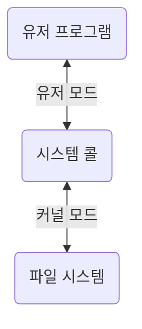
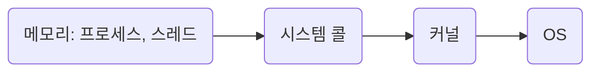

# 3장. 운영체제

## 3.1 운영체제와 컴퓨터

### 3.1.1 운영체제의 역할과 구조

#### 운영체제의 역할

- CPU 스케쥴링과 프로세스 관리: 어떤 프로세스에 CPU 소유권을 할당할지, 프로세스의 생성과 삭제, 자원 할당 및 반환 관리
- 메모리 관리: 한정된 메모리를 프로세스마다 얼마만큼 할당해야 하는지?
- 디스크 파일 관리: 디스크 파일을 어떻게 보관할지?
- I/O 디바이스 관리: 마우스, 키보드와 컴퓨터 간에 데이터를 주고받는 것을 관리

#### 운영체제의 구조

- 운영체제: GUI, System Call, Kernel, Driver

  - User Program
  - _GUI(Graphical User Interface)_: GUI대신 CLI(Command-Line Interface)가 있는 리눅스 서버도 있다.
  - _System Call_
  - _Kernel_
  - _Driver_: 하드웨어를 제어하기 위한 소프트웨어
  - Hardware

##### 시스템콜

> 운영체제가 커널에 접근하기 위한 인터페이스

- 유저 프로그램이 운영체제의 서비스를 받기 위해 커널 함수를 호출할 때 사용한다.

  1. 유저 프로그램이 I/O 요청으로 트랩(trap) 발동
  2. 올바른 I/O 요청인지 확인
  3. 유저 모드가 시스템콜을 통해 커널 모드로 변환되어 실행

- 유저모드에서 파일을 읽지 않고 커널 모드로 들어간다.
- 파일을 읽고 다시 유저 모드로 돌아간다.
- 그 뒤에 있는 유저 프로그램의 로직을 수행한다.

- 컴퓨터 자원에 대한 직접 접근을 차단하고 다른 프로그램으로부터 보호할 수 있다.

- 시스템콜은 하나의 추상화 계층: 낮은 단계의 영역 처리(네트워크 통신, 데이터베이스 등)를 덜 신경쓰면서 프로그램을 구현할 수 있다.

- modebit: 1 또는 0의 값을 가지는 플래그(flag) 변수

  - I/O 디바이스는 운영체제를 통해서만 동작한다: 사용자가 의도한 동작만 수행한다.

| 모드      | 정의                                                        | modebit |
| --------- | ----------------------------------------------------------- | ------- |
| 유저 모드 | 유저의 접근 영역 제한: 컴퓨터 자원에 함부로 침범하지 못한다 | 1       |
| 커널 모드 | 모든 컴퓨터 자원에 접근할 수 있다                           | 0       |

