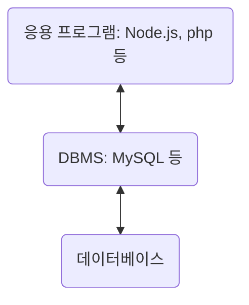

# 4장. 데이터베이스

## 4.1 데이터베이스의 기본

- 일정한 규칙, 혹은 규약을 통해 구조화되어 저장되는 데이터의 모음.

- DBMS(DataBase Management System): 해당 데이터베이스를 제어, 관리하는 통합 시스템

- 데이터베이스 안에 있는 데이터들은 특정 DBMS마다 정의된 쿼리 언어(query language)를 통해 CRUD를 수행한다.

- 실시간 접근과 동시 공유가 가능하다.

### 4.1.1 엔터티(entity)

- 여러 개의 속성을 지닌 명사

  - 회원(엔터티): 이름(속성), 아이디, 주소, 전화번호

- 서비스의 요구 사항에 맞춰 속성이 정해진다.

#### 약한 엔터티와 강한 엔터티

- A는 B의 존재 여부에 따라 종속적일 때의 강한 엔터티(B), 약한 엔터티(A)

### 4.1.2 릴레이션(relation)

- 데이터베이스에서 정보를 구분하여 저장하는 기본 단위

- 데이터베이스는 엔터티에 관한 데이터를 릴레이션 하나에 담아서 관리한다.

- 관계형 데이터베이스에서는 '테이블', NoSQL 데이터베이스에서는 '컬렉션'으로 불린다.

#### 테이블과 컬렉션

| RDBMS                | NoSQL                  |
| -------------------- | ---------------------- |
| MySQL 등             | MongoDB 등             |
| 레코드 - 테이블 - DB | 도큐먼트 - 컬렉션 - DB |

- 레코드가 쌓여서 테이블이, 테이블이 쌓여서 DB가 된다.

### 4.1.3 속성(attribute)

- 릴레이션에서 관리하는 구체적이며 고유한 이름을 갖는 정보

- 서비스의 요구 사항을 기반으로 관리해야 할 필요가 있는 속성들만 엔터티의 속성이 된다.

### 4.1.4 도메인(domain)

- 릴레이션에 포함된 각각의 속성들이 가질 수 잇는 값의 집합

- 성별(속성)이 가지는 값(집합): [남, 여]

### 4.1.5 필드와 레코드

- 필드: 데이터 속성

- 레코드, 튜플: 테이블에 쌓이는 행(row) 단위의 데이터

#### 필드 타입

| 필드 타입 | 예                                                                                  |
| --------- | ----------------------------------------------------------------------------------- |
| 숫자 타입 | TINYINT, SMALLINT, MEDIUMINT, INT, BIGINT                                           |
| 날짜 타입 | DATE(3byte), DATETIME(8byte), TIMESTAMP(4byte)                                      |
| 문자 타입 | CHAR(0~255 사이 고정 길이), VARCHAR(0~65,535 사이 가변 길이), TEXT, BLOB, ENUM, SET |

### 4.1.6 관계

|          |                                                                            |
| -------- | -------------------------------------------------------------------------- |
| 1:1 관계 | 테이블을 두 개의 테이블로 나눠 테이블의 구조를 더 이해하기 쉽게 만든다     |
| 1:N 관계 | 한 개체가 다른 많은 개체를 포함하는 관계                                   |
| N:M 관계 | 직접 연결이 아닌 1:N, 1:M이라는 관계를 갖는 테이블 두 개로 나눠서 설정한다 |

### 4.1.7 키

- 테이블 간의 관계를 조금 더 명확하게 하고 테이블 자체의 인덱스를 위해 설정된 장치

|                          |                                                           |
| ------------------------ | --------------------------------------------------------- |
| 기본키(PK, Primary Key)  | 유일성, 최소성, 자연키 또는 인조키 중에 설정              |
| 자연키                   | 중복된 값을 제외하며 중복되지 않는 것을 뽑는다, 변동성    |
| 인조키                   | 인위적으로 생성한 키, 불변성: 주로 기본키로 설정          |
| 외래 키(FK, Foreign Key) | 다른 테이블의 기본키 참조, 개체와의 관계 식별, 중복 가능  |
| 후보키(Candidate Key)    | 유일성과 최소성 만족: 기본키 후보                         |
| 대체키(Alternate Key)    | 후보키가 두 개 이상일 경우, 기본키로 지정되지 않은 후보키 |
| 슈퍼키(Super Key)        | 각 레코드를 유일하게 식별할 수 있는 유일성을 갖춘 키      |

## 4.2 ERD(Entity Relationship Diagram)와 정규화 과정

- 릴레이션 간의 관계 정의: 데이터베이스 구축 시 가장 기초적인 뼈대 역할

- 서비스를 구축할 때 가장 먼저 신경 써야 할 부분이다.

### 4.2.1 ERD의 중요성

- 시스템의 요구 사항을 기반으로 작성(설계도 역할)되어 데이터베이스를 구축한다.

- 관계형 구조로 표현할 수 있지만 비정형(비구조화) 데이터를 충분히 표현할 수 없다.

### 4.2.2 예제로 배우는 ERD

### 4.2.3 정규화(NF, Normal Form) 과정

- 데이터베이스 이상 현상(릴레이션 간 잘못된 종속 관계 등)시, 저장 공간을 효율적으로 사용하기 위해 릴레이션을 여러 개로 분리하는 과정

- 정규형 원칙을 기반으로 정규형을 만들어가는 과정

|             |                                                           |
| ----------- | --------------------------------------------------------- |
| 기본 정규형 | 제 1 정규형, 제 2 정규형, 제 3 정규형, 보이스/코드 정규형 |
| 고급 정규형 | 제 4 정규형, 제 5 정규형                                  |

- 테이블을 나누게 되면(정규화 과정) 조인 과정으로 인해 오히려 느려질 수 있다: 서비스에 따라 진행해야 한다.

#### 정규형 원칙

- 같은 의미를 표현하는 릴레이션

- 좀 더 좋은 구조

- 자료의 중복성 감소

- 독립적인 관계는 별개의 릴레이션으로 표현

- 각각의 릴레이션은 독립적인 표현 가능

#### 제 1 정규형

- 릴레이션의 모든 도메인이 더 이상 분해될 수 없는 원자 값(atomic value)만으로 구성되어야 한다.

- 릴레이션의 속성 값 중에서 한 개의 기본키에 대해 두 개 이상의 값을 가지는 반복 집합이 있어서는 안된다.

#### 제 2 정규형

- 릴레이션: 제 1 정규형 + 부분 함수의 종속성 제거

- 부분 함수의 종속성 제거: 기본키가 아닌 모든 속성이 기본키에 완전 함수 종속적이다.

- 릴레이션으로 분해할 때 동등한 릴레이션으로 분리, 정보 손실이 발생하지 않도록 분해되어야 한다.

#### 제 3 정규형

- 릴레이션: 제 2 정규형 + 모든 속성이 이행적 함수 종속(transitive FD) 불만족

  - 이행적 함수 종속: A -> B, B -> C라면 A -> C 성립되는데, 이는 집합 C가 집합 A에 이행적으로 함수 종속이 되었다.

#### 보이스/코드 정규형(BCNF)

- 릴레이션: 제 3 정규형 + 결정자가 후보키가 아닌 함수 종속 관계를 제거하여 릴레이션의 함수 종속 관계에서 모든 결정자가 후보키이다.

  - 결정자: 함수 종속 관계에서 특정 종속자(dependent)를 결정짓는 요소

    - X -> Y일 때 X는 결정자, Y는 종속자이다.

## 4.3 트랙잭션과 무결성

### 4.3.1 트랜잭션

- 데이터베이스에서 하나의 논리적 기능을 수행하기 위한 작업의 단위

- 쿼리를 통해 데이터베이스에 접근한다: 여러 개의 쿼리를 하나로 묶는 단위

#### 원자성(Atomicity)

- all or nothing

- 트랜잭션과 관련된 일이 모두 수행되거나 되지 않는 것을 보장한다.

- 트랜잭션 단위로 여러 로직을 묶을 때 외부 API를 호출하는 것이 있으면 안된다.(롤백시 주의)

| commit                                                      | rollback                                 |
| ----------------------------------------------------------- | ---------------------------------------- |
| 여러 쿼리의 성공적인 처리 확정                              | 트랜잭션으로 처리한 과정을 이전으로 돌림 |
| 트랜잭션 단위로 수행                                        |                                          |
| 변경된 내용 모두 영구 저장                                  |                                          |
| 커밋이 수행되었다 = 하나의 트랜잭션에 성공적으로 수행되었다 |                                          |
| update, insert, delete                                      |                                          |

- 데이터의 무결성을 보장한다.

- 트랜잭션 전파: 여러 트랜잭션 관련 메서드의 호출을 하나의 트랜잭션에 묶이도록 한다.

#### 일관성(Consistency)

- '허용된 방식'으로만 데이터를 변경한다.

- 데이터베이스에 기록된 모든 데이터는 여러 가지 조건, 규칙에 따라 유효성을 가져야 한다.

#### 격리성(Isolation)

- 트랜잭션 수행 시 서로 끼어들 수 없다.

- 복수의 병렬 트랜잭션은 서로 격리되어 순차적으로 실행되는 것처럼 동작한다.

- DB는 여러 사용자가 같은 데이터에 접근할 수 있어야 한다.

- 격리 수준에 따라 격리성을 보장한다.

|                  |           |                         |           |                          |
| ---------------- | --------- | ----------------------- | --------- | ------------------------ |
| READ_UNCOMMITTED | 팬텀 리드 | 반복 가능하지 않은 조회 | 더티 리드 | 강한 동시성, 약한 격리성 |
| READ_COMMITTED   | 팬텀 리드 | 반복 가능하지 않은 조회 |           |                          |
| REPEATABLE_READ  | 팬텀 리드 |                         |           |
| SERIALIZABLE     |           |                         |           | 약한 동시성, 강한 격리성 |

##### 격리 수준에 따라 발생하는 현상

- 팬텀 리드(Phantom Read): 한 트랜잭션 내에 동일한 쿼리를 보냈을 때 해당 조회 결과가 다른 경우 |

- 반복 가능하지 않은 조회(Non-Repeatable Read): 한 트랜잭션 내의 같은 행에 두 번이상 조회가 발생했는데 그 값이 다른 경우

- 더티 리드(Dirty Read): 한 트랜잭션에 실행 중일 때 다른 트랜잭션에 의해 수정되었지만 아직 '커밋되지 않은' 행의 데이터를 읽을 수 있을 때 발생

##### 격리 수준

- SERIALIZABLE

  - 말 그대로 트랜잭션을 순차적으로 진행한다.

  - 여러 트랜잭션이 동시에 같은 행에 접근할 수 없다.

  - 매우 엄격한 수준으로 해당 행에 격리시키고 트랜잭션이 이 행에 대해 일어나면 기다려야 한다.

  - 교착 상태가 일어날 확률도 많고 가장 성능이 떨어진다.

- REPEATABLE_READ

  - 하나의 트랜잭션이 수정한 행을 다른 트랜잭션이 수정할 수 없도록 막아준다.

  - 새로운 행을 추가하는 것은 막지 않으므로 이후에 추가된 행이 발견될 수도 있다.

- READ_COMMITTED

  - MySQL 8.0, PostgreSQL, SQL Serever, 오라클에서 기본값으로 설정된, 가장 많이 사용되는 격리수준이다.

  - REPEATABLE_READ와는 달리 다른 트랜잭션이 커밋하지 않은 정보는 읽을 수 없습니다.

  - 커밋 완료된 데이터에 대해서만 조회를 허용합니다.

  - 어떤 트랜잭션이 접근한 행을 다른 트랜잭션이 수정할 수 있습니다.

- READ_UNCOMMITTED

  - 가장 낮은 격리 수준이다.

  - 하나의 트랜잭션이 커밋되기 이전에 다른 트랜잭션에 노출되는 문제가 있지만 가장 빠르다.

  - 데이터 무결성을 위해 되도록이면 사용하지 않는 것이 이상적이나, 몇몇 행이 제대로 조회되지 않더라도 괜찮은 거대한 양의 데이터를 '어림잡아' 집계하는 데 사용하면 좋다.

#### 지속성(Durability)

- 성공적으로 수행된 트랜잭션은 영원히 반영되어야 한다.

- 데이터베이스에 시스템 장애가 발생해도 원래 상태로 복구하는 회복 기능이 있어야 한다.

- DB는 이를 위해 체크섬, 저널링, 롤백 등의 기능을 제공한다.

  - 체크섬: 중복 검사의 한 형태, 오류 정정을 통해 송신된 자료의 무결성을 보호하는 단순한 방법

  - 저널링: 파일 시스템 또는 DB 시스테에 변경 사항을 반영(commit)하기 전에 로깅하는 것, 트랜잭션 등 변경 사항에 대한 로그를 남기는 것

### 4.3.2 무결성

- 데이터의 정확성, 일관성, 유효성을 유지하는 것

- DB에 저장된 데이터 값과 그 값에 해당하는 현실 세계의 실제 값이 일치하는지에 대한 신뢰가 생긴다.

|             |                                                                                                  |
| ----------- | ------------------------------------------------------------------------------------------------ |
| 개체 무결성 | 기본키로 선택된 필드는 빈 값을 허용하지 않습니다.                                                |
| 참조 무결성 | 서로 참조 관계에 있는 두 테이블의 데이터는 항상 일관된 값을 유지해야 한다.                       |
| 고유 무결성 | 특정 속성에 대해 고유한 값을 가지도록 조건이 주어진 경우 그 속성 값은 모두 고유한 값을 가집니다. |
| NULL 무결성 | 특정 속성 값에 NULL이 올 수 없다는 조건이 주어진 경우 그 속성 값은 NULL이 될 수 없다.            |
