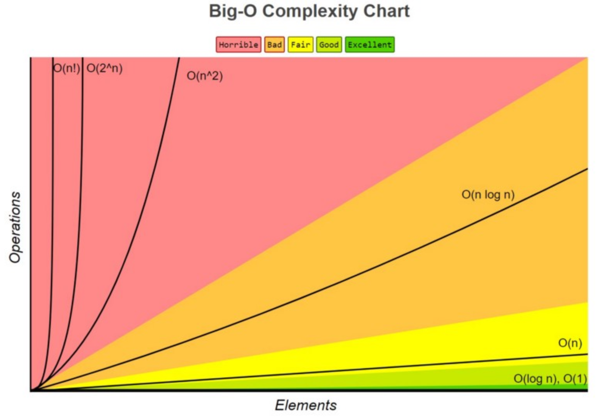

# 5장. 자료 구조(data structure)

- 효율적으로 데이터를 관리하고 수정, 삭제, 탐색, 저장할 수 있는 데이터 집합

- C++: STL을 기반으로 전반적인 자료 구조를 가장 잘 설명할 수 있는 언어

  - STL(Standard Template Library): 스택, 배열 등 데이터 구조 함수 등을 제공하는 라이브러리 묶음

## 5.1 복잡도

### 5.1.1 시간 복잡도

#### C++의 기본

#### 빅오 표기법

- 입력 범위 n을 기준으로 '로직이 몇 번 반복되는지' 나타낸다.

- 시간 복잡도: 문제를 해결하는 데 걸리는 시간과 입력의 함수 관계

#### 시간 복잡도의 존재 이유

- 효율적인 코드로 개선하는데 쓰이는 척도

#### 시간 복잡도의 속도 비교

### 5.1.2 공간 복잡도

- 프로그램을 실행시켰을 때 필요로 하는 자원 공간량

### 5.1.3 자료 구조에서의 시간 복잡도

- 시간 복잡도를 생각할 때 평균, 최악 시간 복잡도를 고려하여 사용한다.

| 자료 구조          | 최고 시간 복잡도             | 최악 시간 복잡도       |
| ------------------ | ---------------------------- | ---------------------- |
| Array              | O(1): 접근                   | O(n): 탐색, 삽입, 삭제 |
| Stack              | O(1): 삽입, 삭제             | O(n): 접근, 탐색       |
| Queue              | O(1): 삽입, 삭제             | O(n): 접근, 탐색       |
| Double Linked List | O(1): 삽입, 삭제             | O(n) : 접근, 탐색      |
| Hash Table         | O(1): 접근, 탐색, 삽입, 삭제 | O(n)                   |
| Binary Search Tree | O(logn)                      | O(n)                   |
| AVL Tree           | O(logn)                      | O(logn)                |
| Red-Black Tree     | O(logn)                      | O(logn)                |

## 5.2 선형 자료 구조

- 일렬로 나열되어 있는 자료 구조

### 5.2.1 연결 리스트(Linked List)

- 포인터로 데이터를 감싼 노드를 연결해서 공간적인 효율성을 극대화시킨 자료 구조

- 탐색: O(n), 삽입/삭제: O(1)

- prev, next 포인터로 앞 뒤 노드를 연결시킨다.

| 종류                  | 정의                                                                      |
| --------------------- | ------------------------------------------------------------------------- |
| 싱글 연결 리스트      | next 포인터만 가진다                                                      |
| 이중 연결 리스트      | prev, next 포인터를 가진다                                                |
| 원형 이중 연결 리스트 | 이중 연결 리스트와 동일, 마지막 노드의 next 포인터가 head 노드를 가리킨다 |

### 5.2.2 배열(Array)

- 크기가 정해져 있고 같은 타입의 변수들로 이뤄진, 인접한 메모리 위치에 있는 데이터를 모아놓은 집합

- 중복을 허용하고 순서가 존재한다.

- 정적 배열은 랜덤 접근(random access)가 가능하다.

- 탐색: O(1), 삽입/삭제: O(n)

- 데이터 추가와 삭제가 많다면 연결 리스트, 탐색을 많이 하면 배열로 하는 것이 좋다.

- 인덱스에 해당하는 원소를 빠르게 접근해야 하거나 간단하게 데이터를 쌓고 싶을 때 사용한다.

#### 랜덤 접근과 순차적 접근

|                      |                                                                                                |
| -------------------- | ---------------------------------------------------------------------------------------------- |
| 랜덤 접근(직접 접근) | 동일한 시간에 배열과 같은 순차적인 데이터가 있을 때 임의의 인덱스에 해당하는 데이터에 접근한다 |
| 순차적 접근          | 데이터를 저장된 순서대로 검색한다                                                              |

#### 배열과 연결 리스트 비교

| 배열                             | 연결 리스트                             |
| -------------------------------- | --------------------------------------- |
| 상자를 순서대로 나열한 자료 구조 | 상자를 선으로 연결한 형태의 데이터 구조 |
| 랜덤 접근 가능                   | 랜덤 접근 불가                          |
| O(1)                             | O(n)                                    |

### 5.2.3 벡터(vector)

- 동적으로 요소를 할당할 수 있는 동적 배열

- 컴파일 시점에 개수를 모르면 벡터를 사용해야 한다.

- 중복을 허용하고 순서 존재, 랜덤 접근이 가능하다.

| 함수        | 정의                 |
| ----------- | -------------------- |
| push_back() | 뒤부터 요소를 더한다 |
| pop_back()  | 맨 뒤부터 지운다     |
| erase()     | 요소를 삭제한다      |
| find()      | 요소를 찾는다        |
| clear()     | 배열을 초기화한다    |

### 5.2.4 스택(Stack)

- LIFO(Last In First Out) 성질을 가진 자료구조

- 재귀 함수나 알고리즘에 사용되며 웹 브라우저 방문 기록에 사용한다.

- 탐색: O(n), 삽입/삭제: O(1)

### 5.2.5 큐(Queue)

- FIFO(First In First Out) 성질을 가진 자료구조

- CPU 작업을 기다리는 프로세스, 스레드 행렬 또는 네트워크 접속 대기 행렬, 너비 우선 탐색, 캐시 등에 사용한다.

- 탐색: O(n), 삽입/삭제: O(1)

## 참고 자료

- https://www.freecodecamp.org/news/all-you-need-to-know-about-big-o-notation-to-crack-your-next-coding-interview-9d575e7eec4/
