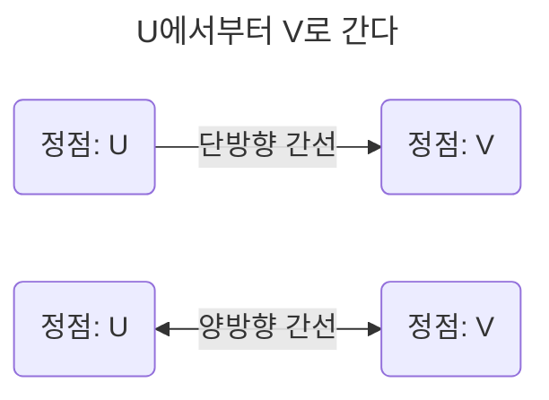

# 5장. 자료 구조(data structure)

- 효율적으로 데이터를 관리하고 수정, 삭제, 탐색, 저장할 수 있는 데이터 집합

- C++: STL을 기반으로 전반적인 자료 구조를 가장 잘 설명할 수 있는 언어

  - STL(Standard Template Library): 스택, 배열 등 데이터 구조 함수 등을 제공하는 라이브러리 묶음

## 5.1 복잡도

### 5.1.1 시간 복잡도

#### C++의 기본

#### 빅오 표기법

- 입력 범위 n을 기준으로 '로직이 몇 번 반복되는지' 나타낸다.

- 시간 복잡도: 문제를 해결하는 데 걸리는 시간과 입력의 함수 관계

#### 시간 복잡도의 존재 이유

- 효율적인 코드로 개선하는데 쓰이는 척도

#### 시간 복잡도의 속도 비교

### 5.1.2 공간 복잡도

- 프로그램을 실행시켰을 때 필요로 하는 자원 공간량

### 5.1.3 자료 구조에서의 시간 복잡도

- 시간 복잡도를 생각할 때 평균, 최악 시간 복잡도를 고려하여 사용한다.

| 자료 구조          | 최고 시간 복잡도             | 최악 시간 복잡도       |
| ------------------ | ---------------------------- | ---------------------- |
| Array              | O(1): 접근                   | O(n): 탐색, 삽입, 삭제 |
| Stack              | O(1): 삽입, 삭제             | O(n): 접근, 탐색       |
| Queue              | O(1): 삽입, 삭제             | O(n): 접근, 탐색       |
| Double Linked List | O(1): 삽입, 삭제             | O(n) : 접근, 탐색      |
| Hash Table         | O(1): 접근, 탐색, 삽입, 삭제 | O(n)                   |
| Binary Search Tree | O(logn)                      | O(n)                   |
| AVL Tree           | O(logn)                      | O(logn)                |
| Red-Black Tree     | O(logn)                      | O(logn)                |

## 5.2 선형 자료 구조

- 일렬로 나열되어 있는 자료 구조

### 5.2.1 연결 리스트(Linked List)

- 포인터로 데이터를 감싼 노드를 연결해서 공간적인 효율성을 극대화시킨 자료 구조

- 탐색: O(n), 삽입/삭제: O(1)

- prev, next 포인터로 앞 뒤 노드를 연결시킨다.

| 종류                  | 정의                                                                      |
| --------------------- | ------------------------------------------------------------------------- |
| 싱글 연결 리스트      | next 포인터만 가진다                                                      |
| 이중 연결 리스트      | prev, next 포인터를 가진다                                                |
| 원형 이중 연결 리스트 | 이중 연결 리스트와 동일, 마지막 노드의 next 포인터가 head 노드를 가리킨다 |

### 5.2.2 배열(Array)

- 크기가 정해져 있고 같은 타입의 변수들로 이뤄진, 인접한 메모리 위치에 있는 데이터를 모아놓은 집합

- 중복을 허용하고 순서가 존재한다.

- 정적 배열은 랜덤 접근(random access)가 가능하다.

- 탐색: O(1), 삽입/삭제: O(n)

- 데이터 추가와 삭제가 많다면 연결 리스트, 탐색을 많이 하면 배열로 하는 것이 좋다.

- 인덱스에 해당하는 원소를 빠르게 접근해야 하거나 간단하게 데이터를 쌓고 싶을 때 사용한다.

#### 랜덤 접근과 순차적 접근

|                      |                                                                                                |
| -------------------- | ---------------------------------------------------------------------------------------------- |
| 랜덤 접근(직접 접근) | 동일한 시간에 배열과 같은 순차적인 데이터가 있을 때 임의의 인덱스에 해당하는 데이터에 접근한다 |
| 순차적 접근          | 데이터를 저장된 순서대로 검색한다                                                              |

#### 배열과 연결 리스트 비교

| 배열                             | 연결 리스트                             |
| -------------------------------- | --------------------------------------- |
| 상자를 순서대로 나열한 자료 구조 | 상자를 선으로 연결한 형태의 데이터 구조 |
| 랜덤 접근 가능                   | 랜덤 접근 불가                          |
| O(1)                             | O(n)                                    |

### 5.2.3 벡터(vector)

- 동적으로 요소를 할당할 수 있는 동적 배열

- 컴파일 시점에 개수를 모르면 벡터를 사용해야 한다.

- 중복을 허용하고 순서 존재, 랜덤 접근이 가능하다.

| 함수        | 정의                 |
| ----------- | -------------------- |
| push_back() | 뒤부터 요소를 더한다 |
| pop_back()  | 맨 뒤부터 지운다     |
| erase()     | 요소를 삭제한다      |
| find()      | 요소를 찾는다        |
| clear()     | 배열을 초기화한다    |

### 5.2.4 스택(Stack)

- LIFO(Last In First Out) 성질을 가진 자료구조

- 재귀 함수나 알고리즘에 사용되며 웹 브라우저 방문 기록에 사용한다.

- 탐색: O(n), 삽입/삭제: O(1)

### 5.2.5 큐(Queue)

- FIFO(First In First Out) 성질을 가진 자료구조

- CPU 작업을 기다리는 프로세스, 스레드 행렬 또는 네트워크 접속 대기 행렬, 너비 우선 탐색, 캐시 등에 사용한다.

- 탐색: O(n), 삽입/삭제: O(1)

## 5.3 비선형 자료 구조

- 일렬로 나열하지 않고 자료 순서나 관계가 복잡한 구조

### 5.3.1 그래프(graph)

- 정점과 간선으로 이루어진 집합 자료 구조

#### 정점과 간선

|                        |                       |
| ---------------------- | --------------------- |
| 정점(V, U: vertex)     | 목적지                |
| 간선(edge)             | 가는 방법             |
| 정점으로 나가는 간선   | 해당 정점의 outdegree |
| 정점으로 들어오는 간선 | 해당 정점의 indegree  |

#### 가중치

- 간선과 정점 사이에 드는 비용

### 5.3.2 트리

- 그래프처럼 정점과 간선으로 이루어진, 트리 구조로 배열된 계층적 데이터 집합

- 숲: 트리로 이루어진 집합

#### 트리의 특징

1. 부모, 자식 계층 구조를 가진다.

2. `E(간선수) = V(노드 수) - 1`

3. 트리 내의 두 노드(node) 사이의 경로는 반드시 존재한다.

#### 트리의 구성

| 트리의 구성 | 정의                                       |
| ----------- | ------------------------------------------ |
| 루트 노드   | 가장 위에 있는 노드                        |
| 내부 노드   | 루트 노드와 내부 노드 사이에 존재하는 노드 |
| 리프 노드   | 자식 노드가 없는 노드                      |

| 용어       | 설명                                                     |
| ---------- | -------------------------------------------------------- |
| 깊이, 레벨 | 루트 노드로부터 특정 노드까지 최단 거리로 갔을 때의 거리 |
| 높이       | 루트 노드로부터 리프 노드까지 거리 중 가장 긴 거리       |
| 서브트리   | 트리 내의 하위 집합(부분 집합)                           |

#### 이진 트리(Binary Tree)

- 자식의 노드 수가 2개 이하인 트리

| 종류                       | 정의                                                          |
| -------------------------- | ------------------------------------------------------------- |
| 정(full) 이진 트리         | 자식 노드가 0 또는 2개인 이진 트리                            |
| 완전(complete) 이진 트리   | 왼쪽부터 채워진 이진 트리                                     |
| 변질(degenerate) 이진 트리 | 자식 노드가 하나밖에 없는 이진 트리                           |
| 포화(perfect) 이진 트리    | 모든 노드가 꽉찬 이진 트리                                    |
| 균형(balanced) 이진 트리   | 왼쪽/오른쪽 노드 높이 차가 1 이하인 이진 트리(Red-Black Tree) |

#### 이진 탐색 트리(BST: Binary Search Tree)

- 노드의 오른쪽 하위 트리에는 노드 값보다 큰 값이, 왼쪽 하위 트리에는 노드 값보다 작은 값이 들어있는 트리

- 검색에 용이하다: O(logn)

- 삽입 순서에 따라 선형적일 수 있다(degenerate binary tree): O(n)

#### AVL(Adelson-Velsky and Landis) 트리

- 선형적인 트리가 되는 것을 방지하고 스스로 균형을 잡는 이진 탐색 트리

- 두 자식 서브트리의 높이는 항상 최대 1만큼 차이가 난다.

- 시간 복잡도: O(logn)

#### 레드 블랙 트리

- 각 노드가 빨간색/검은색을 나타내는 추가 비트를 저장하는 균형 이진 탐색 트리

  - 모든 리프 노드와 루트 노드는 블랙이고 어떤 노드가 레드이면 그 노드의 자식은 반드시 블랙이다.

- ex) C++ STL의 set, multiset, map, multimap

- 시간 복잡도: O(logn)

### 5.3.3 힙

- 완전 이진 트리 기반의 자료 구조

| 규칙   | 정의                                                                  |
| ------ | --------------------------------------------------------------------- |
| 최대힙 | 루트 노드의 키는 가장 커야 한다, 부모-자식 노드 관계도 동일(재귀적)   |
| 최소힙 | 루트 노드의 키는 가장 작아야 한다, 부모-자식 노드 관계도 동일(재귀적) |

#### 최대힙의 삽입

- 새로운 노드가 들어오면, 일단 힙의 마지막 노드에 이어서 삽입한다.

- 부모 노드들과의 크기를 비교/교환하여 힙의 성질을 만족시킨다.

#### 최대힙의 삭제

- 루트 노드(최댓값)를 삭제하고, 이후에 마지막 노드와 루트 노드를 swap하는 과정을 거쳐 재구성된다.

### 5.3.4 우선순위 큐(우선순위 대기열)

- 대기열에서 우선순위가 높은 요소가 우선순위가 낮은(Enqueue) 요소보다 먼저 제공(Dequeue)된다.

- 힙을 기반으로 구현된다.

### 5.3.5 맵(map)

- 특정 순서에 따라 키(key)와 매핑된 값(value)의 조합

- RBT 기반으로 형성, 삽입 시 자동 정렬되며 해시 테이블을 구현할 때 사용한다.

| map<string, int> | 정렬 보장 유무 |
| ---------------- | -------------- |
| map              | O              |
| unordered_map    | X              |

### 5.3.6 셋(set)

- 특정 순서에 따라 고유한 요소를 저장하는 컨테이너: `set<pair<string, int>>`

- 중복 요소가 없고 오직 희소한(unique) 값만 저장한다.

### 5.3.7 해시 테이블

- 무한에 가까운 데이터를 유한한 개수의 해시 값으로 매핑한 테이블

- unordered_map으로 구현한다.

- 시간 복잡도: O(1)

## 예상 질문

1. 해시 테이블이 무엇인가요?

2. 그래프와 트리의 차이점에 대해 설명해주세요.

3. 이진 탐색 트리의 문제점과 이를 해결하는 트리는 무엇인가요?

## 참고 자료

- https://www.freecodecamp.org/news/all-you-need-to-know-about-big-o-notation-to-crack-your-next-coding-interview-9d575e7eec4/
