# 1장. 사용자 수에 따른 규모 확장성

> - 1명부터 수백만 사용자를 지원하는 시스템을 설계한다.
>
> - 규모 확장성과 관계된 설계 문제를 푸는 데 쓰일 유용한 지식을 습득한다.

## TL;DR

1. 웹 계층은 무상태 계층으로

2. 모든 계층에 다중화 도입

3. 가능한 한 많은 데이터를 캐시할 것

4. 여러 데이터 센터를 지원할 것

5. 정적 콘텐츠는 CDN을 통해 서비스 할 것

6. 데이터 계층은 샤딩을 통해 그 규모를 확장할 것

7. 각 계층은 독립적 서비스로 분할할 것

8. 시스템을 지속적으로 모니터링하고, 자동화 도구들을 활용할 것


## 단일 서버

- 서버 1대에서 웹, 앱, 데이터베이스, 캐시 등을 전부 실행한다.

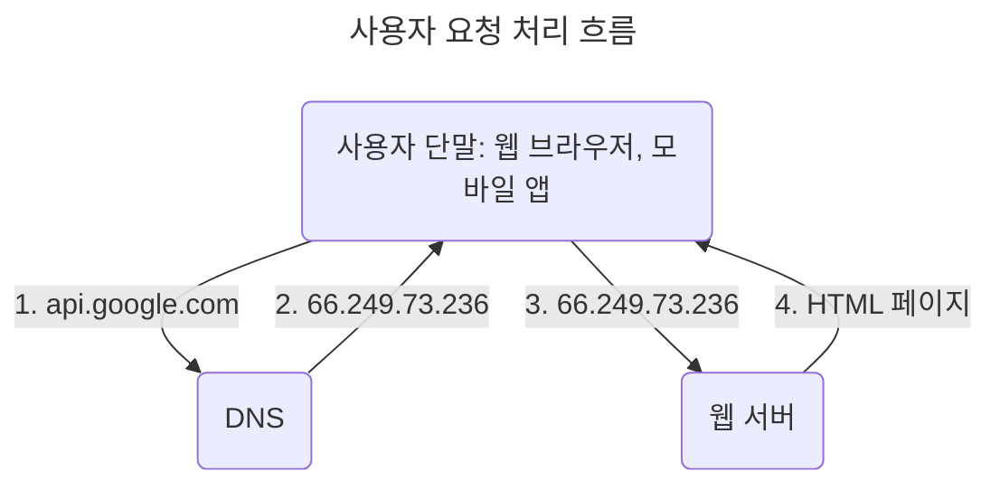
1. 사용자는 도메인 이름(`www.google.com`)을 이용하여 웹사이트에 접속한다.

   - 도메인 이름을 도메인 이름 서비스(DNS: Domain Name Service)에 질의하여 IP 주소로 변환한다.

      > DNS는 보통 제3 사업자(third party)가 제공하는 유료, 외부 서비스를 사용하므로 설계 시스템의 일부는 아니다.

2. DNS 조회 결과로 IP 주소가 반환된다.

3. 해당 IP 주소로 HTTP(HyperText Transfer Protocol) 요청이 전달된다.

4. 요청을 받은 웹 서버는 HTML 페이지나 JSON 형태의 응답을 반환한다.


| 요청 단말기   | 설명                                                                                                         |
|----------|------------------------------------------------------------------------------------------------------------|
| 웹 애플리케이션 | - 서버 구현용 언어(Java, Python 등): 비즈니스 로직, 데이터 저장 등 처리<br> - 클라이언트 구현용 언어(HTML, JavaScript 등): 프레젠테이션 용         |
| 모바일 앱    | - 모바일 앱-웹 서버 간 통신을 위해 HTTP 프로토콜을 이용한다<br> - JSON(JavaScript Object Notation): HTTP 프로토콜을 통해 반환되는 응답 데이터 포맷 |

## 데이터베이스

- 사용자가 늘어나면 서버 하나로는 충분하지 않기 때문에 여러 대의 서버를 두어야 한다.

  - 웹/모바일 트래픽 처리 서버: 웹 계층

  - 데이터베이스 서버: 데이터 계층

- 웹/모바일 트래픽 처리 서버 - 데이터베이스 서버를 분리하면 독립적으로 확장해나갈 수 있다.

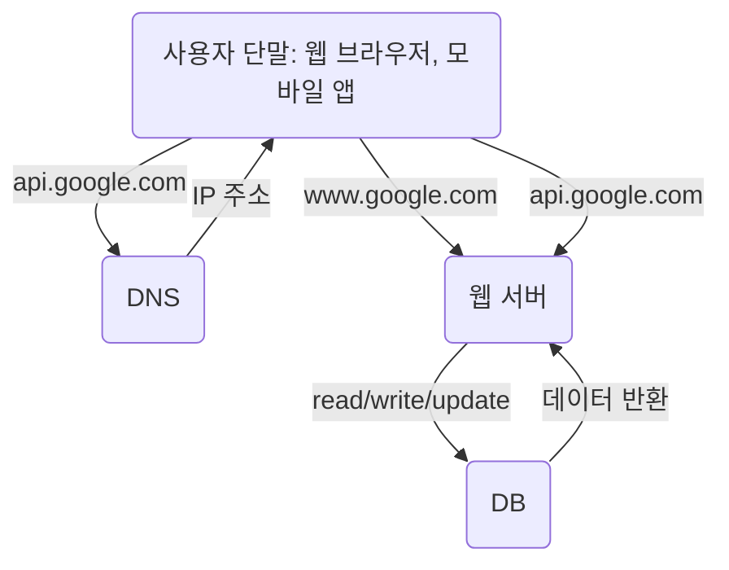

### 어떤 데이터베이스를 사용할 것인가?


| 데이터베이스 종류                                                           | 특징                                                                                                                                  | 예시                                                |
|---------------------------------------------------------------------|-------------------------------------------------------------------------------------------------------------------------------------|---------------------------------------------------|
| 관계형 데이터베이스 관리 시스템<br>(RDBMS:Relational Data-base Management System) | 1. table, row, column로 자료를 표현한다.<br>2. SQL(Structured Query Language)로 여러 테이블에 있는 데이터를 관계(relation)에 따라 join할 수 있다.                 | MySQL, Oracle, PostgreSQL                         |
| 비-관계형 데이터베이스<br>(No SQL)                                            | 1. 키-값 저장소(key-value store), 그래프 저장소(graph store), 칼럼 저장소(column store), 문서 저장소(document store)로 나눌 수 있다.<br>2.  join 연산은 지원하지 않는다. | CouchDB, Neo4j, Cassandra, HBase, Amazon DynamoDB |

- No-SQL을 사용하는 것이 나을 경우

  - 아주 낮은 응답 지연시간(latency) 요구

  - 비정형(unstructured) 데이터 다루기: 동영상 파일, 오디오 파일, 사진, 문서, 메일 본문 등

  - 데이터(JSON, YAML, XML 등) 직렬화(serialize) 혹은 역직렬화(deserialize)

  - 아주 많은 양의 데이터 저장

## 수직적 규모 확장 vs 수평적 규모 확장

- 수직적 규모 확장(vertical scailing; scale up)

  - 서버에 고사양 자원을 추가한다.

  - 서버로 유입되는 트래픽의 양이 적을 때 사용하며 단순하다.

  - 한 대의 서버에 CPU나 메모리를 무한대로 증설하는데 한계가 있다.

  - 서버 장애 발생시, 웹사이트/앱은 완전히 중단되어 장애 자동복구(failover)나 다중화(redundancy)를 제시하지 않는다.

- 수평적 규모 확장(horizonal scailing; scale out)

  - 더 많은 서버를 추가한다.

  - 대규모 애플리케이션을 지원하는데 적절하다.

  - 웹 서버가 다운되거나 너무 많은 사용자가 접속하여 웹 서버가 한계 상황에 도달하게 되면 응답 속도가 느려지거나 서버 접속이 불가능할 수 있다. → 부하 분산기 또는 로드밸런서(load balancer)를 도입하는 이유

### 로드밸런서

- 부하 분산 집합(load balancing set)에 속한 웹 서버에 트래픽 부하를 고르게 분산한다.

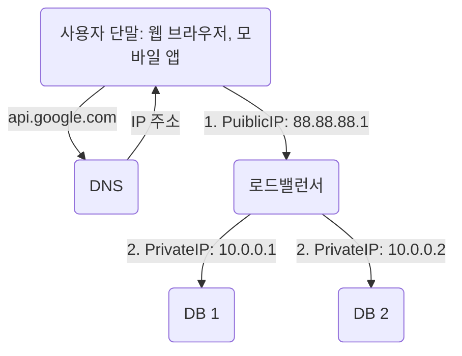

1. 공개 IP 주소(public IP address): 클라이언트 접속 처리

2. 사설 IP 주소(private IP address): 서버간 통신 처리

  - 같은 네트워크에 속한 서버 사이의 통신에만 쓰이는 IP 주소로 인터넷을 통해 접속할 수 없다.
  
  - 로드밸런서가 웹 서버와 통신할 때 사설 IP 주소를 이용한다.

- 부하 분산 집합에 웹 서버를 추가하면 장애를 자동복구하지 못하는 문제(failover)가 해소되고 웹 계층 가용성(availability)이 향상된다.

  - 서버 1이 다운되면(offline) 모든 트래픽은 서버 2로 전송되면서 웹 사이트 전체가 다운되는 일이 방지된다.

  - 웹사이트 트래픽이 급증하면 웹 서버 계층에 더 많은 서버를 추가하여 로드 밸런서가 자동적으로 트래픽을 분산시킨다.

### 데이터베이스 다중화

- 많은 데이터베이스 관리 시스템이 지원하는, 주(master) - 부(slave) 서버 관계 모델이다.

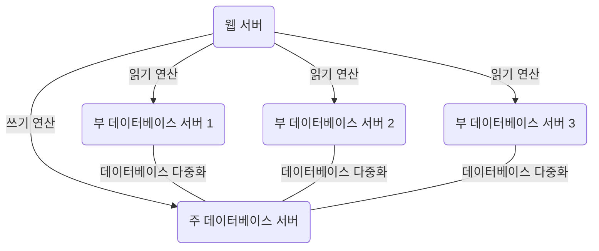

| 주(master) 서버              | 부(slave) 서버               |
|---------------------------|---------------------------|
| 데이터 원본 저장                 | 주 데이터베이스부터 그 사본을 전달받아 저장  |
| 쓰기 연산(write operation) 지원 | 읽기 연산(read operation)만 지원 |

- 데이터베이스를 변경하는 명령어(insert, delete, update 등)는 주 데이터베이스로만 전달되어야한다.

- 대부분의 애플리케이션은 읽기 연산의 비중이 쓰기 연산보다 훨씬 높으므로 부 데이터베이스의 수가 주 데이터베이스의 수보다 많다.

| 다중화 이점            | 설명                                                                    |
|-------------------|-----------------------------------------------------------------------|
| 더 나은 성능           | 주(master) - 부(slave) 관계로 병렬로 처리될 수 있는 query 수가 늘어난다                   |
| 안정성(reliability)  | 읽기 연산은 부 데이터베이스 서버들로 분산되므로 서버 일부가 파괴되어도 데이터는 보존된다                     |
| 가용성(availability) | 데이터를 여러 지역에 복제해 둠으로써 한 서버에 장애가 발생하더라도 다른 서버에 있는 데이터를 가져와 계속 서비스할 수 있다 |

- 부 데이터베이스 서버가 다운된다면?

  - 부 서버가 한 대일 때: 읽기 연산은 한시적으로 모두 주 서버로 전달되며 즉시 새로운 부 서버가 장애 서버를 대체한다.

    > 주 데이터베이스 서버가 다운된다면?
    >
    > - 해당 부 서버가 새로운 주 서버가 되면서 모든 데이터베이스 연산은 일시적으로 새로운 주 서버 상에서 수행된다.
    > 
    > - 새로운 부 서버가 추가된다.

  - 부 서버가 여러 대일 때: 읽기 연산은 나머지 부 서버로 분산되며 새로운 부 서버가 장애 서버를 대체한다.
  
  > 프로덕션(production) 환경이라면?
  >
  > - 부 서버의 데이터가 최신 상태가 아닐 수 있고, 존재하지 않는 데이터는 복구 스크립트(recovery script)를 돌려서 추가해야 한다.
  >
  > - 다중 마스터(multi-master)나 원형 다중화(circular replication) 방식을 도입하면 해결할 수 있다.

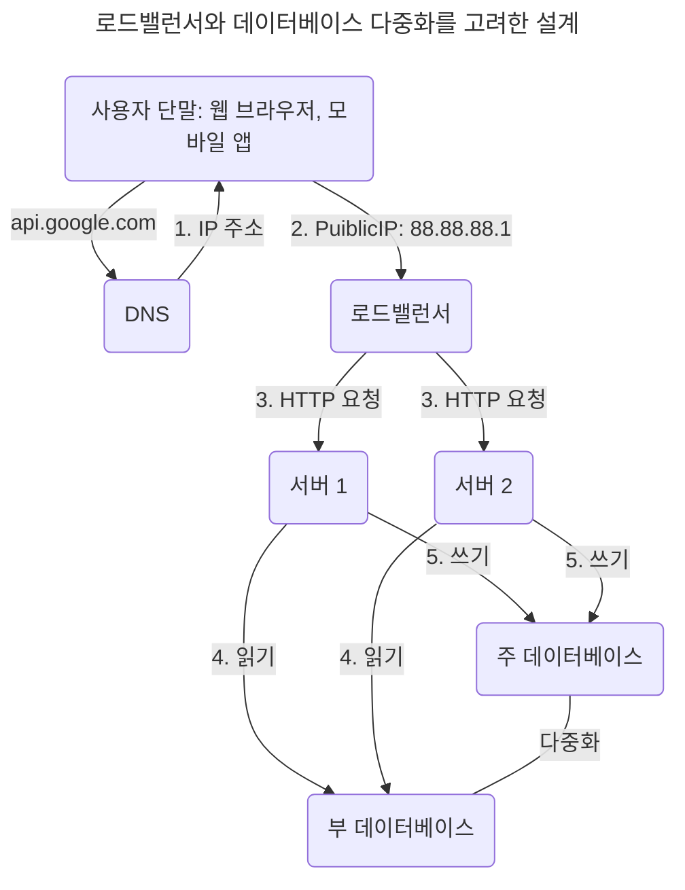

1. 사용자는 DNS로부터 로드밸런서의 공개 IP 주소를 받는다.

2. 사용자는 해당 IP 주소를 사용해 로드밸런서에 접속한다.

3. HTTP 요청은 서버 1이나 서버 2로 전달된다.

4. 웹 서버는 사용자의 데이터를 부 데이터베이스 서버에서 읽는다.

5. 웹 서버는 데이터 변경 연산(데이터 추가, 삭제, 갱신 등)은 주 데이터베이스로 전달한다.

## 캐시

- 값비싼 연산 결과 또는 자주 참조되는 데이터를 메모리 안에 두고, 뒤이은 요청이 보다 빨리 처리될 수 있도록 하는 저장소

- 애플리케이션 성능은 데이터베이스를 얼마나 자주 호출하느냐에 크게 좌우되는데, 캐시는 그런 문제를 완화한다.

- 캐시(cache)를 붙이고 정적 콘텐츠를 콘텐츠 전송 네트워크(Content Delivery Network, CDN)로 옮기면 응답시간(latency)을 개선할 수 있다.

### 캐시 계층(cache tier)

- 데이터가 잠시 보관되는 곳으로 데이터베이스보다 훨씬 빠르다.

  - 성능이 개선된다.
  
  - 데이터베이스의 부하를 줄일 수 있다.

  - 캐시 계층의 규모를 독립적으로 확장시킬 수 있다.

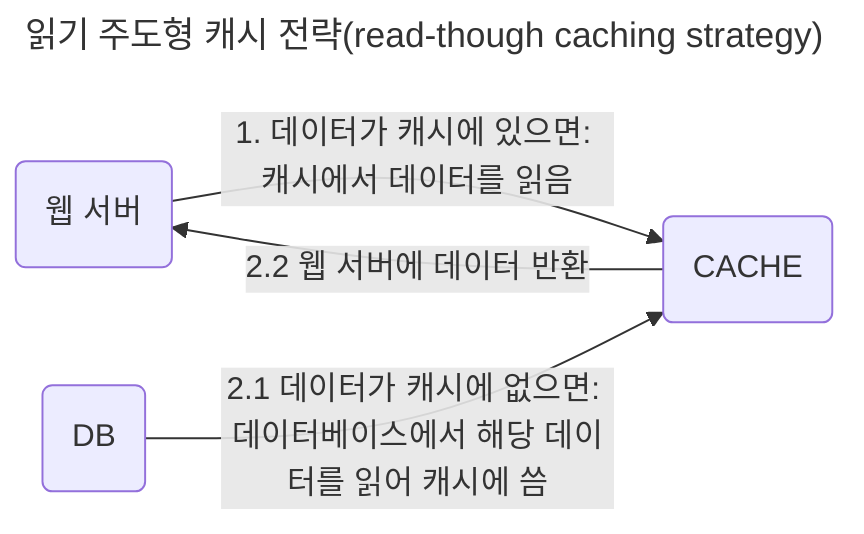

- 대부분의 캐시 서버들이 일반적으로 널리 쓰이는 프로그래밍 언어를 사용하여 API를 제공한다.

  ```python
  # memcached API 사용 예시

  SECOND = 1
  cache.set('myKey', 'hello world!', 3600 + SECOND)
  cache.get('myKey')
  ```

### 캐시 사용 시 유의할 점

1. 사용하는 상황

2. 캐싱할 대상 데이터

   - 캐시는 휘발성 메모리이므로 중요한 데이터는 지속적 저장소(persistent data store)에 두어야 한다.

3. 캐시에 보관되어있는 데이터 만료(expire)

   - 이에 대한 정책을 마련하고 만료된 데이터는 캐시에서 삭제한다.

4. 일관성(consistency) 유지

   - 일관성: 데이터 저장소의 원본과 캐시 내의 사본이 같은지에 대한 여부.

   - [저장소의 원본을 갱신하는 연산과 캐시를 갱신하는 연산은 단일 트랜잭션으로 처리되어야한다.](https://www.usenix.org/system/files/conference/nsdi13/nsdi13-final170_update.pdf)

5. 장애 대처

   - 캐시 서버를 한 대만 둔다면, 해당 서버는 단일 장애 지점이 될 수 있다.

      > 단일 장애 지점(Single Point of Failure, SPOF): 특정 지점의 장애가 전체 시스템의 동작을 중단시키는 경우

   - 결과적으로 여러 지역에 걸쳐 캐시 서버를 분산시켜야 한다.
  
      ```mermaid
      flowchart LR

      A(사용자 A) --> D(단일 서버: SPOF)
      B(사용자 B) --> D
      C(사용자 C) --> D
      ```

6. 캐시 메모리 크기

  - 너무 작으면 액세스 패턴에 따라 데이터가 자주 캐시에서 밀려나버려(eviction) 캐시의 성능이 떨어진다.

  - 캐시 메모리를 **과할당(overprovision)** 하면서 캐시에 보관될 데이터가 갑자기 늘어났을 때 생기는 문제를 방지한.

7. 캐시 데이터 방출(eviction) 정책

  - 캐시가 다 차버리면 추가로 캐시에 데이터를 넣어야하는 경우 기존 데이터를 내보내야 한다.

    | 종류                          | 정의                             |
    |-----------------------------|--------------------------------|
    | LRU (Least Recently Used)   | 마지막으로 사용된 시점이 가장 오래된 데이터를 내보낸다 |
    | LFU (Least Frequently Used) | 사용된 빈도가 가장 낮은 데이터를 내보낸다        |
    | FIFO (First In First Out)   | 가장 먼저 캐시에 들어온 데이터를 가장 먼저 내보낸다  |

## 콘텐츠 전송 네트워크(CDN)

- 정적 콘텐츠(전송 중 변경되지 않는 이미지, 비디오, CSS, JavaScript 파일 등)를 전송하는 데 사용하는, 지리적으로 분산된 서버의 네트워크

  > 동적 콘텐츠 캐싱?
  >
  > - 요청 경로(request path), 질의 문자열(query string), 쿠키(cookie), 요청 헤더(request header) 등의 정보에 기반하여 HTML 페이지를 캐시한다.

- 어떤 사용자가 웹사이트를 방문하면 그 사용자에게 가장 가까운 CDN 서버가 정적 콘텐츠를 전달한다

- 사용자가 CDN 서버로부터 멀면 멀수록 웹사이트는 천천히 로드될 것이다

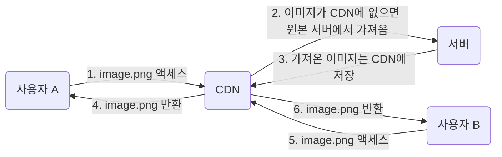

1. 사용자 A가 이미지 URL을 이용해 image.png에 접근한다. URL 도메인은 CDN 서비스 사업자가 제공한다.

2. CDN 서버 캐시에 해당 이미지가 없는 경우, 서버는 원본(origin) 서버(웹 서버, AWS S3 등)에 요청하여 파일을 가져온다.

3. 원본 서버가 파일을 CDN 서버에 반환한다. 응답의 HTTP 헤더에 해당 파일이 얼마나 오래 캐시될 수 있는지를 설명하는 **TTL(Time-To-Live)** 값이 들어 있다.

4. CDN 서버는 파일을 캐시하고 사용자 A에게 반환한다. 이미지는 TTL에 명시된 시간이 끝날 때까지 캐시된다.

5. 사용자 B가 같은 이미지에 대한 요청을 CDN 서버에 전송한다.

6. 만료되지 않은 이미지에 대한 요청은 캐시를 통해 처리된다.

### CDN 사용 시 고려해야 할 사항

1. 비용
  
   - CDN은 보통 제3 사업자(third-party providers)가 운영하며 CDN으로 출입하는 데이터 전송량에 따라 비용을 지불한다.
   
   - 자주 사용되지 않는 콘텐츠는 CDN에서 빼는 것(캐싱하지 않는 것)이 낫다.

2. 적절한 만료 시한 설정: 시의성이 중요한(time-sensitive) 콘텐츠의 경우 만료 시점을 잘 정해야 한다.

3. CDN 장애 대처: CDN 자체가 죽었을 경우 웹사이트/애플리케이션이 어떻게 동작해야 하는지 고려해야 한다.

4. 콘텐츠 무효화(Invalidation): 아직 만료되지 않은 콘텐츠라 하더라도 CDN에서 제거할 수 있다.
  
   - CDN 서비스 사업자가 제공하는 API를 사용하여 콘텐츠를 무효화한다.
  
   - 콘텐츠의 다른 버전을 서비스하도록 오브젝트 버저닝(object versioning)을 이용한다.
  
   - 콘텐츠의 새로운 버전을 지정하기 위해서는 URL 마지막에 버전 번호를 인자(`image.png?v=2`)로 주면 된다.

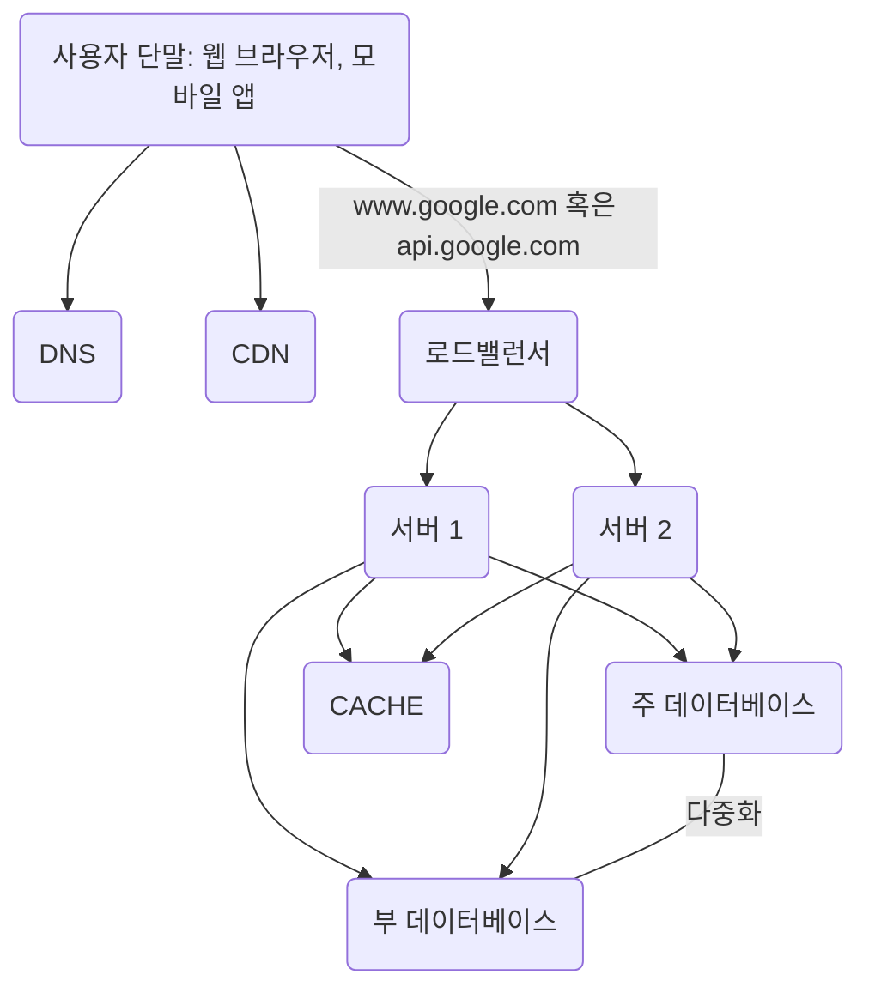
  
## 무상태(stateless) 웹 계층

- 상태 정보를 관계형 데이터베이스나 NoSQL 같은 지속성 저장소에 보관하고, 필요할 때 가져온다.

- 웹 계층을 수평적으로 확장하기 위해 상태 정보(사용자 세션 데이터 등)를 웹 계층에서 제거해야 한다.

### 상태 정보 의존적인 아키텍처

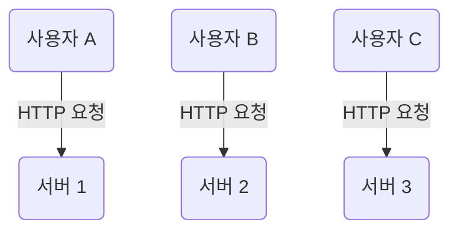

- 클라이언트 정보(세션 정보, 프로파일 이미지)등을 유지하여 요청들 사이에 공유한다.

- 사용자 A의 인증 요청을 서버 2로 전송하면, 서버 2에는 사용자 A 데이터가 보관되어있지 않기 때문에 인증을 실패한다.

- 즉, 같은 클라이언트의 요청은 항상 같은 서버로 전송되어야 한다.

- 대부분의 로드밸런서의 고정 세션(sticky session) 기능으로 해결할 수 있지만

  - 로드밸런서에게 부담을 준다.

  - 로드밸런서 뒷단에 서버를 추가하거나 제거하기도 까다로워지므로 서버 장애를 처리하기도 복잡해진다.

### 무상태 아키텍처

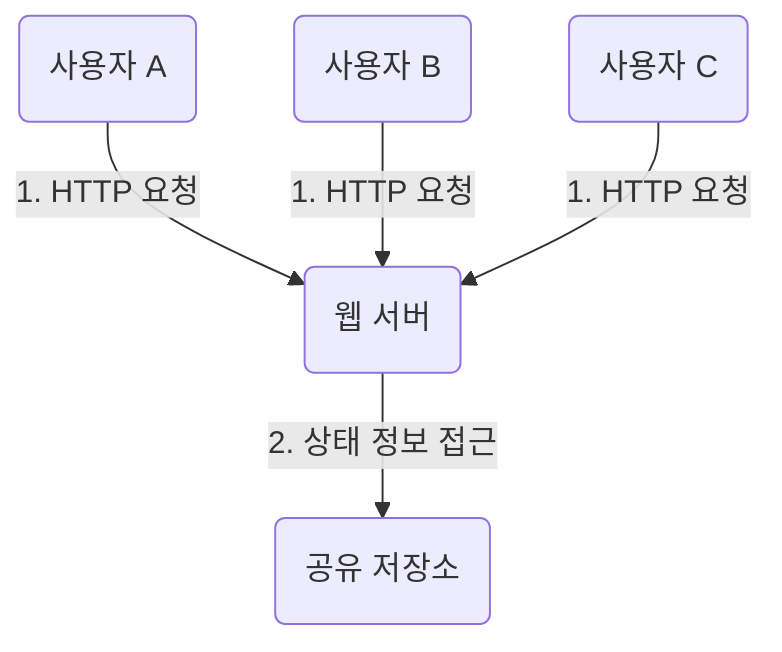

1. 사용자로부터 HTTP 요청은 어떤 웹 서버로도 전달될 수 있다.

2. 웹 서버는 상태 정보가 필요할 경우 공유 저장소(shared storage)로부터 데이터를 가져온다.

   - 상태 정보는 웹 서버로부터 물리적으로 분리되어있어 단순하고, 안정적이며, 규모 확장이 쉽다.

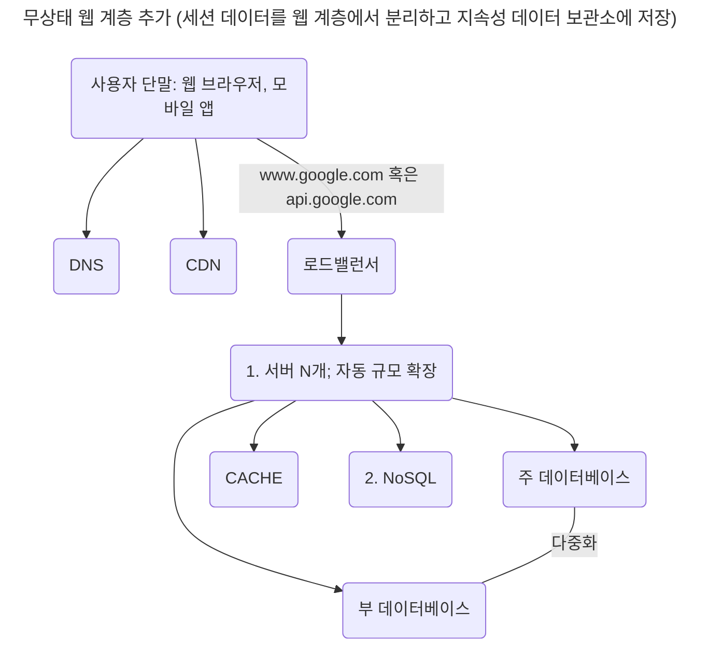

1. 자동 규모 확장(autoscailing): 트래픽 양에 따라 웹 서버를 자동으로 추가하거나 삭제한다.

2. NoSQL은 규모 확장이 간편하다: 이 공유 저장소는 RDBMS, 캐시 시스템(Memcached/Redis)일 수도 있다.

- 상태 정보가 웹 서버들로부터 제거되었으므로, 트래픽 양에 따라 웹 서버를 넣거나 빼기만 하면 자동으로 확장할 수 있다.
  
## 데이터 센터

- 지리적 라우팅(geoDNS-routing, geo-routing)
  - 장애가 없는 상황에서 사용자를 가장 가까운 데이터 센터로 안내한다.

  - geoDNS: 사용자의 위치에 따라 도메인 이름을 어떤 IP 주소로 변환할지 결정하는 DNS 서비스

- 데이터 센터 중 하나에 심각한 장애가 발생하면 모든 트래픽은 장애가 없는 데이터 센터로 전송된다.

  |   기술적 난제    |   설명  |
  |---------------|--------|
  | 트래픽 우회      | GeoDNS는 사용자에게서 가장 가까운 데이터센터로 트래픽을 보낸다. |
  | 데이터 동기화(synchronization) | - 데이터 센터마다 별도의 데이터베이스를 사용하고 장애가 자동으로 복구(failover)됐을 때 트래픽은 다른 데이터베이스로 우회한다.<br> - 이 때, 해당 데이터센터에는 찾는 데이터가 없을 수 있으므로 [데이터를 여러 데이터센터에 걸쳐 데이터를 다중화](https://netflixtechblog.com/active-active-for-multi-regional-resiliency-c47719f6685b)한다.|
  | 테스트와 배포(deployment)      | - 여러 위치에서 웹 사이트 또는 애플리케이션을 테스트해야 한다.<br>- 자동화된 배포 도구는 모든 데이터 센터에 동일한 서비스가 설치되도록 한다. |

## 메시지 큐(message queue)

- 메시지의 무손실(durability)을 보장하는 비동기 통신(asynchronous communication)을 지원하는 컴포넌트

  > 무손실? 메시지 큐에 일단 보관된 메시지는 소비자가 꺼낼 때까지 안전히 보관된다는 특성

- 메시지의 버퍼 역할을 하고 비동기적으로 전송한다.


1. 생산자 또는 발행자(producer/publisher)라고 불리는 입력 서비스가 메시지를 만들어 메시지 큐에 발행(publish)한다.

2. 큐에는 보통 소비자 혹은 구독자(consumer subscriber)라 불리는 서비스 혹은 서버가 연결되어 있는데, 메시지를 받아 그에 맞는 동작을 수행한다.

- 서비스 또는 서버 간 결합이 느슨해져서 규모 확장성이 보장되어야 하는 안정적 애플리케이션을 구성하는데 좋다.

- 생산자는 소비자 프로세스가 다운되어 있어도 메시지를 발행할 수 있고, 소비자는 생산자 서비스가 가용한 상태가 아니더라도 메시지를 수신할 수 있다.

- 큐의 크기가 커지면 더 많은 작업 프로세스를 추가해야 처리 시간을 줄일 수 있고, 거의 항상 비어 있는 상태라면 작업 프로세스의 수를 줄일 수 있다.

## 로그, 메트릭 그리고 자동화

- 몇 개 서버에서 실행되는 소규모 웹 사이트가 아닌 웹 사이트와 사업 규모가 커졌을 때, 필수적으로 사용해야 한다.

### 로그

- 시스템의 오류와 문제들을 보다 쉽게 찾아낼 수 있다.

- 서버 단위로 모니터링하거나 로그를 단일 서비스로 모아주는 도구를 사용해 모니터링 할 수 있다.

### 메트릭

- 메트릭을 잘 수집하면 사업 현황에 관한 유용한 정보를 얻을 수도 있고 시스템의 현 상태를 손쉽게 파악할 수도 있다.

| 메트릭            | 예시                                                        |
|----------------|-----------------------------------------------------------|
| 호스트 단위         | CPU, 메모리, 디스크 I/O에 관한 메트릭                                 |
| 종합(aggregated) | 데이터베이스 계층이나 캐시 계층의 성능                                     |
| 핵심 비즈니스        | 일별 능동 사용자(daily active user), 수익(revenue), 재방문(retention) |

### 자동화

- 시스템이 크고 복잡해질 때 생산성을 높이기 위해 사용한다.

- 지속적 통합(continuous integration)을 도와주는 도구를 사용해 개발자가 만드는 코드를 어떤 검증 절차에 자동으로 거치게 하면서 문제를 쉽게 감지할 수 있다.

- 빌드, 테스트, 배포 등의 절차를 자동화하면서 개발 생산성을 크게 향상시킬 수 있다.

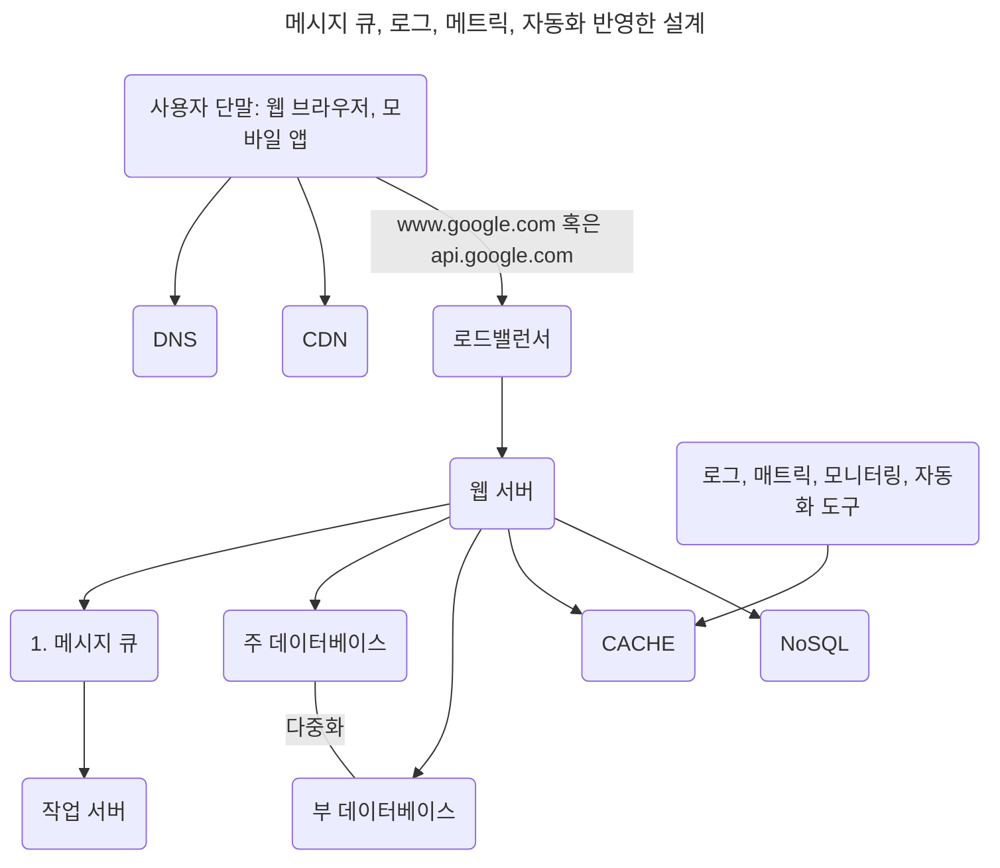

1. 각 컴포넌트가 느슨한 결합(loosely coupled)을 하고, 각 결함에 대한 내성을 높인다.

## 데이터베이스의 규모 확장

- 저장할 데이터가 많아지면 데이터베이스에 대한 부하도 증가한다.

### 수직적 확장(scale up)

- 기존 서버에 고성능의 자원(CPU, RAM, 디스크 등)을 증설한다.

- 많은 양의 데이터를 보관하고 처리할 수 있지만 CPU, RAM 등을 무한 증설할 수 없다.

- SPOF(Single Point of Failure)로 인한 위험성이 크고 비용이 많이 든다.

### 수평적 확장(scale out)

- 샤딩(sharding)이라고도 부르며 더 많은 서버를 추가한다.

- 샤딩: 대규모 데이터베이스를 샤드(shard)라고 부르는 작은 단위로 분할하는 기술

  - 모든 샤드는 같은 스키마를 쓰지만 샤드에 보관되는 데이터 사이에는 중복이 없다.

- 사용자 데이터를 어느 샤드에 넣을지는 사용자 ID에 따라 정한다.

- 샤딩 전략을 구현할 때 고려해야 할 가장 중요한 것은 샤딩 키(sharding key)를 어떻게 정하느냐 이다.

- 샤딩 키: 파티션 키(partition key), 데이터가 어떻게 분산될지 정하는 하나 이상의 칼럼

  - 샤딩 키를 통해 올바른 데이터베이스에 query를 보내 데이터 조회나 변경을 처리하므로 효율을 높일 수 있다.

  - 샤딩 키를 정할 때 **데이터를 고르게 분할** 하는게 제일 중요하다.

- 샤딩 도입 시 발생하는 문제

|데이터의 재 샤딩(resharding)|유명인사(celebrity) 문제|조인과 비정규화(join and de-nomalization)|
|-|-|-|
|데이터가 너무 많아져서 하나의 샤드로는 더 이상 감당하기 어려울 때|핫스팟 키(hotspot key) 문제라고도 하며 특정 사드에 질의가 집중되어 서버에 과부하가 걸린다.|하나의 데이터베이스를 여러 샤드 서버로 쪼개면, 여러 샤드에 걸친 데이터를 join하기가 힘들다|
|샤드 소진 현상 발생 시, 샤드 키 계산 함수를 변경하고 데이터 재배치|read 연산이 많은 데이터 각각에 샤드를 할당하거나 더 잘 쪼개야한다.|데이터베이스를 비정규화하여 하나의 테이블에서 query를 실행한다.|

  > 샤드 소진(shard exhaustion)? 샤드 간 데이터 분포가 균등하지 못하여 어떤 샤드에 할당된 공간 소모가 다른 샤드에 비해 빨리 진행) 

## 백만 사용자, 그리고 그 이상

- 시스템의 규모를 확장하는 것은 지속적이고 반복적(iterative)인 과정이다.
