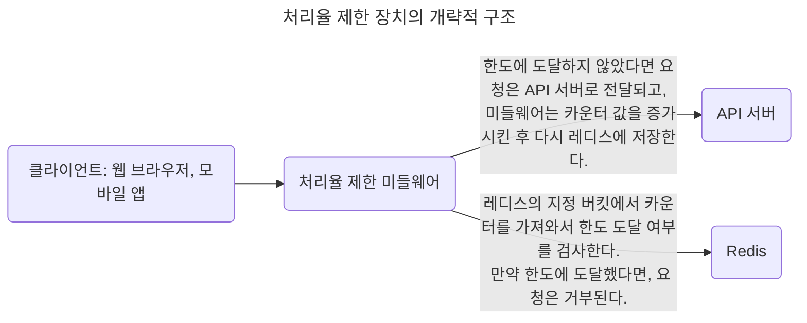
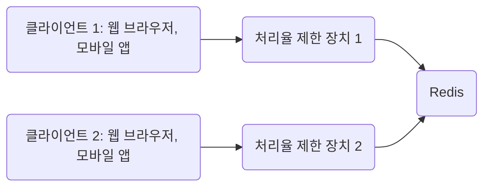

# 4장 처리율 제한 장치의 설계

- 클라이언트 또는 서비스가 보내는 트래픽의 처리율(rate)을 제어한다.

- HTTP에서는 특정 기간 내에 전송되는 클라이언트의 요청 횟수를 제한한다.

- API 요청 횟수가 제한 장치에 정의된 임계치(threshold)를 넘으면, 추가로 도달한 모든 호출 처리는 중단(block)된다.

- API에 처리율 제한 장치를 두면 좋은 점은..

  - DoS(Denial of Service) 공격에 의한 자원 고갈(resource starvation)을 방지할 수 있다.

  - 비용을 절감한다.

    - 추가 요청 처리를 위한 서버를 별도로 두지 않아도 된다.

    - 우선순위가 높은 API에 더 많은 자원을 할당할 수 있다.

  - 봇(bot)에서 오는 트래픽이나 사용자의 잘못된 이용 패턴으로 유발되는 트래픽을 거르면서 서버 과부하를 막는다.

## TL;DR

## 1단계 문제 이해 및 설계 범위 확정

- 처리율 제한 장치를 구현하는 알고리즘은 다양하다.

  - 어떤 종류(클라이언트 혹은 서버 측)의 처리율 제한 장치를 설계해야하는지?

  - 어떤 기준을 사용해서 API 호출을 제어해야 할지? IP 주소를 사용해야 하는지? 아니면 사용자 ID?

    - 다양한 형태의 제어 규칙(throttling role)을 정의할 수 있는 유연한 시스템이어야 한다.

  - 설계할 시스템은 대규모 요청을 처리할 수 있어야 한다.

  - 시스템이 분산 환경에서 동작해야 한다.

  - 해당 처리율 제한 장치는 독립된 서비스인지 애플리케이션 코드에 포함될 수 있는지?

    - 그 결정은 지원자 본인이 내려달라.

  - 사용자 요청이 처리율 제한 장치에 의해 걸러진 경우, 사용자에게 그 사실을 알려야 한다.

### 요구사항

- 설정된 처리율을 초과하는 요청은 정확하게 제한한다.

- 낮은 응답시간: 이 처리율 제한 장치는 HTTP 응답 시간에 나쁜 영향을 주어서는 안된다.

- 가능한 적은 메모리를 사용해야 한다.

- 분산형 처리율 제한(distributed rate limiting): 하나의 처리율 제한 장치를 여러 서버나 프로세스에 공유할 수 있어야 한다.

- 예외 처리: 요청이 제한되었을 때는 사용자에게 그 사실을 보여주어야 한다.

- 높은 결함 감내성(fault tolerance): 제한 장치에 장애가 생겨도 전체 시스템에 영향을 주어서는 안된다.

## 2단계 개략적 설계안 제시 및 동의 구하기

- 일을 너무 복잡하게 만드는 대신 기본적인 클라이언트 - 서버 통신 모델을 사용한다.

### 처리율 제한 장치는 어디에 둘 것인가?

- 클라이언트에 두면, 위변조가 쉬운 클라이언트 요청의 처리 제한이 불안정하고 클라이언트의 구현을 통제하기 어렵다.

- 처리율 제한 장치를 API 서버에 두되, 처리율 제한 미들웨어(middleware)를 만든다.

  - 처리율 제한 미들웨어로 API 서버로 가는 요청을 통제한다.

  - HTTP status code 429는 사용자가 너무 많은 요청을 보내려고 했음(Too many requests)을 의미한다.

- 클라우드 마이크로서비스의 경우, 보통 API 게이트웨이(gateway) 컴포넌트에서 처리율 제한 장치를 구현한다.

  > - API 게이트웨이?
  >
  >   - 클라우드 업체가 유지 보수를 담당하는 완전 위탁관리형 서비스(fully managed)이다.
  >
  >   - 처리율 제한, SSL 종단(termination), 사용자 인증(authentication), IP 허용 목록(whitelist) 관리 등을 지원한다.

- 처리율 제한 장치를 설계할 때 **'처리율 제한 장치를 둘 위치'** 는 중요하지만, 케바케다.

- 일반적으로 해당 지침들을 적용해볼 수 있다.

  1. 프로그래밍 언어, 캐시 서비스 등 현재 사용하고 있는 기술 스택을 점검하라.

     - 현재 사용하는 프로그래밍 언어가 서버 측 구현을 지원하기 충분할 정도로 효율이 높은지 확인하라.

  2. 사업 필요에 맞는 처리율 제한 알고리즘을 찾아라.

     - 서버 측에서 모든 것을 구현한다면, 알고리즘을 선택할 수 있지만, 게이트웨이를 사용한다면 선택지는 제한된다.

  3. 마이크로서비스에 기반하고, 이미 API 게이트웨이를 포함시킨 설계라면, 처리율 제한 기능도 게이트웨이에 포함시켜야 할 수 있다.

  4. 처리율 제한 장치를 구현하기에 인력이 부족하다면 상용 API 게이트웨이를 사용하라.

### 처리율 제한 알고리즘

#### 토큰 버킷(token bucket)

- 알고리즘에 대한 세간의 이해도도 높고 인터넷 기업들이 보편적으로 사용한다.

- 동작 원리

  - 토큰 버킷은 지정된 용량을 갖는 컨테이너로, 사전 설정된 양의 토큰이 주기적으로 채워진다.

    - 토큰이 꽉 찬 버킷에는 더 이상의 토큰은 추가되지 않고 추가로 공급된 토큰은 버려진다(overflow).

  - 각 요청이 처리될 때마다 하나의 토큰을 사용하는데, 요청이 도착했을 때 버킷에 충분한 토큰이 있는지 검사한다.

    - 충분한 토큰이 있는 경우, 버킷에서 토큰 하나를 꺼낸 후 요청을 시스템에 전달한다.

    - 없는 경우, 해당 요청은 버려진다(dropped).

- 2개의 인자(parameter), 버킷 크기(버킷에 담을 수 있는 토큰의 최대 개수)와 토큰 공급률(refill rate, 초당 몇 개의 토큰이 버킷에 공급되는지)를 적절하게 튜닝하는 것이 까다롭다.

- 공급 제한 규칙에 따라 사용할 버킷의 갯수가 달라진다.

  - 통상적으로, API 엔드포인트(endpoint)마다 별도의 버킷을 둔다.

  - IP 주소별로 처리율 제한을 적용해야 한다면 IP 주소마다 버킷을 하나씩 할당해야 한다.

  - 시스템의 처리율을 초당 10,000개 요청으로 제한하고 싶다면, 모든 요청이 하나의 버킷을 공유하도록 해야 한다.

- 구현이 쉽고, 메모리 사용 측면에서도 효율적이다.

- 버킷에 남은 토큰이 있기만 하면 짧은 시간에 집중되는 트래픽(burst of traffic)도 처리 가능하다.

#### 누출 버킷(leaky bucket)

- 토큰 버킷 알고리즘과 비슷하지만 요청 처리율이 고정되어있고, 보통 FIFO(First-In-First-Out) 큐로 구현한다.

- 동작원리

  - 요청이 도착하면 큐가 어느정도 채워져 있는지 확인한다.

  - 빈자리가 있다면 큐에 요청을 추가하고, 가득 차있는 경우에는 새 요청은 버린다.

  - 지정된 시간마다 큐에서 요청을 꺼내어 처리한다.

- 버킷 크기(큐 사이즈와 같은 값으로 큐에는 처리될 항목들이 보관)와 처리율(outflow rate, 지정된 시간당 몇 개의 항목을 처리할지 지정하는 값으로 보통 초 단위로 표현된다)를 인자(parameter)로 받는데, 역시 튜닝하기 까다롭다.

- 사용량 측면에서 효율적이고, 안정적인 출력(stable outflow rate)이 필요할 때 적합하다.

- 단시간에 많은 트래픽이 몰리는 경우, 큐에 쌓인 오래된 요청들을 제때 처리 못하면 최신 요청들은 버려지게 된다.

#### 고정 윈도 카운터(fixed window counter)

- 동작원리

  - 타임라인(timeline)을 고정된 간격의 윈도(window)로 나누고, 각 윈도마다 카운터(counter)를 붙인다.

  - 요청이 접수될 때마다 이 카운터의 값은 1씩 증가한다.

  - 이 카운터의 값이 사전에 설정된 임계치(threshold)에 도달하면 새로운 요청은 새 윈도가 열릴 때까지 버려진다.

- 윈도의 경계 부근에 순간적으로 많은 트래픽이 집중될 경우, 윈도에 할당된 양보다 더 많은 요청이 처리될 수 있다.

- 메모리 효율이 좋고 이해하기 쉽다.

- 윈도가 닫히는 시점에 카운터를 초기화하는 방식은 특정한 트래픽 패턴을 처리하기에 적합하다.

- 윈도 경계 부근에 일시적으로 많은 트래픽이 몰려들 경우, 시스템의 처리 한도보다 많은 양의 요청을 처리하게 된다.

#### 이동 윈도 로그(sliding window log)

- 동작 원리

  - 요청의 타임스탬프(timestamp)를 추적한다.

    > - 타임스탬프 데이터는 보통 레디스(Redis)의 정렬 집합(sorted set)같은 캐시에 보관한다.

  - 새 요청이 오면 만료된 타임스탬프(현재 윈도의 시작 시점보다 오래된 타임 스탬프)는 제거한다.

  - 새 요청의 타임스탬프를 로그(log)에 추가한다.

  - 로그의 크기가 허용치보다 같거나 작으면 요청을 시스템에 전달하고, 크다면 처리를 거부한다.

- 어느 순간의 윈도를 보더라도 허용되는 요청의 개수는 시스템의 처리율 한도를 넘지 않으므로 매우 정교하다.

- 거부된 요청의 타임스탬프도 보관하기 때문에 다량의 메모리를 사용한다.

#### 이동 윈도 카운터(sliding window counter)

- 고정 윈도 카운터 알고리즘과 이동 윈도 로깅 알고리즘을 결합한 알고리즘이다.

- 이전 시간대의 평균 처리율에 따라 현재 윈도의 상태를 계산하므로 짧은 시간에 몰리는 트래픽에도 잘 대응한다.

- 메모리 효율이 좋다.

- 직전 시간대에 도착한 요청이 균등하게 분포되어 있다고 가정하고 추정치를 계산하므로 다소 느슨하지, 심각하지는 않다.

### 개략적인 아키텍처

- '얼마나 많은 요청이 접수되었는지'를 추적할 수 있는 카운터를 추적 대상 별(사용자, IP 주소, API 엔드포인트, 서비스 단위 등)로 두고, 해당 카운터 값이 어떤 한도를 넘으면 그 이후의 요청은 거부한다.

- 카운터를 보관하는 장소로 데이터베이스는 디스크 접근 때문에 느리므로 부적합하다.

- 빠르고 시간에 기반한 만료 정책을 지원하는, 메모리상에서 동작하는 캐시가 바람직하다.

  > - 레디스(Redis)? 처리율 제한 장치를 구현할 때 자주 사용되는 메모리 기반 저장 장치이다..
  >
  >   - INCR 명령어: 메모리에 저장된 카운터의 값을 1만큼 증가시킨다.
  >
  >   - EXPIRE 명령어: 카운터에 타임아웃 값을 설정하고, 설정된 시간이 지나면 카운터는 자동으로 삭제된다.

## 3단계 상세 설계

### 처리율 제한 규칙

- 보통 설정 파일(configuration file) 형태로 디스크에 저장된다.

### 처리율 한도 초과 트래픽의 처리

- 어떤 요청이 한도 제한에 걸리면, API는 HTTP 상태 코드 Too Many Requests(429)로 클라이언트에게 응답한다.

- 경우에 따라 한도 제한이 걸린 메시지를 나중에 처리하기 위해 큐에 보관한다.

#### 처리율 제한 장치가 사용하는 HTTP 헤더

- 클라이언트는 HTTP 응답 헤더(response header)를 통해 처리율 제한이 걸린지(throttle)를 감지할 수 있다.

  - X-Ratelimit-Remaining: 윈도 내에 남은 처리 가능 요청의 수.

  - X-Ratelimit-Limit: 매 윈도마다 클라이언트가 전송할 수 있는 요청의 수.

  - X-Ratelimit-Retry-After: 한도 제한에 걸리지 않기 위해 몇 초 후에 요청을 다시 보내야 하는지 알림.

- 사용자가 너무 많은 요청을 보내면 X-Ratelimit-Retry-After 헤더와 Too Many Requests(429) 오류를 반환한다.

### 상세 설계

- 처리율 제한 규칙은 디스크에 보관하고, 작업 프로세스(workers)는 규칙을 디스크에서 수시로 읽어 캐시에 저장한다.

- 클라이언트가 서버에 Request를 보내면, 먼저 처리율 제한 미들웨어에 도달한다.

- 처리율 제한 미들웨어는 캐시에서 제한 규칙을, 레디스 캐시에서 카운터 및 마지막 요청의 타임스탬프(timestamp)를 가져온다.

  - 두 값을 비교하여 Request를 API 서버로 보낼지 여부를 결정한다.

### 분산 환경에서의 처리율 제한 장치의 구현

- 여러 대의 서버와 병렬 스레드를 지원하는 시스템에서는 경쟁 조건(race condition)과 동기화(synchronization) 문제가 발생한다.

#### 경쟁 조건

- n개의 요청을 처리하는 스레드(thread)가 각각 병렬로 counter 값을 읽을 경우에 발생한다.

- 보편적으로 락(lock)을 통해 해결할 수 있지만, 시스템 성능을 상당히 떨어뜨릴 수 있는 단점이 있다.

#### 동기화 이슈

- 웹 계층은 무상태(stateless)이므로 처리율 제한 장치 서버를 여러 대 두게 되면 동기화가 필요하다.

- 고정 세션(sticky session)을 사용하여 같은 클라이언트로부터의 request는 항상 같은 처리율 제한 장치로 보내면서 해결할 수 있지만, 규모면에서 확장이 불가하고 유연하지 않다.

- 레디스와 같은 중앙 집중형 데이터 저장소를 사용하는 것이 더 낫다.

#### 성능 최적화

- 대부분의 클라우드 서비스 사업자는 사용자의 트래픽을 가장 가까운 엣지 서버(edge server)로 전달하여 지연시간(latency)을 줄인다.

- 제한 장치 간에 데이터를 동기화할 때 최종 일관성 모델(eventual consistency model)을 사용한다.

#### 모니터링

- 채택한 처리율 제한 알고리즘과 정의한 처리율 제한 규칙이 효과적인지 모니터링을 통해 확인한다.

## 4단계 마무리

- 경성(hard) 처리율 제한: 요청의 개수는 임계치를 절대 넘을 수 없다.

- 연성(soft) 처리율 제한: 요청 개수는 잠시 동안은 임계치를 넘을 수 있다.

- 애플리케이션 계층(OSI(Open Systems Interconnection model): 네트워크 계층도 기준 7번 계층)외에 다른 계층에서도 처리율 제한이 가능하다.

- 처리율 제한을 회피하는 방법도 있다.

  - 클라이언트 측 캐시를 사용하여 API 호출 횟수를 줄인다.

  - 처리율 제한의 임계치를 이해하고, 짧은 시간동안 대량의 메시지를 보내지 않는다.

  - 클라이언트가 예외 케이스로부터 복구될 수 있도록 예외/에러 처리 코드를 도입한다.

  - 재시도(retry) 로직을 구현할 때 충분한 백오프(back-off) 시간을 둔다.

## 참고문헌

- [Rate-limiting strategies and techniques](https://cloud.google.com/architecture/infra-reliability-guide/traffic-load?hl=en)

- [Twitter rate limits](https://developer.twitter.com/en/docs/twitter-api/rate-limits)

- [Google docs usage limits](https://developers.google.com/docs/api/limits)

- [IBM microservices](https://www.ibm.com/topics/microservices)

- [Throttle API requests for better throughput](https://docs.aws.amazon.com/apigateway/latest/developerguide/api-gateway-request-throttling.html)

- [Stripe rate limiters](https://stripe.com/docs/rate-limits)

- [Shopify REST Admin API rate limits](https://shopify.dev/docs/api/usage/rate-limits)

- [Better Rate Limiting With Redis Sorted Sets](https://engineering.classdojo.com/blog/2015/02/06/rolling-rate-limiter/)

- [System Design — Rate limiter and Data modelling](https://medium.com/@saisandeepmopuri/system-design-rate-limiter-and-data-modelling-9304b0d18250)

- [How we built rate limiting capable of scaling to millions of domains](https://blog.cloudflare.com/counting-things-a-lot-of-different-things)

- [Redis website](https://redis.io/)

- [Lyft rate limiting](https://github.com/pusher/lyft-ratelimit)

- [Scaling your API with rate limiters](https://stripe.com/blog/rate-limiters)

- [What is edge computing?](https://www.cloudflare.com/learning/serverless/glossary/what-is-edge-computing/)

- [Rate Limit Requests with Iptables](https://blog.programster.org/rate-limit-requests-with-iptables)

- [OSI model](https://en.wikipedia.org/wiki/OSI_model)
