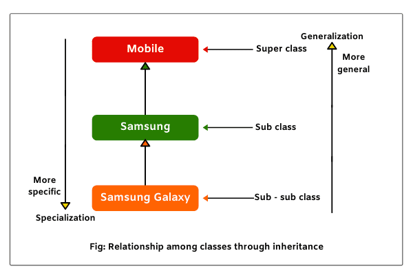

# 03. 타입과 추상화

> 일단 컴퓨터를 조작하는 것이 추상화를 구축하고, 조작하고 추론하는 것에 관한 모든 것이라는 것을 깨닫고 나면 (훌륭한) 컴퓨터 프로그램을 작성하기 위한 중요한 전제 조건은 추상화를 정확하게 다루는 능력이라는 것이 명확해진다. - 키스 데블린(Keith Devilin)

## TL;DR

1. 추상화의 목적은 복잡성을 단순화하는 것이다.
2. 개념을 이용해 공통점을 가진 객체들을 분류할 수 있다.
3. 객체는 외부에 행동만을 제공하고 데이터는 감춰야 하고(캡슐화) 객체를 결정하는 것은 행동(책임)이다.
4. 타입은 추상화다.
5. 클래스는 타입을 구현하는 방법으로 클래스와 타입은 다르다.

 

- 해리 벡이 창조한 지하철 노선도의 핵심은 지도가 당연히 가져야 한다고 생각되는 '정확성'을 버리고 그 '목적'에 집중한 결과다.

- 즉, 열차를 갈아타는 것, 연결이라는 목적에 부합하도록 지하철 노선을 추상화했다.

 

- 현실: 복잡하고 예측 불가능한 혼돈의 덩어리 -> 현실에 존재하는 다양한 현상 및 사물과 상호작용하기 위해서 우선 현실을 **이해**해야한다.

- 인간의 인지 능력과 저장 공간은 한계적이므로, 본능적으로 이해하기 쉽고 예측 가능한 수준으로 현실을 분해하고 단순화한다.

- 현실에서 출발하되 불필요한 부분을 도려내가면서 _사물의 본질을 드러나게_ 하는 과정이다.

> '현상은 복잡하다. 법칙은 단순하다. 버릴 게 무엇인지 알아내라.' - 리차드 파인만

- **추상화(Abstraction)** : 복잡도를 극복하는 방법

  - 어떤 양상, 세부 사항, 구조를 명확하게 이해하기 위해 특정 절차나 물체를 의도적으로 생략 또는 감춘다.

  - 목적: 불필요한 부분을 무시함으로써 현실에 존재하는 복잡성을 극복한다.

  - 추상화의 수준, 이익, 가치는 목적에 의존적이기 때문에 어떤 추상화도 의도된 목적이 아닌 다른 목적으로 사용된다면 오도될 수 있다.

  - 추상화는 두 차원에서 이뤄진다.

    - 구체적인 사물들 간의 공통점은 취하고 차이점은 버리는 *일반화*를 통해 단순하게 만드는 것이다.

    - 중요한 부분을 강조하기 위해 불필요한 세부 사항을 제거함으로써 *단순*하게 만드는 것이다.

### 모든 경우에서 추상화의 목적은 복잡성을 이해하기 쉬운 수준으로 단순화한다.

 

- 객체(Object): 명확한 경계를 가지고 서로 구별할 수 있는 구체적인 사람이나 사물

  - 객체지향 패러다임의 중심에는 구체적이고 실제적인 객체가 존재한다.
  - 인간은 공통적인 특성을 기준으로 객체를 여러 그룹으로 묶어 동시에 다뤄야 하는 가짓수를 줄임으로써 상황을 단순화한다.

- 객체를 이용하면 객체를 여러 그룹으로 **분류(classification)** 할 수 있다.

- 각 객체는 특정한 개념을 표현하는 그룹의 일원으로 포함된다.

  - 객체: 특정한 개념을 적용할 수 있는 구체적인 사물

  - 인스턴스: 개념이 객체에 적용됐을 때 객체

- **개념(concept)** : 공통점을 기반으로 객체들을 묶기 위한 틀

  - 인식하고 있는 다양한 사물이나 객체에 적용할 수 있는 아이디어나 관념. 객체들의 복잡성을 극복하기 위한 추상화 도구

  - 어떤 객체에 어떤 개념이 적용됐다 = 해당 개념이 부가하는 의미를 만족시킴으로써 다른 객체와 함께 해당 개념의 일원이 되었다.

  - 객체의 분류 장치로서 개념을 이야기할 때의 세 가지 관점

    - 심볼(symbol): 개념을 가리키는 간략한 이름이나 명칭

    - 내연(intension): 개념의 완전한 정의(의미). 객체가 개념에 속하는지 여부를 확인할 수 있다.

    - 외연(extension): 개념에 속하는 모든 객체(인스턴스)의 집합(set)

### 개념을 이용해 공통점을 가진 객체들을 분류할 수 있다.

- **분류(classification)** : 객체를 특정한 개념에 적용하는 작업

  - 객체에 특정한 개념을 적용할 때 객체를 **특정한 집합의 멤버로 분류** 한다.

  - _어떤 객체를 어떤 개념으로 분류_ 할지가 객체지향의 품질을 결정한다.

 

- **타입(Type)** : 공통점을 기반으로 객체들을 묶기 위한 틀(개념의 정의와 동일)

- 메모리의 세상에는 타입이라는 질서가 존재하지 않는다.

  - 타입이 없다(Untyped): 메모리 안의 데이터를 다룰 수 있는 단 하나의 타입만이 존재한다.

  - 타입이 없는 체계 안에서 모든 데이터는 일련의 비트열(bit string: 0, 1)로 구성된다.

### 인간은 본인이 다뤄야하는 데이터의 용도와 행동에 따라 그것들을 분류했다.

- 타입 시스템의 목적: 메모리 안의 모든 데이터가 비트열로 보임으로써 야기되는 혼란을 방지한다.

  - 메모리 안에 저장된 0과 1에 대해 수행 가능한 작업과 불가능한 작업을 구분함으로써 데이터가 잘못 사용되는 것을 방지한다. -> 데이터가 잘못 사용되지 않도록 제약사항을 부과한다.

- 타입은 데이터가 어떻게 사용되느냐에 관한 것이다.

  - 데이터가 어떤 타입에 속하는지를 결정하는 것 = 데이터에 적용할 수 있는 작업: 객체가 수행하는 행동
  - 연산자(operator): 데이터를 이용해 수행할 수 있는 작업
  - 어떤 데이터에 어떤 연산자를 적용할 수 있느냐: 해당 데이터의 타입을 결정한다.

- 타입에 속한 데이터를 메모리에 어떻게 표현하는지는 외부로부터 철저하게 감춰진다.: 객체의 행동을 가장 효과적으로 수행할 수만 있다면 객체 내부의 상태를 어떤 방식으로 표현하더라도 무방하다.

  - 데이터 타입의 표현은 연산 작업을 수행하기에 가장 효과적인 형태가 선택된다.
  - 개발자는 해당 데이터 타입의 표현 방식을 몰라도 데이터를 사용하는 데 지장이 없고, 데이터 타입에 적용할 수 있는 연산자만 알고 있으면 해당 데이터 타입을 사용할 수 있다.

- **데이터 타입(Data Type)**: 메모리 안에 저장된 데이터의 종류를 분류하는 데 사용하는 메모리 집합에 관한 메타데이터

  - 암시적으로 어떤 종류의 연산이 해당 데이터에 대해 수행될 수 있는지를 결정한다.

- 객체를 타입에 따라 분류하고 그 타입에 이름 붙이기 = 프로그램에서 사용할 새로운 데이터 타입 선언

- 객체는 행위에 따라 변할 수 있는 상태를 가지고 있다.
- 객체는 데이터가 아니다: 객체에서 중요한 것은 **객체의 행동**이다.
  - 상태는 행동의 결과다: 그 결과로 초래된 부수효과를 쉽게 표현하기 위해 도입한 추상적인 개념
  - 객체를 만들 때 가장 중요하게 고려해야 하는 것: 객체가 이웃하는 객체와 협력하기 위해 어떤 행동을 해야 할지 결정하는 것

### 객체가 협력을 위해 어떤 책임을 지녀야 하는지 결정 -> 객체지향 설계의 핵심

- 한 객체를 다른 객체와 동일한 타입으로 분류하는 기준: 그 객체가 타입에 속한 다른 객체와 동일한 행동을 하는가?

- 객체의 타입을 결정하는 것은 객체의 행동이다.: 객체가 어떤 데이터를 보유하고 있는지는 영향을 미치지 않는다.

- 같은 타입에 속한 객체는 행동(책임: 메시지 수신)만 동일하다면 서로 다른 데이터를 가질 수 있다.

  - 동일한 타입에 속하더라도 동일한 메시지를 처리하는 방식은 서로 다를 수밖에 없다.: 다형성
  - 다형성: 동일한 요청에 서로 다른 방식으로 응답할 수 있는 능력
  - 동일한 메시지를 서로 다른 방식으로 처리하기 위해서는 객체들은 동일한 메시지를 수신할 수 있어야 한다: **다형적인 객체들은 동일한 타입(또는 타입 계층)에 속한다.**

- 데이터의 내부 표현 방식과 무관하게 행동만이 고려 대상 = 외부에 데이터를 감춰야 한다.

### 훌륭한 객체지향 설계는 외부에 행동만을 제공하고 데이터는 행동 뒤로 감춰야 한다.: 캡슐화

- 책임 주도 설계(Responsibility-Driven Design): 데이터 주도 설계 방법의 단점 개선

  - 객체가 외부에 제공해야 하는 책임을 먼저 결정한다.

  - 그 책임을 수행하는 데 적합한 데이터는 나중에 결정한다.

  - 데이터를 책임을 수행하는 데 필요한 외부 인터페이스 뒤로 캡슐화해야 한다.

  - 데이터 주도 설계(Data-Driven Design): 데이터를 먼저 결정하고 객체의 책임 결정(유연하지 못한 설계)

### 객체를 결정하는 것은 행동이다. 데이터는 단지 행동을 따를 뿐이다.

 

- **일반화/특수화(generalization/specialization)** 계층: 객체가 외부에 제공하는 **행동**에서 동시에 결정된다.

- **슈퍼타입(Suertype)**: 특수한 타입이 가진 모든 행동들 중에서 일부 행동만을 가지는 타입(일반적)

- **서브타입(Subtype)**: 일반적인 타입이 가진 모든 행동을 포함하지만 거기에 자신만의 행동을 추가하는 타입(특수)

- 일반적인 타입은 특수한 타입보다 더 적은 수의 행동을 가진다.

- 객체지향 패러다임에서 추상화의 두번째 차원(_중요한 부분을 강조하기 위해 불필요한 세부 사항을 제거해 단순하게 만든다_)을 활용한다.

 

- 타입을 사용하는 이유

  - 인간의 인지 능력으로는 시간에 따라 동적으로 변하는 객체의 복잡성을 극복하기 어렵다.

  - 한 객체의 상태에 복잡성을 부과하는 요소를 제거하고, 정적인 관점에서 객체를 묘사한다.

### 타입은 추상화다.

- 타입을 이용하면 객체의 동적인 특성을 추상화할 수 있다 -> 시간에 따른 객체의 상태 변경이라는 복잡성을 단순화할 수 있는 효과적인 방법

- **동적 모델(Dynamic Model)**: 객체가 살아 움직이는 동안 상태가 어떻게 변하고 어떻게 행동하는지 포착한다.

  - 스냅샷(snapshot): 객체가 특정 시점에 구체적으로 어떤 상태를 가지는지 표현한다.

  - 객체 다이어그램(Object Diagram): UML(Unified Modeling Language: 객체지향 모델링을 위한 표준 언어)에서의 스냅샷

  - 객체의 동적인 모델 탐험: 애플리케이션을 실행해 객체의 상태 변경을 추적하고 **디버깅**하는 시점

- **정적 모델(Static Model)**: 객체가 속한 타입의 정적인 모습을 표현한다.

  - 타입 모델(Type Diagram): 객체가 가질 수 있는 모든 상태와 모든 행동을 시간에 독립적으로 표현한다.

  - 객체의 정적인 모델 탐험: 객체지향 프로그래밍 언어를 이용해 **클래스**를 작성하는 시점

- 클래스(Class): **타입을 구현**하는 가장 보편적인 방법 -> 클래스 != 타입
